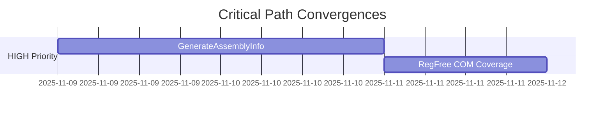
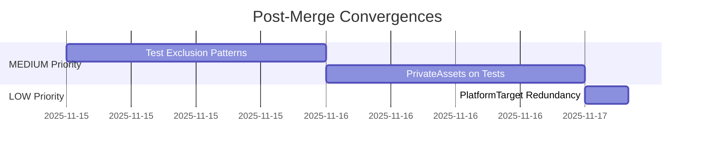

# SDK Migration Convergence Status Dashboard

**Last Updated**: 2025-11-08
**Framework**: [CONVERGENCE-FRAMEWORK.md](CONVERGENCE-FRAMEWORK.md)

---

## Executive Summary

| Metric | Value |
|--------|-------|
| Total Convergences | 5 |
| Completed | 0 (0%) |
| In Progress | 0 (0%) |
| Not Started | 5 (100%) |
| Blocked | 0 (0%) |
| **Total Estimated Effort** | **30-40 hours** |

---

## Convergence Tracking

| # | Convergence | Priority | Effort | Status | Phase | Owner | Start | ETA |
|---|-------------|----------|--------|--------|-------|-------|-------|-----|
| 1 | [GenerateAssemblyInfo](CONVERGENCE-1-GenerateAssemblyInfo.md) | 🔴 HIGH | 8-10h | 🔴 Not Started | - | TBD | TBD | TBD |
| 2 | [RegFree COM Coverage](CONVERGENCE-2-RegFreeCOM.md) | 🔴 HIGH | 6-8h | 🔴 Not Started | - | TBD | TBD | TBD |
| 3 | [Test Exclusion Patterns](CONVERGENCE-3-TestExclusionPatterns.md) | 🟡 MEDIUM | 3-4h | 🔴 Not Started | - | TBD | TBD | TBD |
| 4 | [PrivateAssets on Tests](CONVERGENCE-4-PrivateAssets.md) | 🟡 MEDIUM | 3-4h | 🔴 Not Started | - | TBD | TBD | TBD |
| 5 | [PlatformTarget Redundancy](CONVERGENCE-5-PlatformTarget.md) | 🟢 LOW | 1-2h | 🔴 Not Started | - | TBD | TBD | TBD |

**Status Legend**:
- 🔴 Not Started
- 🟡 In Progress
- 🟢 Complete
- ⚫ Blocked
- ⏸️ Paused

**Phase Tracking** (when In Progress):
- Phase 1/5: Analysis
- Phase 2/5: Implementation
- Phase 3/5: Validation
- Phase 4/5: Documentation
- Phase 5/5: Ongoing Maintenance

---

## Priority Breakdown

### 🔴 HIGH Priority (Must Complete Before Merge)
**Total Effort**: 14-18 hours

1. **GenerateAssemblyInfo** (8-10h)
   - **Impact**: Mixed settings cause confusion, CS0579 errors
   - **Benefit**: Clear standard, no duplicates, easier maintenance
   - **Blockers**: None
   - **Dependencies**: None

2. **RegFree COM Coverage** (6-8h)
   - **Impact**: Incomplete self-contained deployment
   - **Benefit**: All EXEs work on clean systems without registry
   - **Blockers**: None
   - **Dependencies**: None

---

### 🟡 MEDIUM Priority (Should Complete After Merge)
**Total Effort**: 6-8 hours

3. **Test Exclusion Patterns** (3-4h)
   - **Impact**: 3 different patterns cause inconsistency
   - **Benefit**: Single standard, easier to maintain
   - **Blockers**: None
   - **Dependencies**: None

4. **PrivateAssets on Tests** (3-4h)
   - **Impact**: Test dependencies may leak
   - **Benefit**: Isolated test dependencies
   - **Blockers**: None
   - **Dependencies**: None

---

### 🟢 LOW Priority (Nice to Have)
**Total Effort**: 1-2 hours

5. **PlatformTarget Redundancy** (1-2h)
   - **Impact**: Redundant settings in 22 projects
   - **Benefit**: DRY principle, single source of truth
   - **Blockers**: None
   - **Dependencies**: None

---

## Recommended Implementation Order

### Critical Path (Pre-Merge)
**Goal**: Complete before merging SDK migration to main

**Timeline**: 3 days (14-18 hours)

1. **Day 1-2**: GenerateAssemblyInfo (8-10h)
   - Audit: 2h
   - Implementation: 4-6h
   - Validation: 2h

2. **Day 3**: RegFree COM Coverage (6-8h)
   - Audit: 2-3h
   - Implementation: 2-3h
   - Testing: 2-3h

---

### Post-Merge Path (Medium Priority)
**Goal**: Complete within 2 weeks after merge

**Timeline**: 3 days (7-10 hours)

3. **Week 1**: Test Exclusion Patterns (3-4h)
4. **Week 1**: PrivateAssets on Tests (3-4h)
5. **Week 2**: PlatformTarget Redundancy (1-2h)

---

## Progress Tracking

### Phase Completion Matrix

| Convergence | Audit | Convert | Validate | Document | Maintain |
|-------------|-------|---------|----------|----------|----------|
| 1. GenerateAssemblyInfo | ⬜ | ⬜ | ⬜ | ⬜ | ⬜ |
| 2. RegFree COM | ⬜ | ⬜ | ⬜ | ⬜ | ⬜ |
| 3. Test Exclusions | ⬜ | ⬜ | ⬜ | ⬜ | ⬜ |
| 4. PrivateAssets | ⬜ | ⬜ | ⬜ | ⬜ | ⬜ |
| 5. PlatformTarget | ⬜ | ⬜ | ⬜ | ⬜ | ⬜ |

**Legend**: ⬜ Not Started | 🟦 In Progress | ✅ Complete

---

## Deliverables Checklist

### Per Convergence

- [ ] Audit report (CSV file)
- [ ] Conversion decisions (reviewed CSV)
- [ ] Modified project files
- [ ] Validation report
- [ ] Updated documentation
- [ ] CI validation (if applicable)

### Across All Convergences

- [ ] Framework implemented (audit_framework.py)
- [ ] Unified CLI tool (convergence.py)
- [ ] All 5 convergence scripts
- [ ] Updated SDK-MIGRATION.md
- [ ] Updated Directory.Build.props
- [ ] Updated .github/instructions/*.md
- [ ] Project templates updated

---

## Risk Register

| Risk | Likelihood | Impact | Mitigation | Owner |
|------|------------|--------|------------|-------|
| Build breaks after changes | Medium | High | Incremental testing, backups | TBD |
| Timeline slips | Medium | Medium | Prioritize HIGH items | TBD |
| Scope creep | Low | Medium | Stick to framework phases | TBD |
| Merge conflicts | Low | Low | Work in feature branch | TBD |

---

## Dependencies and Blockers

### External Dependencies
- ✅ Build system functional (no blockers)
- ✅ Test suite passing (no blockers)
- ✅ CI accessible (no blockers)

### Internal Dependencies
- None - All convergences are independent

### Current Blockers
- None

---

## Success Criteria

### Per Convergence
- ✅ Audit complete with statistics
- ✅ All projects follow standard pattern
- ✅ Build successful (Debug + Release)
- ✅ No regressions in tests
- ✅ Documentation updated
- ✅ Validation passes

### Overall Migration
- ✅ All HIGH priority convergences complete
- ✅ MEDIUM priority convergences scheduled
- ✅ Zero divergent approaches in critical areas
- ✅ Clear standards documented
- ✅ Enforcement mechanisms in place

---

## Change Log

| Date | Change | Author |
|------|--------|--------|
| 2025-11-08 | Initial creation | Copilot |

---

## Quick Links

- **Framework**: [CONVERGENCE-FRAMEWORK.md](CONVERGENCE-FRAMEWORK.md)
- **Main Migration Doc**: [SDK-MIGRATION.md](SDK-MIGRATION.md)
- **Build Challenges**: [SDK-MIGRATION.md#build-challenges-deep-dive](SDK-MIGRATION.md#build-challenges-deep-dive)

### Convergence Documents
1. [GenerateAssemblyInfo](CONVERGENCE-1-GenerateAssemblyInfo.md)
2. [RegFree COM Coverage](CONVERGENCE-2-RegFreeCOM.md)
3. [Test Exclusion Patterns](CONVERGENCE-3-TestExclusionPatterns.md)
4. [PrivateAssets on Tests](CONVERGENCE-4-PrivateAssets.md)
5. [PlatformTarget Redundancy](CONVERGENCE-5-PlatformTarget.md)

---

## Notes

**For Project Managers**:
- Critical path is 3 days for HIGH priority items
- Can parallelize some tasks (audit scripts can run simultaneously)
- Post-merge items are low risk, can be scheduled flexibly

**For Developers**:
- Each convergence is independent - can be worked on separately
- Use unified CLI tool: `python convergence.py <name> <action>`
- All changes backed up automatically
- Dry-run mode available for testing

**For Reviewers**:
- Each convergence produces audit report for review before implementation
- Validation scripts catch errors automatically
- Clear before/after metrics in each document

---

*Dashboard maintained by: TBD*
*Review frequency: Weekly during active convergence, Monthly after completion*
