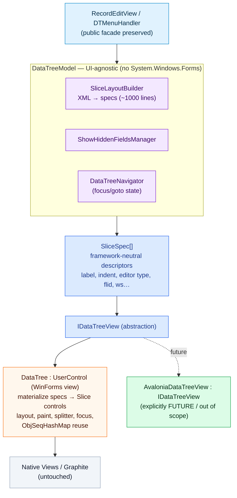
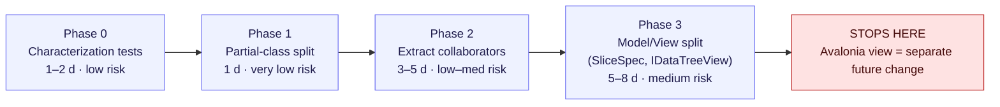
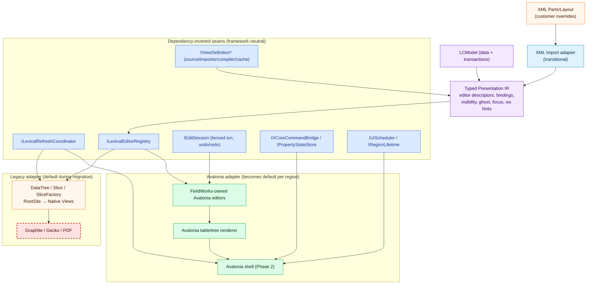
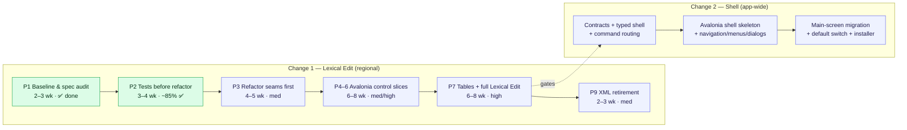
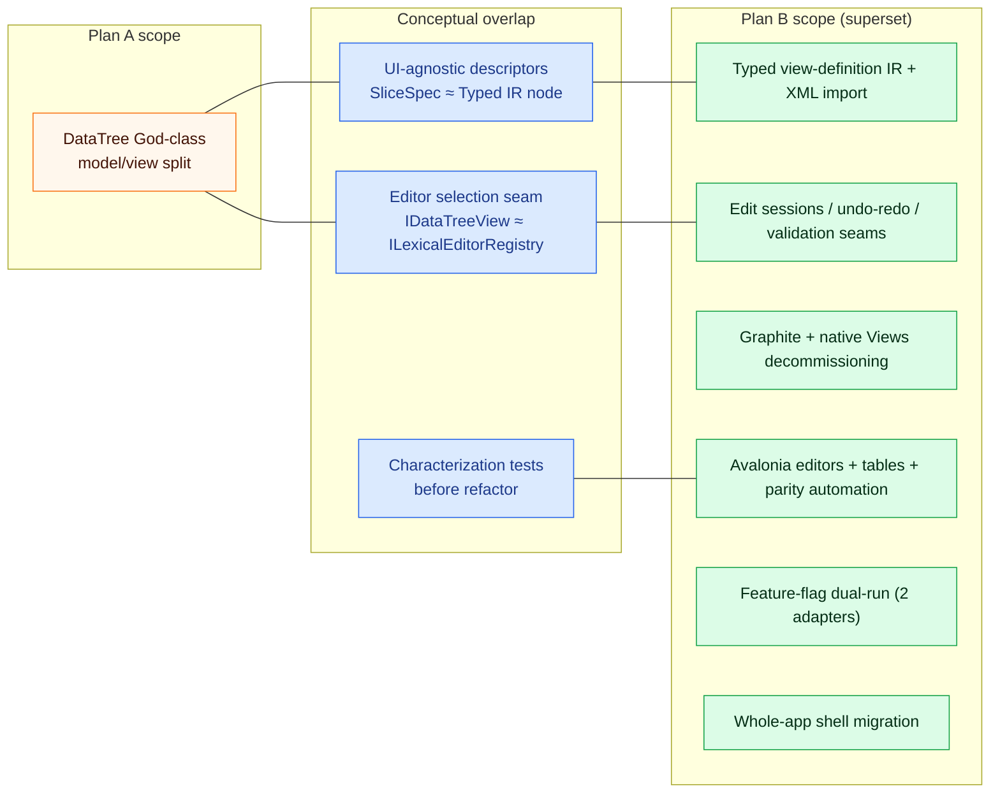

# Avalonia Migration: Comparison of the Two Plans + Recommended Paths

**Date:** 2026-06-05
**Author:** Review synthesis (subagent-assisted)
**Goal under evaluation:** Move the whole FieldWorks UI to Avalonia, starting with the main
Lexical Edit view (after a small proof-of-concept), preserving *visual functional fidelity and
density* (not pixel-perfect), with the new path behind a **feature flag** so the app can run either
Avalonia or the legacy WinForms controls.

This document compares the two existing planning sets, shows how their **scope and detail differ**,
and proposes **three ways to proceed** with pros/cons and a recommendation.

---

## 1. The two plans at a glance

| | **Plan A — "datatree-model-view-separation"** (older; this branch `datatree-model-view`) | **Plan B — "lexical-edit-avalonia-migration" + "fieldworks-avalonia-shell-migration"** (newer; branch `010-advanced-entry-view-phase-1-2`) |
|---|---|---|
| **Core idea** | Refactor `DataTree.cs` (4.7k-line God Class) into a UI-agnostic **model** + a WinForms **view** behind `IDataTreeView`, so an Avalonia view can be added later. | **Refactor dependency-inverted *seams* first**, introduce a **typed view-definition IR**, build owned Avalonia editors, decommission Graphite + native Views, then replace the whole shell. |
| **End state** | `DataTreeModel` + `SliceSpec[]` + `IDataTreeView`; WinForms still the only renderer. Avalonia view is explicitly **out of scope / future**. | Avalonia is the **default host** for Lexical Edit (Phase 1), then the **whole app shell** (Phase 2). No WinForms/native in the default render path. |
| **Reaches working Avalonia?** | No — stops at the abstraction boundary. | Yes — that is the explicit objective, via a first editable Avalonia slice → full Lexical Edit → shell. |
| **Graphite / native Views removal** | Not addressed. | Explicit completion gate; inventory + classify + replace (OpenType/HarfBuzz) or block with diagnostics. |
| **Feature-flag / dual-run** | Not designed (inferred only). | Designed: **two-adapter pattern** (legacy WinForms adapter vs Avalonia adapter) behind a flag/preview host. |
| **Testing** | Characterization tests + unit tests for extracted collaborators; manual smoke. | Layered: unit/integration + **semantic parity snapshots** + UIA2 legacy smoke + Avalonia.Headless + full-app smoke + perf budgets. |
| **Effort** | ~9–16 days (Phases 0–3). | ~40–50 weeks end-to-end (both changes). |
| **Status** | `IDataTreePainter` exists; characterization tests partially done; no model/view classes yet. | Phase 1 done; Phase 2 ~85% (93 tests, semantic baseline capture, seam docs frozen); net8 Avalonia prototype split to branch `010-advanced-entry-preview-prototype`; Phase 3+ not started. |
| **Granularity** | One focused change, 4 phases. | Two changes, ~15+ phases, 6 frozen "seam recommendation" capability specs, region manifests, coverage maps. |

**One-line summary:** Plan A is a *narrow, low-risk enabler* (clean up DataTree so Avalonia is
possible). Plan B is a *full migration program* (actually get to Avalonia, app-wide, with the hard
problems — Graphite, native Views, shell, parity — scoped in).

---

## 2. Plan A architecture & scope (older)

**Scope:** managed C# only, centered on `DataTree.cs` / `Slice.cs` / `SliceFactory.cs` in
`Src/Common/Controls/DetailControls/`, with minimal touch of `RecordEditView` and `DTMenuHandler`.
**Out of scope:** Avalonia itself, native C++, Graphite, XML format changes, dual-run wiring.

---

## 3. Plan B architecture & scope (newer)

**Scope:** managed seams + Avalonia editors + Graphite/native-Views decommissioning + (Change 2)
the entire shell, navigation, menus, dialogs, startup/shutdown, installer.
**Out of scope:** LCModel/schema rewrite, deleting linguistics services (XAmple, parsers, ICU),
one-shot migration of non-Lexical-Edit screens before shell seams exist.

---

## 4. How the scope & detail differ

Key differences:

1. **Ambition.** Plan A *enables* Avalonia; Plan B *delivers* Avalonia (and removes the things that
   block it — Graphite, native Views, the WinForms shell).
2. **The hard problems.** Plan A is silent on the three biggest risks: native Views/COM rendering,
   Graphite/Gecko, and the feature-flag/dual-run mechanics. Plan B scopes all three explicitly.
3. **Boundary type.** Plan A's `SliceSpec` + `IDataTreeView` is essentially a *narrow, concrete
   instance* of Plan B's *typed Presentation IR* + `ILexicalEditorRegistry` — but built only for
   `DataTree`, with a different vocabulary.
4. **Fidelity/density.** Plan B has the machinery to *prove* fidelity/density (semantic parity
   snapshots, render-comparison evidence, perf budgets). Plan A relies on manual smoke tests.
5. **Cost & risk profile.** Plan A is days and near-zero risk but doesn't reach the goal. Plan B is
   months and carries real unknowns (net8↔net48 host bridge, browser/PDF replacement) but is the
   only one that actually reaches "everything on Avalonia."
6. **Progress already banked.** Plan B has more sunk, reusable work (93+ tests, frozen seam specs,
   coverage map, a net8 Avalonia prototype on a sibling branch). Plan A's collaborator/model classes
   don't exist yet.

---

## 5. Three ways to proceed

### Approach 1 — Adopt Plan B wholesale; retire Plan A
Commit to the newer two-change program as written. Resume at Lexical Edit Phase 3 (seam extraction),
then build Avalonia editor slices, parity automation, Graphite gating, and eventually the shell.
Harvest nothing structural from Plan A.

**Pros**
- Only approach that actually reaches the stated goal (whole app on Avalonia).
- Hard problems already scoped: Graphite/native removal, feature-flag dual-run, parity/density proof.
- ~85% of Phases 1–2 already done and verified (tests green); momentum and frozen decisions exist.
- Single coherent vocabulary and gate model; less reconciliation work.

**Cons**
- 40–50 week program; risks crowding out other roadmap work; needs sustained staffing.
- Biggest unknowns (net8↔net48 host bridge, browser/PDF replacement) are still unresolved "open questions."
- Heavy process (region manifests, frozen seam specs) can slow the first visible Avalonia pixel.
- Plan A's already-clean DataTree decomposition work is left on the table.

### Approach 2 — Hybrid: Plan A's DataTree split as the concrete first realization *inside* Plan B's seams
Keep Plan B as the program spine (seams, parity, Graphite gates, flag, shell) **but** execute the
Lexical Edit "first region" by doing Plan A's model/view split concretely: `DataTreeModel` +
`SliceSpec` become the typed-IR/editor-registry realization for the DataTree region, and
`IDataTreeView` gets a second implementation (`AvaloniaDataTreeView`) selected by Plan B's two-adapter
flag. Reconcile the two vocabularies once (SliceSpec ⊂ Typed IR; IDataTreeView ⊂ editor registry).

**Pros**
- Fastest route to a *flagged, real* Avalonia DataTree view: A's split is the missing "make it
  swappable" step, B supplies the flag, parity harness, and gates.
- Reuses partially-done work from **both** branches; little is thrown away.
- `SliceSpec` is a ready-made, battle-tested typed-IR seam for the densest part of Lexical Edit.
- Keeps the big risks (Graphite, native Views, host bridge) visible via B's gates instead of ignoring them.

**Cons**
- Requires an explicit reconciliation of two designs/vocabularies up front (one-time cost, some churn).
- Risk of building the DataTree boundary slightly "wrong" for the broader IR if alignment is sloppy.
- Still inherits B's long tail (shell, XML retirement) and unresolved host-bridge question.
- Two branches must be merged/curated, which is non-trivial given history rewrites already in play.

### Approach 3 — Thin vertical POC spike first; defer choosing the full plan
Before committing to A, B, or the hybrid, build the smallest possible **flagged, dual-run** Avalonia
slice: one `LexEntry` field + one chooser popup, hosted next to the WinForms view, using just enough
of B's ports to work. Use it to de-risk the three unknowns that dominate the decision: the
**net8↔net48 host bridge**, **visual fidelity/density** parity, and the **flag/dual-run** switch.
Then pick A-scope, B-scope, or hybrid with real data.

**Pros**
- Cheapest way to answer the questions that actually decide cost/feasibility (host bridge, density, flag).
- Produces a demoable Avalonia-in-FieldWorks artifact quickly; strong stakeholder signal.
- Low commitment; findings make the subsequent full-plan estimate far more reliable.
- Directly matches the user's "a few small things for proof of concept" framing.

**Cons**
- The spike itself is partly throwaway; not production value on its own.
- Doesn't advance Graphite/native-Views removal or parity automation (those remain ahead).
- Risk of "POC that lingers" if not time-boxed and followed by a real decision.
- Could under-represent the hard parts (tables, virtualization) that only show up at scale.

---

## 6. Recommendation

**Do Approach 3 *then* Approach 2** — i.e., run a strictly time-boxed POC spike as the "few small
things for proof of concept," and use it to launch the Hybrid (Plan B spine, Plan A's DataTree split
as the first concrete region).

Rationale:
- The user explicitly wants to *start with a small POC*, keep the change *behind a flag with dual-run*,
  and prioritize *functional fidelity and density* over pixels. Approach 3 is purpose-built to validate
  exactly those three things (flag/dual-run, host bridge, density) at minimal cost.
- Once the spike proves the host bridge and density, Approach 2 gives the fastest path to a **real,
  flagged Avalonia Lexical Edit view**, because Plan A's `DataTreeModel`/`SliceSpec`/`IDataTreeView`
  split is precisely the "make the densest screen swappable" work, while Plan B supplies the flag,
  the parity/density proof harness, and the Graphite/native-Views gates that Plan A omits.
- This sequencing banks the sunk work in **both** branches, keeps risk visible, and defers the
  expensive shell migration (Plan B Change 2) until the regional pattern is proven — which is exactly
  the dependency Plan B itself mandates.

Concrete next steps:
1. **Spike (time-boxed, ~1–2 weeks):** one editable Avalonia slice + chooser, behind a flag, hosted
   beside the WinForms Lexical Edit view; capture host-bridge findings + a semantic/density parity snapshot.
2. **Reconcile vocabularies:** map `SliceSpec` → Plan B typed-IR node, `IDataTreeView` → editor
   registry; record the decision in `seam-recommendations.md`.
3. **Land Plan A Phases 0–2** (characterization tests + partial split + collaborator extraction) on
   the integration branch — low risk, immediately valuable, and the substrate for the Avalonia view.
4. **Implement `AvaloniaDataTreeView`** selected by Plan B's two-adapter flag; drive it through B's
   parity/Graphite/native-audit gates for the Lexical Edit region.
5. **Only then** open Plan B Change 2 (shell), per its own gating.

---

## 7. Source documents reviewed

**Plan A (branch `datatree-model-view`, in working tree):**
- `openspec/changes/datatree-model-view-separation/{proposal,design,tasks,datatree-mental-model}.md`
- `openspec/changes/datatree-model-view-separation/specs/**`
- companions: `detail-controls-testability`, `retire-linux-era-view-shims`, `render-speedup-benchmark`

**Plan B (branch `010-advanced-entry-view-phase-1-2`):**
- `openspec/changes/lexical-edit-avalonia-migration/{proposal,design,tasks,architecture-diagrams,migration-map,view-inventory,seam-recommendations,coverage-map,phase2-execution-evidence}.md` and `specs/**`
- `openspec/changes/fieldworks-avalonia-shell-migration/{proposal,design,tasks}.md` and `specs/**`
- (note: `.github/option3-plan.md` is unrelated — it covers CI/CD agent automation, not Avalonia.)
