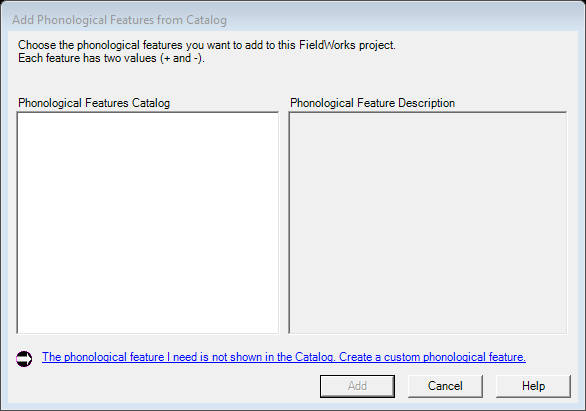

# Create Feature / Value (legacy `MasterInflectionFeatureListDlg` / `MasterPhonologicalFeatureListDlg` blank-create link)

| | |
|---|---|
| **Legacy class** | `SIL.FieldWorks.LexText.Controls.MasterInflectionFeatureListDlg` (`Src/LexText/LexTextControls/MasterInflectionFeatureListDlg.cs`) and `MasterPhonologicalFeatureListDlg` (`Src/LexText/LexTextControls/MasterPhonologicalFeatureListDlg.cs`) — their blank-create link |
| **Area / tool** | Feature-structure editor › inline "create new feature / value" affordance |
| **Primitive(s)** | plain-form (2 fields: Name + Abbreviation) |
| **Canonical reference** | InsertEntryDialog (closest kept canonical for a small plain-form with text fields) |
| **Backed-out Avalonia stub** | `Src/Common/FwAvaloniaDialogs/CreateFeatureDialogView.axaml(.cs)` + `CreateFeatureDialogViewModel.cs` @ git `this branch (recover from history)` |
| **JIRA** | LT-XXXXX |

## What it is
A small dialog to create a new feature or feature value (Name + optional Abbreviation) inline from the
feature-structure editor, without going through the full master feature list. Invoked from the
`FwFeatureStructureEditor` create-feature / add-value affordances.

## What it looks like (before / after)
Legacy "before" captured by the screenshot harness (ScreenshotHarnessTests, option 2). Avalonia "after"
comes from the surface's FwAvaloniaDialogs(Tests) visual test (same data); attach both to the JIRA ticket.

| Legacy (WinForms) — "before" | Avalonia (New) — "after" |
|---|---|
|  |  |
## Behaviour to preserve (parity checklist)
- [ ] Name text field (required).
- [ ] Abbreviation text field (optional).
- [ ] OK gated on a non-empty Name; an in-dialog error message shows when Name is empty.
- [ ] Labels are parameterised for the feature vs. value flows (`NameLabel` / `AbbreviationLabel`).
- [ ] OK (default) / Cancel buttons.

## Migration gotchas
- Stub header: "Phase-1 §19b Stage 3 … the LCModel-free collector behind the inline create affordances of
  `FwFeatureStructureEditor`. It is the Avalonia replacement for the `MasterInflectionFeatureListDlg` /
  `MasterPhonologicalFeatureListDlg` blank-create link".
- PARITY deferral (stub): "the heavy MGA-catalog import path is a documented PARITY deferral — it needs the
  MGA assembly + GlossList XML parsing, outside this stage's clean reach." The Avalonia stub only covers the
  blank-create link, not the full master-catalog import.
- The stub is LCModel-free (a collector); the launcher/wiring applies the result to the model.

## Wiring
- Legacy call site(s): the blank-create link inside the WinForms `MasterInflectionFeatureListDlg` /
  `MasterPhonologicalFeatureListDlg` (`Src/LexText/LexTextControls/`); the Legacy feature-editor path opens
  that master list rather than this small dialog.
- The Avalonia path branched on `UIMode=New` here before back-out: the dialog is invoked via the
  `FwMsaGroupBox` / `FwFeatureStructureEditor` create-feature + add-value events, routed through
  `LcmInflectionFeatureCreateWiring` (`Src/LexText/LexTextControls/LcmInflectionFeatureCreateWiring.cs`).
  Product call sites (CreateFeature / AddValue) of that wiring:
  - `Src/LexText/LexTextControls/LcmMsaCreatorDialogLauncher.cs:252` and `:254`
  - `Src/LexText/LexTextControls/LcmInsertEntryDialogLauncher.cs:555` and `:557`
  - `Src/LexText/LexTextControls/LcmAddNewSenseDialogLauncher.cs:160` and `:162`
  - Launcher: `LcmCreateFeatureLauncher` (`Src/LexText/LexTextControls/LcmCreateFeatureLauncher.cs`).
- Re-wiring target: the `LcmInflectionFeatureCreateWiring` create/add affordances re-enter the Avalonia
  dialog behind `UIMode=New`; Legacy keeps the master-list blank-create link.
