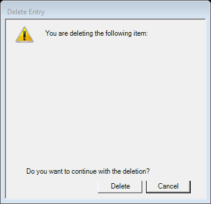

# Delete Confirmation (legacy `ConfirmDeleteObjectDlg`)

| | |
|---|---|
| **Legacy class** | `SIL.FieldWorks.FdoUi.Dialogs.ConfirmDeleteObjectDlg` (`Src/FdoUi/Dialogs/ConfirmDeleteObjectDlg.cs`) |
| **Area / tool** | Lexicon › lexical-reference slice (and other delete-object flows) › "Delete…" confirmation |
| **Primitive(s)** | plain-form (message + gated Delete/Cancel) |
| **Canonical reference** | OptionsDialog (closest kept canonical for a simple message-and-buttons plain form) |
| **Backed-out Avalonia stub** | `Src/Common/FwAvaloniaDialogs/DeleteConfirmationDialogView.axaml(.cs)` + `DeleteConfirmationDialogViewModel.cs` @ git `this branch (recover from history)` |
| **JIRA** | LT-XXXXX |

## What it is
Confirms deletion of an object (e.g. a lexical relation): shows the affected item and asks the user to
continue, with a gated "Delete" button. Opens from delete commands such as the lexical-reference slice.

## What it looks like (before / after)
Legacy "before" captured by the screenshot harness (ScreenshotHarnessTests, option 2). Avalonia "after"
comes from the surface's FwAvaloniaDialogs(Tests) visual test (same data); attach both to the JIRA ticket.

| Legacy (WinForms) — "before" | Avalonia (New) — "after" |
|---|---|
|  |  |
## Behaviour to preserve (parity checklist)
- [ ] Top message ("You are deleting the following item:").
- [ ] Summary of the affected object, shown in bold.
- [ ] Optional note line (orphan / relation wording), hidden when empty.
- [ ] Bottom question ("Do you want to continue…?"), hidden when `CanDelete` is false.
- [ ] Warning icon.
- [ ] Affirmative button is labelled "Delete" (not "OK") and is gated on `CanDelete`.
- [ ] When the object cannot be deleted, the dialog becomes an informational "cannot delete" message (Delete disabled, bottom question hidden).

## Migration gotchas
- Stub header: "Phase-1 §19g".
- PARITY (stub): "the affirmative button is "Delete" (not "OK") and is gated on CanDelete; when the object
  cannot be deleted, the bottom question … is hidden and Delete is disabled — the dialog becomes an
  informational "cannot delete" message." Preserve both the gating and the informational-mode collapse.
- Undo-fencing: deletion runs inside the caller's undo action (e.g. `ksUndoDeleteRelation`); the dialog only
  confirms — the launcher's `Confirm(...)` callback performs the model change.

## Wiring
- Legacy call site(s): the Legacy delete paths in `Src/LexText/LexTextControls/LexReferenceMultiSlice.cs`
  construct the WinForms `ConfirmDeleteObjectDlg` (`Src/FdoUi/Dialogs/ConfirmDeleteObjectDlg.cs`).
- The Avalonia path branched on `UIMode=New` here before back-out:
  `Src/LexText/LexTextControls/LexReferenceMultiSlice.cs:908` and `:987` — `LcmDeleteObjectLauncher.Confirm(...)`
  (one for `TargetsRS.Remove`, one for `DeleteObj`). Launcher: `LcmDeleteObjectLauncher`
  (`Src/LexText/LexTextControls/LcmDeleteObjectLauncher.cs`).
- Re-wiring target: `LexReferenceMultiSlice` delete paths re-enter the Avalonia dialog behind `UIMode=New`;
  Legacy keeps `ConfirmDeleteObjectDlg`.
