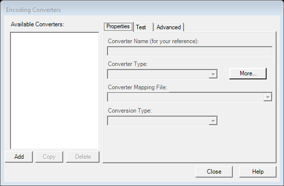
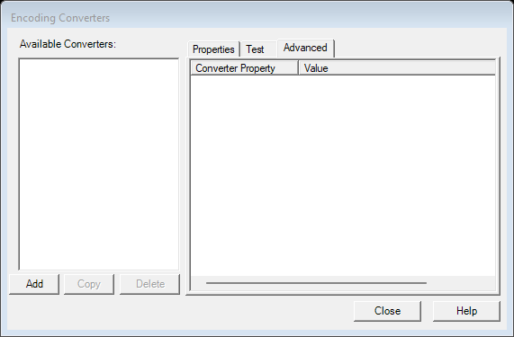
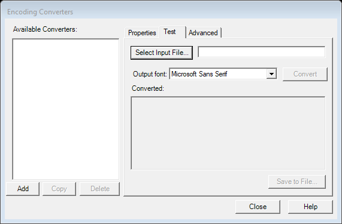

# Add / Configure Encoding Converter (`AddCnvtrDlg`)

| | |
|---|---|
| **Legacy class** | `SIL.FieldWorks.FwCoreDlgs.AddCnvtrDlg` (`Src/FwCoreDlgs/AddCnvtrDlg.cs`) |
| **Area** | App-wide (encoding converters) |
| **Type** | dialog |
| **Primitive** | TABS |
| **State** | legacy |
| **Phase** | 1 |
| **Canonical reference** | tabs→OptionsDialog |
| **JIRA** | LT-XXXXX |

## What it looks like (before / after)
Legacy "before" captured by the screenshot harness (ScreenshotHarnessTests, option 2). Avalonia "after"
comes from the surface's FwAvaloniaDialogs(Tests) visual test (same data); attach both to the JIRA ticket.

| Legacy (WinForms) — "before" | Avalonia (New) — "after" |
|---|---|
|  |  |

Tabs (legacy):

  
## What it is
The dialog for adding/configuring encoding converters.

## Notes / gotchas
- Hosts owned sub-controls `CnvtrPropertiesCtrl` (converter properties editor), `AdvancedEncProps` (advanced encoding properties), and `ConverterTester` (a live test pane that is Views-coupled — its `SampleView : SimpleRootSite` renders converted text). Fold these controls into this dialog's migration.
- Views-coupled via the embedded converter test pane.

> Stub. Deepen using `Docs/migration/_TEMPLATE.md` (capture legacy PNGs via the `fieldworks-winapp` skill) when this ticket is picked up.
