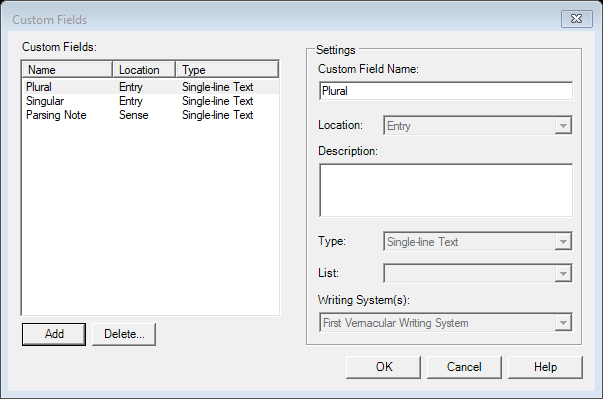

# Add Custom Field (`AddCustomFieldDlg`)

| | |
|---|---|
| **Legacy class** | `SIL.FieldWorks.XWorks.AddCustomFieldDlg` (`Src/xWorks/AddCustomFieldDlg.cs`) |
| **Area** | Lexicon |
| **Type** | dialog |
| **Primitive** | TABLE |
| **State** | legacy |
| **Phase** | 1 |
| **Canonical reference** | ChooserDialog (list/table of fields with add/edit/delete) |
| **JIRA** | LT-XXXXX |

## What it looks like (before / after)
Legacy "before" captured by the screenshot harness (ScreenshotHarnessTests, option 2). Avalonia "after"
comes from the surface's FwAvaloniaDialogs(Tests) visual test (same data); attach both to the JIRA ticket.

| Legacy (WinForms) — "before" | Avalonia (New) — "after" |
|---|---|
|  |  |
## What it is
Lets the user add and manage custom fields on a class; shows existing custom fields in a `ListView` and edits the selected field's name/type/writing-system properties.

## Notes / gotchas
- Built entirely in code (no `.Designer.cs`); `ListView` (`m_fieldsListView`) drives a master-detail layout with the field editor controls below.
- Field type/WS controls are interdependent (selecting a type enables/disables WS pickers) — preserve the enable/disable logic.

> Stub. Deepen using `Docs/migration/_TEMPLATE.md` (capture legacy PNGs via the `fieldworks-winapp` skill) when this ticket is picked up.
