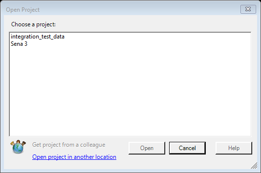

# Choose Language Project (`ChooseLangProjectDialog`)

| | |
|---|---|
| **Legacy class** | `SIL.FieldWorks.FwCoreDlgs.ChooseLangProjectDialog` (`Src/FwCoreDlgs/ChooseLangProjectDialog.cs`) |
| **Area** | App-wide (project open / Send-Receive) |
| **Type** | dialog |
| **Primitive** | plain-form (search + list) |
| **State** | legacy |
| **Phase** | 1 |
| **Canonical reference** | search+list→EntryGoDialog |
| **JIRA** | LT-XXXXX |

## What it looks like (before / after)
Legacy "before" captured by the screenshot harness (ScreenshotHarnessTests, option 2). Avalonia "after"
comes from the surface's FwAvaloniaDialogs(Tests) visual test (same data); attach both to the JIRA ticket.

| Legacy (WinForms) — "before" | Avalonia (New) — "after" |
|---|---|
|  |  |
## What it is
Lets the user pick a language project to open — local projects, networked projects, or projects obtained via Send/Receive. Presents a ListBox of available projects.

## Notes / gotchas
- ListBox-of-projects picker (`m_lstLanguageProjects`); no tabs.

> Stub. Deepen using `Docs/migration/_TEMPLATE.md` (capture legacy PNGs via the `fieldworks-winapp` skill) when this ticket is picked up.
