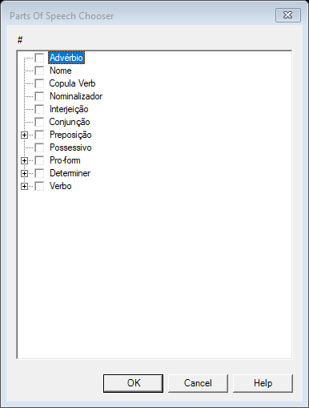

# Chooser (`FwChooserDlg`)

| | |
|---|---|
| **Legacy class** | `SIL.FieldWorks.FwCoreDlgs.FwChooserDlg` (`Src/FwCoreDlgs/FwChooserDlg.cs`) |
| **Area** | App-wide (possibility/list chooser) |
| **Type** | dialog |
| **Primitive** | TREE |
| **State** | legacy |
| **Phase** | 1 |
| **Canonical reference** | tree/multi-select/picker→ChooserDialog |
| **JIRA** | LT-XXXXX |

## What it looks like (before / after)
Legacy "before" captured by the screenshot harness (ScreenshotHarnessTests, option 2). Avalonia "after"
comes from the surface's FwAvaloniaDialogs(Tests) visual test (same data); attach both to the JIRA ticket.

| Legacy (WinForms) — "before" | Avalonia (New) — "after" |
|---|---|
|  |  |
## What it is
A general-purpose chooser for `ICmPossibility` items (implements `ISettings`, `ICmPossibilitySupplier`).

## Notes / gotchas
- Hosts the owned `ChooserTreeView` (a `TriStateTreeView`). Fold into this dialog's migration.
- Tri-state tree selection of possibility-list items.

> Stub. Deepen using `Docs/migration/_TEMPLATE.md` (capture legacy PNGs via the `fieldworks-winapp` skill) when this ticket is picked up.
