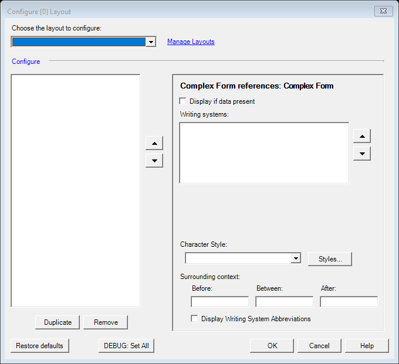

# Dictionary Config Manager (legacy XML) (`DictionaryConfigMgrDlg`)

| | |
|---|---|
| **Legacy class** | `SIL.FieldWorks.XWorks.DictionaryConfigMgrDlg` (`Src/xWorks/DictionaryConfigMgrDlg.cs`) |
| **Area** | Dictionary-config |
| **Type** | dialog |
| **Primitive** | TABLE |
| **State** | legacy |
| **Phase** | 1 |
| **Canonical reference** | ChooserDialog (list of named configurations with rename/copy/delete) |
| **JIRA** | LT-XXXXX |

## What it looks like (before / after)
Legacy "before" captured by the screenshot harness (ScreenshotHarnessTests, option 2). Avalonia "after"
comes from the surface's FwAvaloniaDialogs(Tests) visual test (same data); attach both to the JIRA ticket.

| Legacy (WinForms) — "before" | Avalonia (New) — "after" |
|---|---|
|  |  |
## What it is
MVP "view" for managing stored dictionary configurations (rename/copy/delete/select). Displays the configurations in a `ListView` and reports user actions to `DictionaryConfigManager`. Implements `IDictConfigViewer`.

## Notes / gotchas
- This is the OLDER manager, tied to the legacy XML configure path: newed only from `Src/xWorks/XmlDocConfigureDlg.cs:4368`. The newer equivalent is `DictionaryConfigurationManagerDlg` (`dictionary-configuration-manager.md`). Confirm on pickup which one survives; this one may retire with `XmlDocConfigureDlg`.
- `ListView` items are a custom `VisibleListItem : ListViewItem`.

> Stub. Deepen using `Docs/migration/_TEMPLATE.md` (capture legacy PNGs via the `fieldworks-winapp` skill) when this ticket is picked up.
