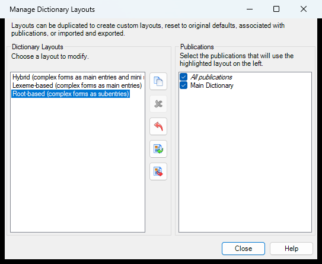

# Dictionary Configuration Manager (`DictionaryConfigurationManagerDlg`)

| | |
|---|---|
| **Legacy class** | `SIL.FieldWorks.XWorks.DictionaryConfigurationManagerDlg` (`Src/xWorks/DictionaryConfigurationManagerDlg.cs`) |
| **Area** | Dictionary-config |
| **Type** | dialog |
| **Primitive** | TABLE |
| **State** | legacy |
| **Phase** | 1 |
| **Canonical reference** | ChooserDialog (list of configurations with rename/copy/delete/import/export) |
| **JIRA** | LT-XXXXX |

## What it is
Manages the set of dictionary configurations (rename, copy, delete, import, export) shown in a `ListView` (`configurationsListView`). The "Manage Configurations" sub-dialog launched from the Configure Dictionary dialog.

## What it looks like (before / after)
Legacy "before" captured live (Capture-MenuDialogs.ps1, option 2b) by opening Configure Dictionary
(Tools→Configure) then clicking the **Manage Layouts…** button — the in-modal `postClicks` path. Avalonia
"after" comes from the surface's FwAvaloniaDialogs(Tests) visual test; attach both to the JIRA ticket.

| Legacy (WinForms) — "before" | Avalonia (New) — "after" |
|---|---|
|  |  |

## Notes / gotchas
- The CURRENT manager (newer than `DictionaryConfigMgrDlg`); newed from `Src/xWorks/DictionaryConfigurationController.cs:367`. Logic lives in `DictionaryConfigurationManagerController`.
- Manipulates per-item fonts (bold = current) and focus handlers on the `ListView`.
- Import/export flows reach `DictionaryConfigurationImportDlg` and controller export code.

> Stub. Deepen using `Docs/migration/_TEMPLATE.md` (capture legacy PNGs via the `fieldworks-winapp` skill) when this ticket is picked up.
