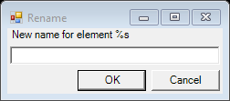

# Dictionary Configuration Node Rename (`DictionaryConfigurationNodeRenameDlg`)

| | |
|---|---|
| **Legacy class** | `SIL.FieldWorks.XWorks.DictionaryConfigurationNodeRenameDlg` (`Src/xWorks/DictionaryConfigurationNodeRenameDlg.cs`) |
| **Area** | Dictionary-config |
| **Type** | dialog |
| **Primitive** | plain-form |
| **State** | legacy |
| **Phase** | 1 |
| **Canonical reference** | plain-form (nearest: OptionsDialog) |
| **JIRA** | LT-XXXXX |

## What it looks like (before / after)
Legacy "before" captured by the screenshot harness (ScreenshotHarnessTests, option 2). Avalonia "after"
comes from the surface's FwAvaloniaDialogs(Tests) visual test (same data); attach both to the JIRA ticket.

| Legacy (WinForms) — "before" | Avalonia (New) — "after" |
|---|---|
|  |  |
## What it is
Small single-field dialog to rename a node (duplicate label) in the dictionary configuration tree; inserts the node value into the description text.

## Notes / gotchas
- Trivial plain-form (label + textbox + OK/Cancel) launched from the configuration tree context.

> Stub. Deepen using `Docs/migration/_TEMPLATE.md` (capture legacy PNGs via the `fieldworks-winapp` skill) when this ticket is picked up.
