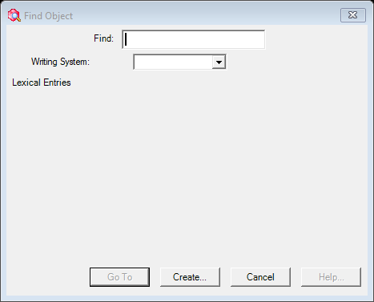

# Go To Entry (`EntryGoDlg`)

| | |
|---|---|
| **Legacy class** | `SIL.FieldWorks.LexText.Controls.EntryGoDlg` (`Src/LexText/LexTextControls/EntryGoDlg.cs`) |
| **Area** | Lexicon |
| **Type** | dialog (search + matching-entries list) |
| **Primitive** | search + list selector |
| **State** | coexist — the Avalonia **EntryGoDialog** is a KEPT canonical screen (see [README](../README.md)) |
| **JIRA** | LT-XXXXX (canonical reference — not a deferred port) |

Legacy "before" baseline for the kept-canonical Avalonia `EntryGoDialog`. Harness captures the dialog
CHROME (ctor-only); the live matching-entries search-browse populates only in the running app.

## Notes / gotchas
- Base of the GoDlg family (the abstract BaseGoDlg): the matching-entries browser is a live XMLView/SearchEngine.

## What it looks like (before / after)
Legacy "before" captured by the screenshot harness (ScreenshotHarnessTests, option 2). Avalonia "after"
comes from the surface's FwAvaloniaDialogs(Tests) visual test (same data); attach both to the JIRA ticket.

| Legacy (WinForms) — "before" | Avalonia (New) — "after" |
|---|---|
|  |  |
## What it looks like (before / after)
Legacy "before" captured by the screenshot harness (ScreenshotHarnessTests, option 2). Avalonia "after"
comes from the surface's FwAvaloniaDialogs(Tests) visual test (same data); attach both to the JIRA ticket.

| Legacy (WinForms) — "before" | Avalonia (New) — "after" |
|---|---|
|  |  |
