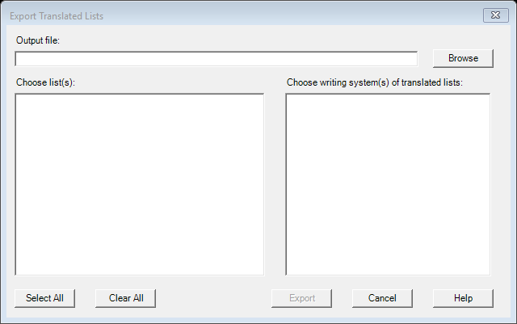

# Export Translated Lists (`ExportTranslatedListsDlg`)

| | |
|---|---|
| **Legacy class** | `SIL.FieldWorks.XWorks.ExportTranslatedListsDlg` (`Src/xWorks/ExportTranslatedListsDlg.cs`) |
| **Area** | Lists |
| **Type** | dialog |
| **Primitive** | MULTI-SELECTOR |
| **State** | legacy |
| **Phase** | 1 |
| **Canonical reference** | ChooserDialog (checked multi-select of lists + writing systems) |
| **JIRA** | LT-XXXXX |

## What it looks like (before / after)
Legacy "before" captured by the screenshot harness (ScreenshotHarnessTests, option 2). Avalonia "after"
comes from the surface's FwAvaloniaDialogs(Tests) visual test (same data); attach both to the JIRA ticket.

| Legacy (WinForms) — "before" | Avalonia (New) — "after" |
|---|---|
|  |  |
## What it is
Lets the user select specific lists to export and the specific writing systems to include, via two checkbox `ListView`s (`m_lvLists`, `m_lvWritingSystems`).

## Notes / gotchas
- Two parallel checkbox lists (lists + writing systems) using `ListView.CheckedItems`; column widths are computed from list width at load — preserve checked-item collection semantics.

> Stub. Deepen using `Docs/migration/_TEMPLATE.md` (capture legacy PNGs via the `fieldworks-winapp` skill) when this ticket is picked up.
