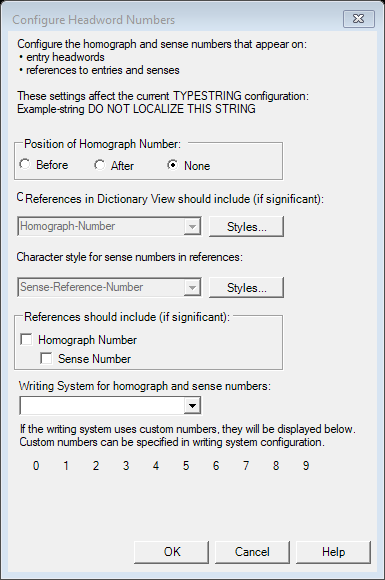

# Headword Numbers (`HeadwordNumbersDlg`)

| | |
|---|---|
| **Legacy class** | `SIL.FieldWorks.XWorks.HeadwordNumbersDlg` (`Src/xWorks/HeadWordNumbersDlg.cs`) |
| **Area** | Dictionary-config |
| **Type** | dialog |
| **Primitive** | plain-form |
| **State** | legacy |
| **Phase** | 1 |
| **Canonical reference** | plain-form (nearest: OptionsDialog) |
| **JIRA** | LT-XXXXX |

## What it looks like (before / after)
Legacy "before" captured by the screenshot harness (ScreenshotHarnessTests, option 2). Avalonia "after"
comes from the surface's FwAvaloniaDialogs(Tests) visual test (same data); attach both to the JIRA ticket.

| Legacy (WinForms) — "before" | Avalonia (New) — "after" |
|---|---|
|  |  |
## What it is
Configures the display and manipulation of homograph/headword numbers (style, before/after text, subentry options). Implements `IHeadwordNumbersView` (MVC view).

## Notes / gotchas
- Has a "Styles..." button that opens the style chooser; raises an event passing the style `ComboBox` as sender so the controller can update it — preserve the styles round-trip.
- Behaviour lives in the controller; the dialog is the view surface.

> Stub. Deepen using `Docs/migration/_TEMPLATE.md` (capture legacy PNGs via the `fieldworks-winapp` skill) when this ticket is picked up.
