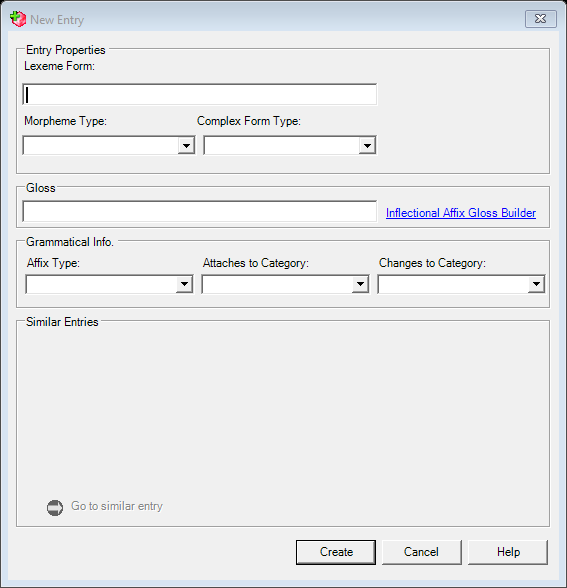

# Insert Entry (`InsertEntryDlg`)

| | |
|---|---|
| **Legacy class** | `SIL.FieldWorks.LexText.Controls.InsertEntryDlg` (`Src/LexText/LexTextControls/InsertEntryDlg.cs`) |
| **Area** | Lexicon |
| **Type** | dialog |
| **Primitive** | owned-control form (multi-WS lexeme/gloss + morph-type picker + MSA group box + matching-entries list) |
| **State** | coexist — the Avalonia **InsertEntryDialog** is a KEPT canonical screen (see [README](../README.md)) |
| **JIRA** | LT-XXXXX (canonical reference — not a deferred port) |

This is the legacy "before" baseline for the kept-canonical Avalonia `InsertEntryDialog`. The harness
captures the dialog CHROME (ctor-only); its live "matching entries" search-browse populates only in the
running app, so the populated results list is captured live / on pickup.

## Notes / gotchas
- Owned controls: `FwMultiWsTextField` (lexeme form + gloss), `FwOptionPicker` (morph type), `FwMsaGroupBox`.
- The matching-entries list is the live search-browse (XMLView) — see the matching-entries note in `capture-ledger.md`.

## What it looks like (before / after)
Legacy "before" captured by the screenshot harness (ScreenshotHarnessTests, option 2). Avalonia "after"
comes from the surface's FwAvaloniaDialogs(Tests) visual test (same data); attach both to the JIRA ticket.

| Legacy (WinForms) — "before" | Avalonia (New) — "after" |
|---|---|
|  |  |
## What it looks like (before / after)
Legacy "before" captured by the screenshot harness (ScreenshotHarnessTests, option 2). Avalonia "after"
comes from the surface's FwAvaloniaDialogs(Tests) visual test (same data); attach both to the JIRA ticket.

| Legacy (WinForms) — "before" | Avalonia (New) — "after" |
|---|---|
|  |  |
