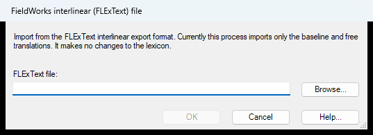

# Interlinear Import (`InterlinearImportDlg`)

| | |
|---|---|
| **Legacy class** | `SIL.FieldWorks.IText.InterlinearImportDlg` (`Src/LexText/Interlinear/InterlinearImportDlg.cs`) |
| **Area** | Texts&Words |
| **Type** | dialog |
| **Primitive** | plain-form |
| **State** | legacy |
| **Phase** | 1 |
| **Canonical reference** | InsertEntryDialog |
| **JIRA** | LT-XXXXX |

## What it looks like (before / after)
Legacy "before" captured by the screenshot harness (ScreenshotHarnessTests, option 2). Avalonia "after"
comes from the surface's FwAvaloniaDialogs(Tests) visual test (same data); attach both to the JIRA ticket.

| Legacy (WinForms) — "before" | Avalonia (New) — "after" |
|---|---|
|  |  |
## What it is
Imports interlinear text (FlexText) into the project.

## Notes / gotchas
- Implements IFwExtension (loaded as a tool extension).
- Uses FileDialog wrappers (SIL.FieldWorks.Common.Controls.FileDialog).

> Stub. Deepen using `Docs/migration/_TEMPLATE.md` (capture legacy PNGs via the `fieldworks-winapp` skill) when this ticket is picked up.

