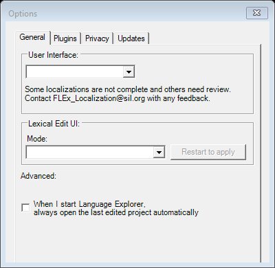
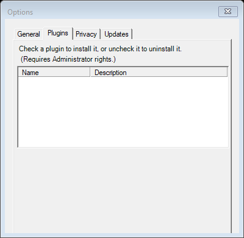
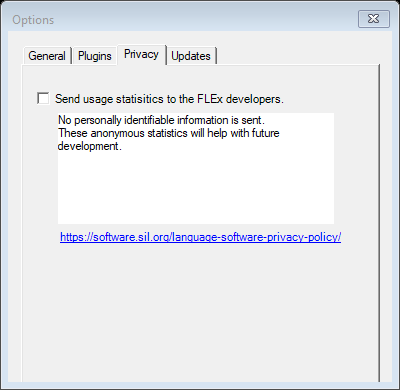
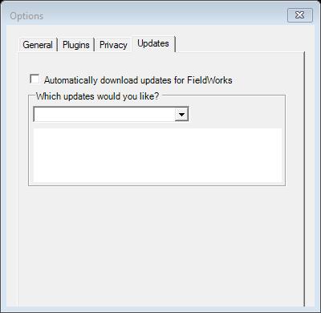

# Tools → Options (`LexOptionsDlg`)

| | |
|---|---|
| **Legacy class** | `SIL.FieldWorks.XWorks.LexText.LexOptionsDlg` (`Src/LexText/LexTextControls/LexOptionsDlg.cs`) |
| **Area** | App-wide |
| **Type** | dialog (TABS) |
| **Primitive** | tabs |
| **State** | coexist — the Avalonia **OptionsDialog** is a KEPT canonical screen (see [README](../README.md)) |
| **JIRA** | LT-XXXXX (canonical reference — not a deferred port) |

Legacy "before" baseline for the kept-canonical Avalonia `OptionsDialog`. Captured with all tabs
(General / Plugins / Privacy / Updates).

## Notes / gotchas
- Canonical TABS example; the Avalonia `OptionsDialog` replaces it (live UI-mode apply, no restart).

## What it looks like (before / after)
Legacy "before" captured by the screenshot harness (ScreenshotHarnessTests, option 2). Avalonia "after"
comes from the surface's FwAvaloniaDialogs(Tests) visual test (same data); attach both to the JIRA ticket.

| Legacy (WinForms) — "before" | Avalonia (New) — "after" |
|---|---|
|  |  |

Tabs (legacy):

   
## What it looks like (before / after)
Legacy "before" captured by the screenshot harness (ScreenshotHarnessTests, option 2). Avalonia "after"
comes from the surface's FwAvaloniaDialogs(Tests) visual test (same data); attach both to the JIRA ticket.

| Legacy (WinForms) — "before" | Avalonia (New) — "after" |
|---|---|
|  |  |

Tabs (legacy):

   
