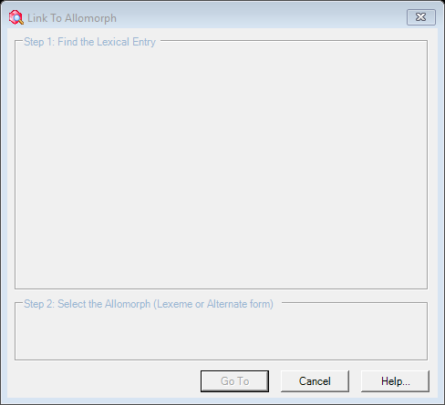

# Link Allomorph (`LinkAllomorphDlg`)

| | |
|---|---|
| **Legacy class** | `SIL.FieldWorks.LexText.Controls.LinkAllomorphDlg` (`Src/LexText/LexTextControls/LinkAllomorphDlg.cs`) |
| **Area** | Lexicon |
| **Type** | dialog |
| **Primitive** | search+list |
| **State** | coexist |
| **Phase** | 1 |
| **Canonical reference** | EntryGoDialog |
| **JIRA** | LT-XXXXX |

## What it looks like (before / after)
Legacy "before" captured by the screenshot harness (ScreenshotHarnessTests, option 2). Avalonia "after"
comes from the surface's FwAvaloniaDialogs(Tests) visual test (same data); attach both to the JIRA ticket.

| Legacy (WinForms) — "before" | Avalonia (New) — "after" |
|---|---|
|  |  |
## What it is
Search for and select an existing allomorph to link to.

## Notes / gotchas
- Subclass of EntryGoDlg. State=coexist: Avalonia path is LcmLinkAllomorphDialogLauncher under UIMode=New.

> Stub. Deepen using `Docs/migration/_TEMPLATE.md` (capture legacy PNGs via the `fieldworks-winapp` skill) when this ticket is picked up.

