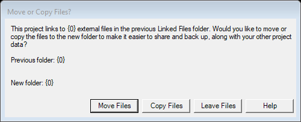

# Move or Copy Files (`MoveOrCopyFilesDlg`)

| | |
|---|---|
| **Legacy class** | `SIL.FieldWorks.FwCoreDlgs.MoveOrCopyFilesDlg` (`Src/FwCoreDlgs/MoveOrCopyFilesDlg.cs`) |
| **Area** | App-wide (linked files) |
| **Type** | dialog |
| **Primitive** | plain-form |
| **State** | legacy |
| **Phase** | 1 |
| **Canonical reference** | plain-form→nearest |
| **JIRA** | LT-XXXXX |

## What it looks like (before / after)
Legacy "before" captured by the screenshot harness (ScreenshotHarnessTests, option 2). Avalonia "after"
comes from the surface's FwAvaloniaDialogs(Tests) visual test (same data); attach both to the JIRA ticket.

| Legacy (WinForms) — "before" | Avalonia (New) — "after" |
|---|---|
|  |  |
## What it is
Asks what to do with files when `LangProject.LinkedFilesRootDir` changes, or when linking a file from outside that root — move, copy into the linked-files root, or leave in place.

## Notes / gotchas
- Driven by `MoveOrCopyFilesController` (folds in); choice/radio-button style decision dialog.

> Stub. Deepen using `Docs/migration/_TEMPLATE.md` (capture legacy PNGs via the `fieldworks-winapp` skill) when this ticket is picked up.
