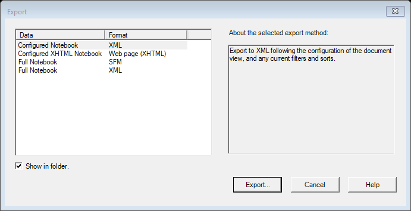

# Notebook Export (`NotebookExportDialog`)

| | |
|---|---|
| **Legacy class** | `SIL.FieldWorks.XWorks.NotebookExportDialog` (`Src/xWorks/NotebookExportDialog.cs`) |
| **Area** | App-wide (Data Notebook) |
| **Type** | dialog |
| **Primitive** | TABLE |
| **State** | legacy |
| **Phase** | 1 |
| **Canonical reference** | ChooserDialog (list of export formats + Export action) |
| **JIRA** | LT-XXXXX |

## What it looks like (before / after)
Legacy "before" captured by the screenshot harness (ScreenshotHarnessTests, option 2). Avalonia "after"
comes from the surface's FwAvaloniaDialogs(Tests) visual test (same data); attach both to the JIRA ticket.

| Legacy (WinForms) — "before" | Avalonia (New) — "after" |
|---|---|
|  |  |
## What it is
Subclass of `ExportDialog` that overrides export behaviour to export from the Data Notebook section of Language Explorer.

## Notes / gotchas
- Inherits the `ExportDialog` `ListView`/config-file surface (`export-dialog.md`); only `ConfigureItem` and the export process differ. Migrate together with `ExportDialog` as a configured variant.

> Stub. Deepen using `Docs/migration/_TEMPLATE.md` (capture legacy PNGs via the `fieldworks-winapp` skill) when this ticket is picked up.
