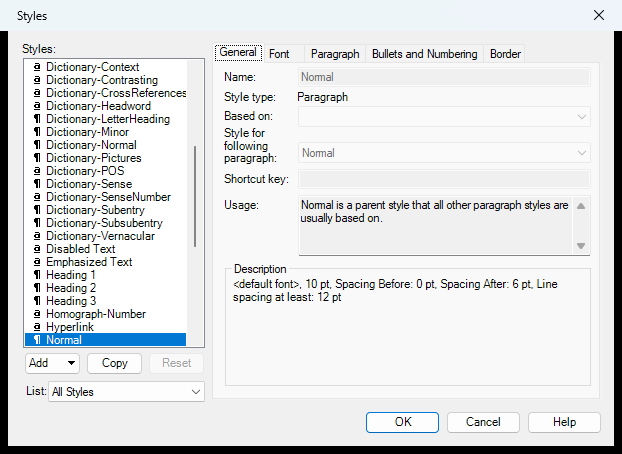

# Styles (`FwStylesDlg`)

| | |
|---|---|
| **Legacy class** | `SIL.FieldWorks.FwCoreDlgs.FwStylesDlg` (`Src/FwCoreDlgs/FwStylesDlg.cs`) |
| **Area** | App-wide (styles) |
| **Type** | dialog |
| **Primitive** | TABS |
| **State** | legacy |
| **Phase** | 1 |
| **Canonical reference** | tabs→OptionsDialog |
| **JIRA** | LT-XXXXX |

## What it looks like (before / after)
Legacy "before" captured by the screenshot harness (ScreenshotHarnessTests, option 2). Avalonia "after"
comes from the surface's FwAvaloniaDialogs(Tests) visual test (same data); attach both to the JIRA ticket.

| Legacy (WinForms) — "before" | Avalonia (New) — "after" |
|---|---|
|  |  |
## What it is
The (new) Styles dialog — create, edit, and organize paragraph/character styles for the project.

## Notes / gotchas
- Views-coupled (hosts a live style preview / `IVwRootSite`).
- Hosts the owned `IStylesTab` tab controls (`FwGeneralTab`, `FwFontTab`, `FwParagraphTab`, `FwBulletsTab`, `FwBorderTab`) plus style-list helpers and `StyleInfo`. Fold these into this dialog's migration.
- Includes an `UndoStyleChangesAction` (undo integration).

> Stub. Deepen using `Docs/migration/_TEMPLATE.md` (capture legacy PNGs via the `fieldworks-winapp` skill) when this ticket is picked up.
