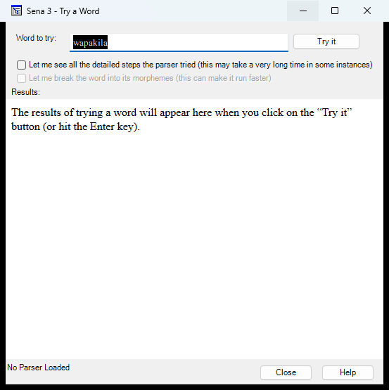

# Try A Word (`TryAWordDlg`)

| | |
|---|---|
| **Legacy class** | `SIL.FieldWorks.LexText.Controls.TryAWordDlg` (`Src/LexText/ParserUI/TryAWordDlg.cs`) |
| **Area** | Grammar |
| **Type** | dialog |
| **Primitive** | owned-control |
| **State** | legacy |
| **Phase** | 1 |
| **Canonical reference** | InsertEntryDialog |
| **JIRA** | LT-XXXXX |

## What it looks like (before / after)
Legacy "before" captured by the screenshot harness (ScreenshotHarnessTests, option 2). Avalonia "after"
comes from the surface's FwAvaloniaDialogs(Tests) visual test (same data); attach both to the JIRA ticket.

| Legacy (WinForms) — "before" | Avalonia (New) — "after" |
|---|---|
|  |  |
## What it is
Runs the parser on a single word and shows the trace/results.

## Notes / gotchas
- Implements IMediatorProvider + IPropertyTableProvider (hosts its own mediator). Hosts a trace/results view (Views-coupled). Modeless-style parser tool.

> Stub. Deepen using `Docs/migration/_TEMPLATE.md` (capture legacy PNGs via the `fieldworks-winapp` skill) when this ticket is picked up.

