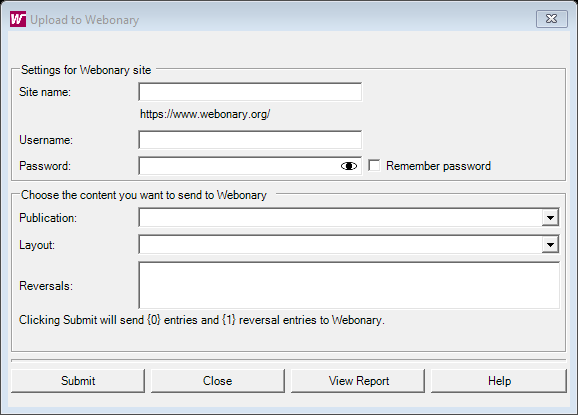

# Upload to Webonary (`UploadToWebonaryDlg`)

| | |
|---|---|
| **Legacy class** | `SIL.FieldWorks.XWorks.UploadToWebonaryDlg` (`Src/xWorks/UploadToWebonaryDlg.cs`) |
| **Area** | Dictionary-config |
| **Type** | dialog |
| **Primitive** | MULTI-SELECTOR |
| **State** | legacy |
| **Phase** | 1 |
| **Canonical reference** | ChooserDialog (credentials + checked multi-select of reversals/publications) |
| **JIRA** | LT-XXXXX |

## What it looks like (before / after)
Legacy "before" captured by the screenshot harness (ScreenshotHarnessTests, option 2). Avalonia "after"
comes from the surface's FwAvaloniaDialogs(Tests) visual test (same data); attach both to the JIRA ticket.

| Legacy (WinForms) — "before" | Avalonia (New) — "after" |
|---|---|
|  |  |
## What it is
Dialog for publishing dictionary data to the Webonary web site: site/credentials, publication and configuration choice, and a checkbox list of reversals (`reversalsCheckedListBox`) to include. Implements `IUploadToWebonaryView` (MVC view).

## Notes / gotchas
- `CheckedListBox` of reversals (checked-item state must round-trip to/from saved project settings).
- Performs network upload; needs `HelpTopicProvider` and saves project-specific settings. Logic in the Webonary controller/model (`UploadToWebonaryModel`, `WebonaryClient`).
- Pairs with `WebonaryLogViewer` for results.

> Stub. Deepen using `Docs/migration/_TEMPLATE.md` (capture legacy PNGs via the `fieldworks-winapp` skill) when this ticket is picked up.
