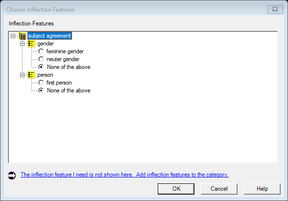

# Feature-Value Chooser (legacy `MsaInflectionFeatureListDlg` / `PhonologicalFeatureChooserDlg`)

| | |
|---|---|
| **Legacy class** | `SIL.FieldWorks.LexText.Controls.MsaInflectionFeatureListDlg` (`Src/LexText/LexTextControls/MsaInflectionFeatureListDlg.cs`) and `PhonologicalFeatureChooserDlg` (`Src/LexText/LexTextControls/PhonologicalFeatureChooserDlg.cs`) |
| **Area / tool** | Lexicon / Grammar › inflection-feature slice and phonological-feature slice › feature-value chooser |
| **Primitive(s)** | picker (owned `FwFeatureStructureEditor` feature-value tree) |
| **Canonical reference** | ChooserDialog (tree / multi-select picker) |
| **Backed-out Avalonia stub** | `Src/Common/FwAvaloniaDialogs/FeatureChooserDialogView.axaml(.cs)` + `FeatureChooserDialogViewModel.cs` @ git `this branch (recover from history)` |
| **JIRA** | LT-XXXXX |

## What it is
A standalone feature-structure chooser: assigns feature values to an MSA's `IFsFeatStruc` (inflection
features) or to the phonological feature system. Opens from the inflection-feature slice and the
phonological-feature slice. **PARTIAL completeness** — see gotchas.

## What it looks like
<!-- CAPTURE: launch legacy FLEx (UIMode=Legacy), open a sense's inflection-feature slice
     and click its chooser button. See .claude/skills/fieldworks-winapp. -->
 <!-- TODO: capture -->

## Behaviour to preserve (parity checklist)
- [ ] Optional instruction prompt at top (may be empty).
- [ ] Owned `FwFeatureStructureEditor`: hierarchical feature system with per-feature value assignment.
- [ ] No OK gate — an empty assignment set (every feature "<None>") is the valid "delete the FS / unspecified" outcome (matches both legacy dialogs).
- [ ] Help button shown only when a help topic is available.

## Migration gotchas
- The single Avalonia chooser stands in for **two** legacy dialogs (inflection + phonological), driven by
  two launchers (`LcmInflectionFeatureChooserLauncher`, `LcmPhonologicalFeatureChooserLauncher`).
- Stub header: "Phase-1 §19b Stage 3 … the Avalonia replacement for the WinForms MsaInflectionFeatureListDlg
  … and PhonologicalFeatureChooserDlg".
- PARTIAL — PARITY (from `LcmPhonologicalFeatureChooserLauncher.cs`): "the legacy dialog can also drive
  phonological-RULE feature CONSTRAINTS (agree/disagree polarity over IPhFeatureConstraint), used only from
  the rule-formula control. That polarity surface is NOT ported here." Re-wiring the rule-formula constraint
  path is out of scope for the bounded port.
- Inline create-feature / add-value affordances are wired through `LcmInflectionFeatureCreateWiring`.

## Wiring
- Legacy call site(s): `Src/LexText/LexTextControls/MsaInflectionFeatureListDlgLauncher.cs` and
  `PhonologicalFeatureListDlgLauncher.cs` — the Legacy branches construct the WinForms
  `MsaInflectionFeatureListDlg` / `PhonologicalFeatureChooserDlg`.
- The Avalonia path branched on `UIMode=New` here before back-out:
  - inflection: `Src/LexText/LexTextControls/MsaInflectionFeatureListDlgLauncher.cs:176` —
    `LcmInflectionFeatureChooserLauncher.ShowForOwner(...)`.
  - phonological: `Src/LexText/LexTextControls/PhonologicalFeatureListDlgLauncher.cs:124` —
    `LcmPhonologicalFeatureChooserLauncher.Show(...)`.
  - Launchers: `LcmInflectionFeatureChooserLauncher` / `LcmPhonologicalFeatureChooserLauncher`
    (`Src/LexText/LexTextControls/`).
- Re-wiring target: both launchers re-enter the Avalonia chooser behind `UIMode=New`; Legacy keeps
  `MsaInflectionFeatureListDlg` / `PhonologicalFeatureChooserDlg`.
