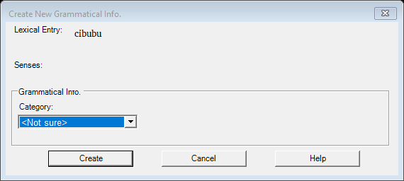

# Create Grammatical Info / MSA (legacy `MsaCreatorDlg`)

| | |
|---|---|
| **Legacy class** | `SIL.FieldWorks.LexText.Controls.MsaCreatorDlg` (`Src/LexText/LexTextControls/MsaCreatorDlg.cs`) |
| **Area / tool** | Lexicon › sense grammatical-info slice › "Create New Grammatical Info." |
| **Primitive(s)** | owned-control form (FwMsaGroupBox) |
| **Canonical reference** | InsertEntryDialog (owned-control form hosting a FwMsaGroupBox) |
| **Backed-out Avalonia stub** | `Src/Common/FwAvaloniaDialogs/MsaCreatorDialogView.axaml(.cs)` + `MsaCreatorDialogViewModel.cs` @ git `this branch (recover from history)` |
| **JIRA** | LT-XXXXX |

## What it is
Lets the user create (or edit) the grammatical info / morpho-syntactic analysis (MSA) for a sense:
choose the POS, slot, inflection class, and inflection features. Opens from the MSA slice and from the
interlinear MSA popup. Returns a `SandboxGenericMSA` for the caller to apply.

## What it looks like (before / after)
Legacy "before" captured by the screenshot harness (ScreenshotHarnessTests, option 2). Avalonia "after"
comes from the surface's FwAvaloniaDialogs(Tests) visual test (same data); attach both to the JIRA ticket.

| Legacy (WinForms) — "before" | Avalonia (New) — "after" |
|---|---|
|  |  |
## Behaviour to preserve (parity checklist)
- [ ] Read-only lexical-entry headword shown at top.
- [ ] Read-only senses summary shown on the edit path.
- [ ] Owned `FwMsaGroupBox`: POS choosers, slot picker, inflection-class picker, inflection-feature editor.
- [ ] No OK gate — the box always has a valid grammatical-info class (matches the legacy dialog).
- [ ] Help button shown only when a help topic is available.

## Migration gotchas
- Owned-control hosting: the stub mounts `FwMsaGroupBox` and stages edits into `InMemoryRegionEditContext`.
- The stub header marks this an "MSA-port Stage 5 replacement for the legacy MsaCreatorDlg in New-UI mode"
  and notes "Like the legacy dialog there is NO OK gate (the box always has a valid grammatical-info class)".
- PARITY (from `LcmMsaCreatorDialogLauncher.cs`): "the legacy dialog has two consumers with DIFFERENT apply
  branches — MSAPopupTreeManager does `m_sense.SandboxMSA = dlg.SandboxMSA` (find-or-create on a sense) and
  MSADlgLauncher does `originalMsa.UpdateOrReplace(dlg.SandboxMSA)` (modify an existing MSA)".
- PARITY (Stage 6 inflection class): "this launcher produces a `SandboxGenericMSA` for the CALLER to apply …
  and does NOT itself mutate the model." Re-wiring must preserve the caller-applies contract.
- Stub markers: `// Stage 3 wires the feature dialogs` and `// §19b Stage 3: wire the inline create-feature
  / add-value affordances (replacing the deferred no-op)`.

## Wiring
- Legacy call site(s): `Src/LexText/Lexicon/MSADlgLauncher.cs` — the Legacy branch constructs the WinForms
  `MsaCreatorDlg` (the second consumer, `MSAPopupTreeManager`, has its own Legacy construction).
- The Avalonia path branched on `UIMode=New` here before back-out: `Src/LexText/Lexicon/MSADlgLauncher.cs:67` —
  `LcmMsaCreatorDialogLauncher.Show(...)` (one of two consumers; the other is `MSAPopupTreeManager`).
  Launcher: `LcmMsaCreatorDialogLauncher` (`Src/LexText/LexTextControls/LcmMsaCreatorDialogLauncher.cs`).
- Re-wiring target: `MSADlgLauncher` (and `MSAPopupTreeManager`) re-enter the Avalonia dialog behind
  `UIMode=New`; each must keep its own apply branch (see PARITY note above). Legacy keeps `MsaCreatorDlg`.
