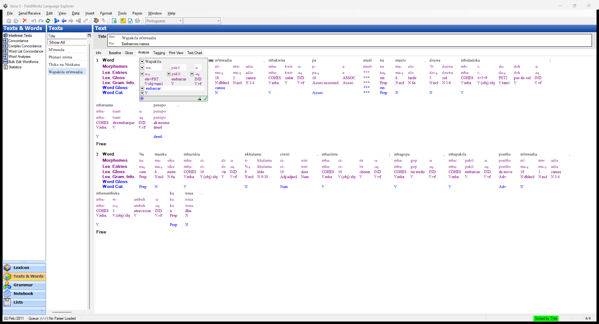

# Interlinear Texts (`interlinearEdit`)

| | |
|---|---|
| **Tool id** | `interlinearEdit` |
| **Area** | Texts & Words |
| **Type** | tool-screen |
| **Surface** | interlinear |
| **Primitive** | interlinear |
| **State** | legacy (default) |
| **Phase** | 1 |
| **Canonical reference** | n/a |
| **JIRA** | LT-XXXXX |

## What it looks like

## What it is
Interlinear text editor (baseline/word/morph/gloss lines over texts).

## Notes / gotchas
- InterlinMaster interlinear master control.
- Interlinear surface -> Primitive interlinear; Canonical n/a.

> Stub. Deepen using `Docs/migration/_TEMPLATE.md` (capture legacy PNGs via the `fieldworks-winapp` skill) when this ticket is picked up.
