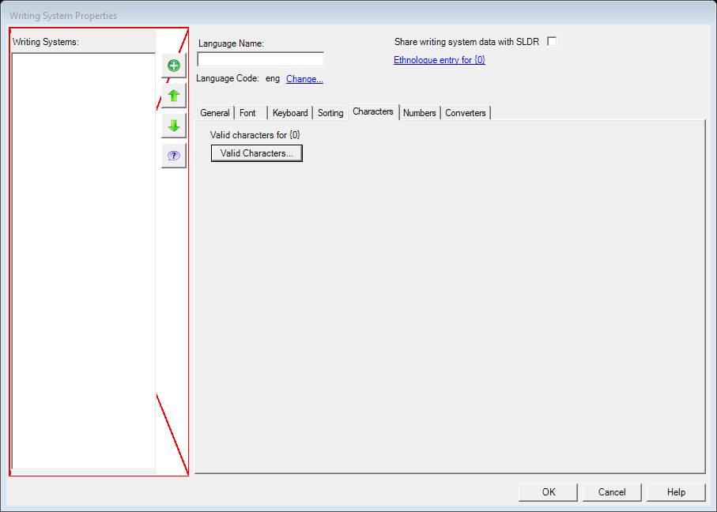
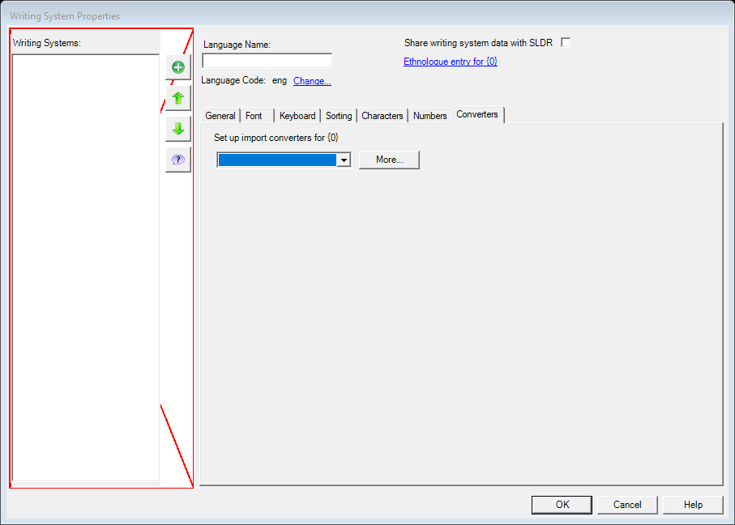
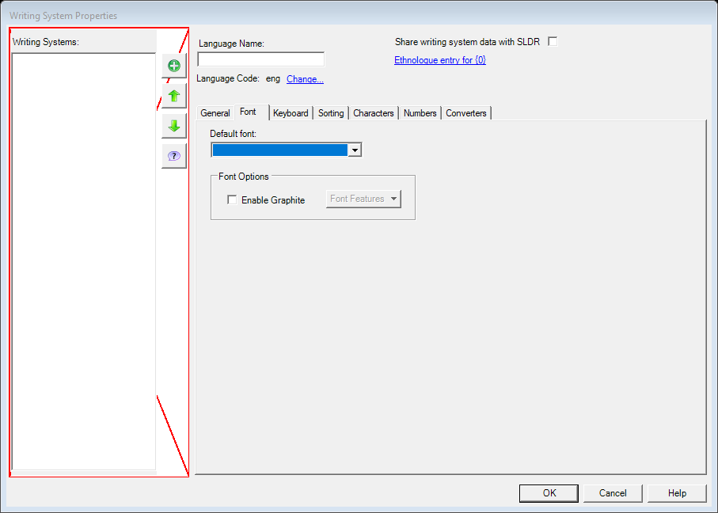
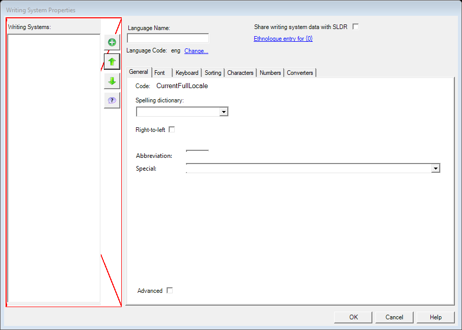
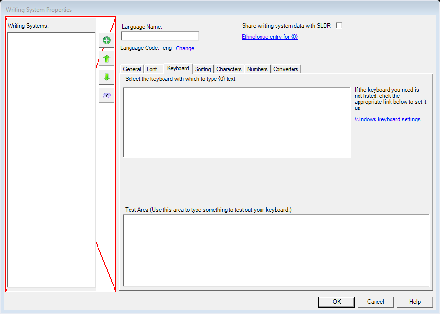
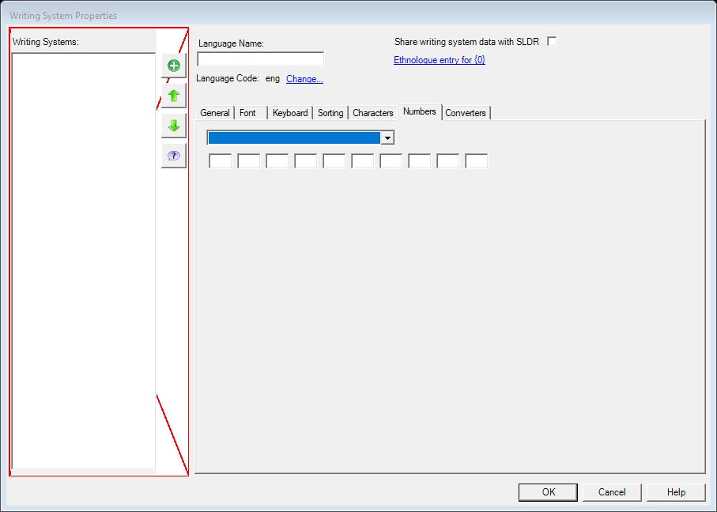
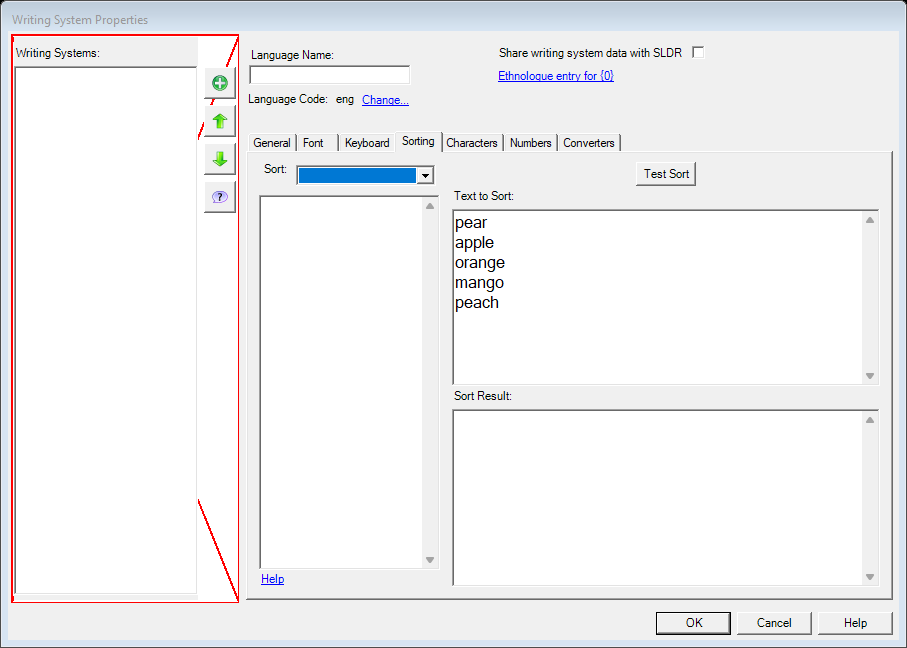

# Writing System Properties — bounded core (legacy `FwWritingSystemSetupDlg`)

| | |
|---|---|
| **Legacy class** | `SIL.FieldWorks.FwCoreDlgs.FwWritingSystemSetupDlg` (`Src/FwCoreDlgs/FwWritingSystemSetupDlg.cs`) |
| **Area / tool** | Format › Set up Writing Systems › single-WS Add/Edit properties (bounded core) |
| **Primitive(s)** | plain-form (name / abbreviation / font / RTL / sort) |
| **Canonical reference** | OptionsDialog (closest kept canonical for a plain-form of fields; legacy is tabbed but this bounded core is plain) |
| **Backed-out Avalonia stub** | `Src/Common/FwAvaloniaDialogs/WritingSystemPropertiesDialogView.axaml(.cs)` + `WritingSystemPropertiesDialogViewModel.cs` @ git `this branch (recover from history)` |
| **JIRA** | LT-XXXXX |

## What it is
A bounded managed core of the writing-system setup dialog: edit a single WS's name, abbreviation, default
font, right-to-left direction, and sort label. **PARTIAL** — the full `FwWritingSystemSetupDlg` surface
(SLDR sharing, encoding converters, merge, the advanced script/region/variant editor, keyboard assignment,
numbering/character-inventory tabs) is NOT ported.

## What it looks like (before / after)
Legacy "before" captured by the screenshot harness (ScreenshotHarnessTests, option 2). Avalonia "after"
comes from the surface's FwAvaloniaDialogs(Tests) visual test (same data); attach both to the JIRA ticket.

| Legacy (WinForms) — "before" | Avalonia (New) — "after" |
|---|---|
|  |  |

Tabs (legacy):

      
## Behaviour to preserve (parity checklist)
- [ ] Name field (required, trimmed).
- [ ] Abbreviation field (required, trimmed).
- [ ] Default-font combo (from the available-fonts list).
- [ ] Right-to-left checkbox.
- [ ] Sort label field (trimmed).
- [ ] OK gated: non-empty name + abbreviation, and a valid (non-duplicate, case-insensitive) tag — mirroring the legacy model's `IsListValid` / duplicate guard at this granularity.
- [ ] In-line validation message (first error) shown when invalid.

## Migration gotchas
- PARTIAL — PARITY (stub `WritingSystemPropertiesDialogViewModel.cs`, §19g): "this is the managed
  name/abbr/font/direction/sort core only. The full `FwWritingSystemSetupModel` surface — SLDR sharing,
  encoding converters, merge, the advanced script/region/variant editor, keyboard assignment, and the
  numbering/character-inventory tabs — is NOT ported here; those remain the legacy `FwWritingSystemSetupDlg`.
  OK is gated on a non-empty name + abbreviation and a valid (non-duplicate) tag, mirroring the legacy
  model's IsListValid/duplicate guard at this granularity."
- WS/RTL: this dialog *defines* a WS's direction — the RTL flag must persist correctly.
- The list-management surface (add/remove/merge across all WSs) is explicitly out of scope; only single-WS
  Add/Edit properties are migrated.

## Wiring
- **UNWIRED (test-only).** There is no product call site. The only references are the stub definition
  (`WritingSystemPropertiesDialogView.axaml.cs`, `WritingSystemPropertiesDialogViewModel.cs`) and the tests
  under `Src/Common/FwAvaloniaDialogs/FwAvaloniaDialogsTests/`. The legacy list-management call site is still
  active and is NOT gated onto the Avalonia stub — so there is no call site to revert.
- PARITY note at the legacy call site (`Src/xWorks/FwXWindow.cs:1547`–`1553`, in `ShowWsPropsDialog`):
  "PARITY §19g: the full Writing System SETUP dialog (`FwWritingSystemSetupDlg` over
  `FwWritingSystemSetupModel` …) stays on the legacy WinForms path: it is far larger than a bounded §19g
  slice. The bounded managed name/abbr/font/direction/sort PROPERTIES core IS migrated to the Avalonia kit
  … for the future single-WS Add/Edit New-UI surface; this list-management call site is not yet gated onto
  it." The live legacy dialog is constructed at `FwXWindow.cs:1557`.
- Re-wiring target (future): a single-WS Add/Edit New-UI surface enters this dialog behind `UIMode=New`;
  Legacy keeps `FwWritingSystemSetupDlg`.
