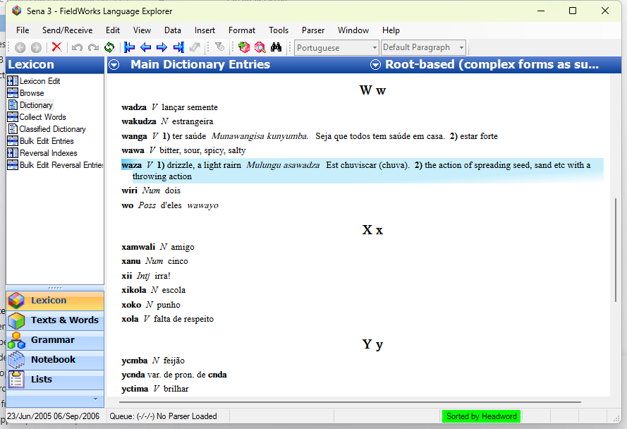
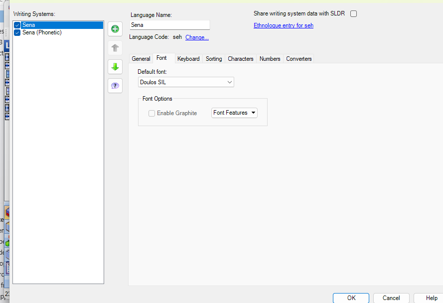
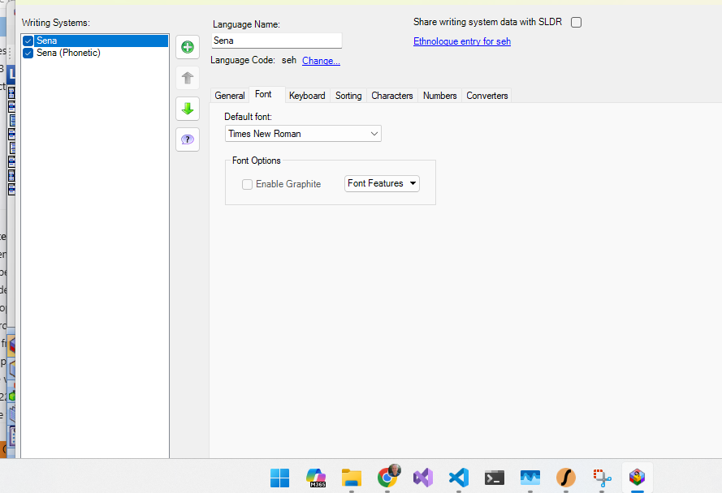
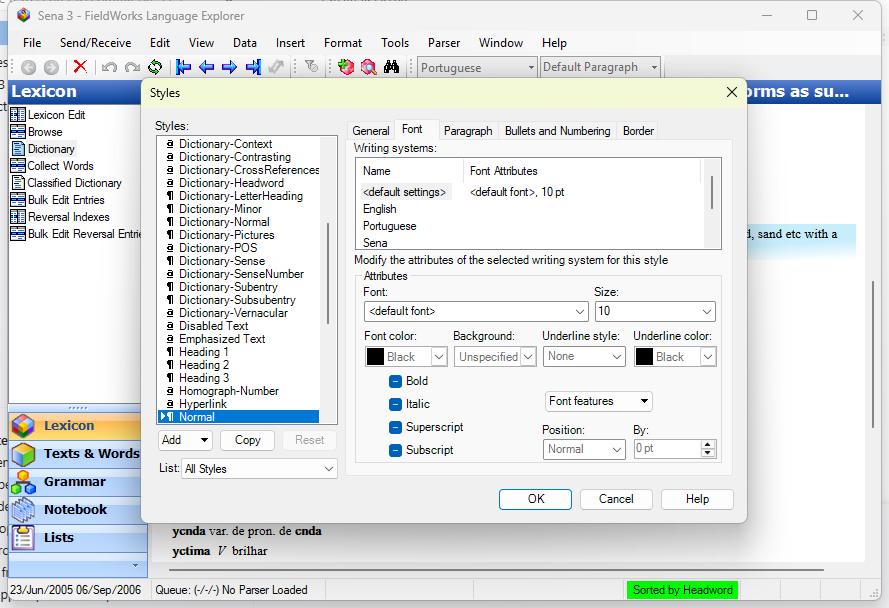

# Manual WinForms/WinApp Testing

This note records the manual FieldWorks walkthrough for LT-22324 OpenType Font
Features using WinApp MCP and WinForms MCP UIA2. Automated coverage remains the
primary verification for renderer application; these steps capture the live UI
surfaces requested for manual review.

## Environment

- Build launched: `Output/Debug/FieldWorks.exe`
- Project: `Sena 3`
- Backup available if restore is needed: `Sena 3 2018-09-11 1145.fwbackup`
- App control: WinApp MCP for the original visible-desktop run; WinForms MCP
   UIA2 (`@fnrhombus/winforms-mcp`) for the refreshed evidence run.
- JIRA fetch status: refreshed Atlassian read-only scripts successfully fetched
   `LT-22324`, one comment, and no attachments on 2026-04-30.
- JIRA target fonts: `CharisSIL-5.000.zip` and `AbyssinicaSIL-2.201.zip` are
   called out as Lorna Evans fonts with both Graphite and OpenType tables. The
   live evidence used installed `Charis SIL`; `Abyssinica SIL` was not installed
   on this machine.

## Manual Steps

1. Launch or attach to `Output/Debug/FieldWorks.exe` with WinApp MCP.
2. Confirm a project is loaded. If no project is loaded, restore
   `Sena 3 2018-09-11 1145.fwbackup` from the repository root.
3. Capture the loaded project state.
4. Open `Format` > `Set up Vernacular Writing Systems...`.
5. Select the `Font` tab.
6. Verify the group label is `Font Options`.
7. Verify `Enable Graphite` is unchecked for the selected non-Graphite state.
8. Verify `Font Features` remains enabled when a selected font exposes feature
   options. This is the primary fixed behavior; the old bug tied feature
   availability too tightly to Graphite enablement.
9. Optionally select an OpenType font such as `Times New Roman` without saving,
   confirm `Font Features` remains available, then cancel the dialog.
10. Open `Format` > `Styles...`.
11. Select the `Font` tab.
12. Verify the shared style Font tab exposes the `Font features` control.
13. For WinForms MCP UIA2 evidence, select `Charis SIL`, invoke `Font
   Features`, and verify the OpenType feature menu includes entries such as
   `Access All Alternates`, `Small Capitals From Capitals`, `Standard
   Ligatures`, `Small Capitals`, and `cv*` character-variant entries.
14. Cancel all dialogs used only for evidence capture.

## Screenshot Evidence

## Font and JIRA Evidence

- `LT-22324` summary: split Font Features from `Enable Graphite` and support
   OpenType features.
- `LT-22324` description says `Font Options` should replace Graphite-only
   wording, feature enablement should not be tied to `Enable Graphite` unless a
   font only has Graphite features, and OpenType features should be listed and
   saved/set similarly to Graphite features.
- `LT-22324` suggests considering HarfBuzzSharp. This implementation keeps
   production rendering on the existing Views/Uniscribe path and uses
   HarfBuzzSharp only in test comparison infrastructure.
- `LT-22324` links `CharisSIL-5.000.zip` and `AbyssinicaSIL-2.201.zip` as fonts
   with both Graphite and OpenType tables. Current local inventory has
   `Charis SIL`, `Andika`, `Doulos SIL`, `Gentium Plus`, and `Quivira`; it does
   not have `Abyssinica SIL`.
- FieldWorks installer inputs include Charis/Andika/Doulos/Gentium Plus 6.101
   font packages and `Quivira.otf`; the exact older JIRA-linked Abyssinica 2.201
   archive is not committed in this workspace.
- Native TestViews now commits `CharisSIL-5.000` regular font data with the OFL
   license under `Src/views/Test/TestData/Fonts/CharisSIL-5.000` and uses it for
   deterministic end-to-end Uniscribe rendering tests.

## Before-State Capture

A true broken-state screenshot was not captured from this workspace because the
active debug build already contains the LT-22324 fix and project data should not
be mutated or the branch reverted during evidence collection. To capture a real
before-state, use a separate pre-fix worktree/build, launch FieldWorks with the
same backup, open `Format` > `Set up Vernacular Writing Systems...` > `Font`,
and capture the Graphite-only/disabled Font Features behavior before switching
back to this fixed build for the after-state screenshots above.

The UI screenshots prove that Font Options and OpenType feature discovery are
available in the live dialog. Feature application to rendered text is covered by
the native `TestViews` Charis SIL fixture tests and the managed/native render
and cache tests; the evidence session did not save a project data change just to
produce an applied-render screenshot.
