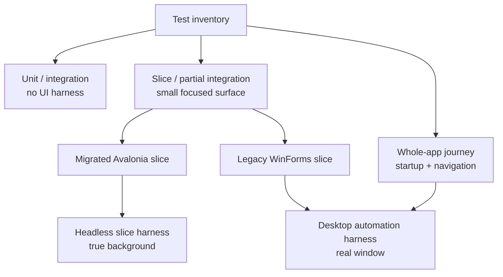
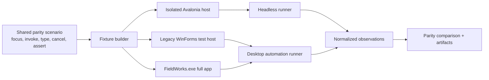
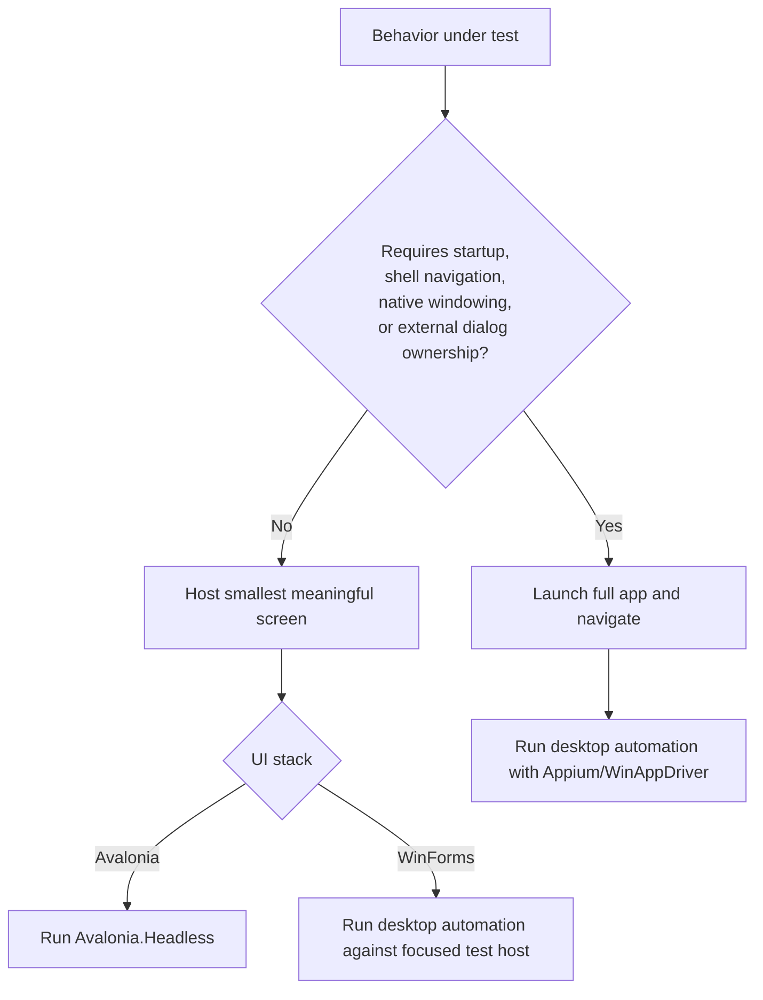

## Context

The Lexical Edit migration already requires UIA2-style WinForms reachability tests and Avalonia.Headless tests, but the current Phase 2 coverage uses direct in-repo smoke substitutes because no UIA2/FlaUI/System.Windows.Automation harness exists in the repo. The refined target is a hybrid parity harness: a truly headless Avalonia slice harness for focused partial-integration tests, plus a desktop automation harness for realized-window tests such as legacy WinForms, full FieldWorks startup, shell navigation, dialogs, and future real-window Avalonia checks.

Avalonia.Headless is already available through `Avalonia.Headless.NUnit` 11.3.9. Legacy WinForms UIA2 and Appium/WinAppDriver tests need realized HWND-backed windows and an interactive Windows desktop. The implementation must follow the root `AGENTS.md`, `openspec/AGENTS.md`, and any area-specific instructions for `Src/Common/Controls/DetailControls/`, `Src/Common/Controls/XMLViews/`, `Src/xWorks/`, `Src/LexText/AdvancedEntry.Avalonia/`, `Src/Common/FwAvalonia/`, `FieldWorks.proj`, `FieldWorks.sln`, and agent/CI scripts under `Build/Agent/` or `scripts/Agent/`.

Research basis:

- Microsoft UI Automation exposes cross-framework UI through common automation elements, properties, control types, patterns, and events. That supports backend-neutral observations, but not deep owner-drawn content inspection.
- Microsoft accessibility guidance recommends automation-first accessibility workflows, CI gates for core flows, and tools such as Accessibility Insights, Inspect, UIA Verify, and AccEvent during development.
- Avalonia's Headless platform is intended for CI/CD and machines without a display, supports simulated keyboard/mouse/text input, dispatcher flushing, and optional frame capture.
- Avalonia's Appium guidance separates fast headless component tests from slower real-window tests that validate platform behavior and accessibility trees.
- WinAppDriver/Appium guidance for CI and remote machines requires an interactive Windows desktop session; locked or incorrectly disconnected RDP sessions can break GUI tests.
- FlaUI wraps Microsoft UI Automation and allows UIA2/UIA3 selection; UIA2 is often the safer first target for legacy WinForms coverage.

## Goals / Non-Goals

**Goals:**

- Let one parity-smoke scenario run against an isolated Avalonia slice, a legacy WinForms realized-window surface, a full FieldWorks startup journey, or a paired combination.
- Keep scenario definitions backend-neutral and compare normalized observations instead of raw control types.
- Make the stable Avalonia.Headless subset easy for CI and agents to run with `./test.ps1` or a repo wrapper.
- Add desktop automation modes for WinForms UIA2/FlaUI-style reachability and Appium/WinAppDriver full-app journeys.
- Detect whether desktop automation is available and report skipped/not-runnable evidence without hiding product failures.
- Produce artifacts that identify scenario id, scope, backend, observations, raw tree dumps where available, screenshots where available, and comparison differences.

**Non-Goals:**

- Replacing unit/integration tests for business logic, LCModel transactions, render snapshots, or semantic IR snapshots.
- Driving owner-drawn Views content deeply through UIA2 or Appium.
- Requiring global COM registration, registry hacks, or installer changes.
- Completing Lexical Edit migration; this is test infrastructure and first scenario coverage only.
- Making real-window desktop automation mandatory for all normal CI jobs.

## Architecture Diagrams

### Test Scope Map

### Shared Scenario Flow

### Harness Selection

## Decisions

### 1. Shared scenarios are the architecture; UIA2 is one backend

**Decision:** Define parity smoke tests around a small contract such as `IParitySmokeScenario`, `IParitySmokeBackend`, `IParitySmokeDriver`, `ParityAction`, `ParityObservation`, `ParityComparison`, and `ParityArtifactSink`. The scenario contract is the stable layer; UIA2, Appium, and Avalonia.Headless are adapters.

**Rationale:** The same scenario should describe user intent: focus the morph-type field, invoke the chooser, observe dialog affordances, cancel, and verify focus return. Backends can implement that intent differently while returning the same observation shape.

**Alternatives considered:** Duplicating tests per framework is faster initially, but lets legacy and Avalonia baselines drift. Making UIA2 the central API would exclude truly headless Avalonia slice tests and future Appium full-app checks.

### 2. Use two harness lanes and three test scopes

**Decision:** Use a headless slice harness for migrated Avalonia partial-integration tests and a desktop automation harness for realized-window tests. Classify scenarios as unit/integration, slice/partial integration, or whole-app journey.

**Rationale:** Most migration feedback should not launch the full app. Avalonia slices can run truly headless. Legacy WinForms slices and full-app journeys need real windows and an automation-capable desktop.

**Alternatives considered:** Running everything through full app startup provides high confidence but creates slow, flaky, hard-to-debug tests. Running everything through in-process object inspection misses real focus, accessibility, and dialog behavior.

### 3. Prefer Avalonia.Headless for migrated slice tests

**Decision:** Use Avalonia.Headless for focused migrated controls: text input, keyboard shortcuts, focus return inside the screen, flyouts/context menus, validation presentation, accessibility metadata, layout realization, and disposal/subscription cleanup.

**Rationale:** It runs without a visible window, is appropriate for normal CI and agent runs, and aligns with the existing AdvancedEntry Avalonia test setup.

**Alternatives considered:** Appium for every Avalonia test would validate native integration but would be much slower and require desktop automation for cases that do not need it.

### 4. Use desktop automation for legacy WinForms and whole-app journeys

**Decision:** The desktop automation harness has adapters for focused WinForms UIA2/FlaUI-style tests and full-app Appium/WinAppDriver journeys. The initial legacy partial backend should prefer FlaUI.UIA2 unless a proof spike shows direct `System.Windows.Automation` is more compatible with the target controls. Whole-app journeys should use Appium.WebDriver against WinAppDriver because Avalonia documents that path for real-window/accessibility-tree tests and it also covers startup/navigation flows.

**Rationale:** Legacy WinForms UIA2 and full-app journeys both require an interactive desktop, but they have different ergonomics. FlaUI is direct and useful for small HWND-backed surfaces. Appium/WinAppDriver is a better fit for end-to-end app launch, remote agent topology, and future real-window Avalonia parity.

**Alternatives considered:** A single Appium-only stack is simpler conceptually but heavy for small legacy hosts. A single FlaUI-only stack is direct for WinForms but less aligned with Avalonia's official real-window testing guidance.

### 5. Normalize observations before comparing

**Decision:** Backends emit normalized facts: stable node ID, accessible name/id, role/control kind, enabled/visible state, focus owner, available actions, selected value, displayed text, table header order, filter affordances, popup/dialog state, and diagnostics.

**Rationale:** WinForms controls, UIA AutomationElements, Appium elements, and Avalonia controls expose different raw trees. The useful comparison is whether the user-observable workflow and accessibility contract match.

**Alternatives considered:** Pixel comparison alone cannot prove focus, invoke patterns, or dialog semantics. Raw tree dumps are useful artifacts but too brittle as primary assertions.

### 6. CI modes are explicit

**Decision:** Provide `HeadlessOnly`, `DesktopOnly`, and `Paired` modes. `HeadlessOnly` is eligible for normal CI once implemented. `DesktopOnly` and `Paired` require Windows desktop automation availability and must skip with an explicit reason when unavailable. Backend filters may further select `WinFormsUia2`, `AvaloniaHeadless`, `AppiumFullApp`, or later adapters.

**Rationale:** Desktop automation is not truly headless. It can run unattended on a dedicated automation VM, but locked/disconnected sessions are a known failure mode. Explicit modes prevent normal CI from accidentally depending on the desktop.

**Alternatives considered:** Making desktop automation mandatory for every CI run would likely create infrastructure flakes. Keeping desktop automation fully manual would fail to protect migration work.

## Suggested Implementation Boundaries

- `Src/Common/UiParity/FwUiParity.Contracts/`: netstandard2.0 or otherwise net48-compatible contracts for scenarios, actions, observations, comparisons, backend capabilities, and artifact sinks.
- `Src/Common/UiParity/FwUiParity.AvaloniaHeadless/`: net8.0-windows test helper/backend over existing Avalonia.Headless conventions.
- `Src/Common/UiParity/FwUiParity.Desktop/`: desktop automation abstractions plus WinForms UIA2/FlaUI and Appium/WinAppDriver adapters, isolated from scenario definitions.
- `Src/Common/UiParity/FwUiParity.Scenarios/`: shared scenario definitions that can be referenced by DetailControls, xWorks, and AdvancedEntry tests without taking UI automation dependencies directly.
- `Build/Agent/` or `scripts/Agent/`: repo-approved wrappers for headless-only, desktop-only, and paired parity modes.

These names are intentionally suggested, not hard-coded OpenSpec requirements. If implementation finds a better existing test-support home, preserve the same dependency direction: contracts first, backends second, scenarios without direct backend package references.

## Risks / Trade-offs

- Desktop automation flakiness -> Keep scenarios short, wait on explicit readiness conditions, emit failure artifacts, and gate by environment capability.
- Offscreen window assumptions fail -> Prefer deterministic on-screen placement for desktop automation; allow offscreen only after a backend proves the automation tree is still discoverable and invokable.
- Backend abstraction hides important differences -> Preserve raw UIA/Appium/Avalonia tree dumps as artifacts while asserting normalized observations.
- Scenario DSL becomes a second UI framework -> Keep actions tiny and user-observable; business logic remains in unit/integration tests.
- New package compatibility risk -> Isolate FlaUI/Appium/UIAutomation dependencies in adapter projects and validate through repo scripts before widening use.
- Slow full-app tests block developer flow -> Keep full-app Appium journeys out of the default fast lane until the dedicated automation runner is reliable.

## Migration Plan

1. Add shared managed parity-smoke contracts and include any new project in `FieldWorks.proj` and `FieldWorks.sln`.
2. Add the Avalonia.Headless slice backend over existing AdvancedEntry Avalonia test infrastructure.
3. Add desktop environment detection and a focused WinForms UIA2/FlaUI backend for small realized-window legacy hosts.
4. Add Appium/WinAppDriver backend support for full-app journeys and future real-window Avalonia checks.
5. Convert Phase 2 direct smoke baselines into shared scenario definitions while keeping existing tests green during transition.
6. Add repo wrapper/task entry points for headless-only, desktop-only, and paired modes.
7. Require new migrated slices to add headless scenarios first, then paired scenarios when both legacy and Avalonia surfaces exist.

Rollback is straightforward: keep existing direct characterization tests, disable desktop modes by environment flag, and continue running headless-only scenarios until desktop automation infrastructure is fixed.

## Open Questions

1. Should desktop UI tests run on a self-hosted persistent Windows VM first, or can an existing hosted CI image provide a sufficiently stable interactive desktop for Appium/WinAppDriver?
2. Should paired comparison artifacts live under `Output/UiParity/` or the existing test artifact directory convention?
3. Which first full-app journey should be the pilot: app startup to Lexical Edit, project open to AdvancedEntry preview, or a narrower launcher/chooser path from an existing test project?