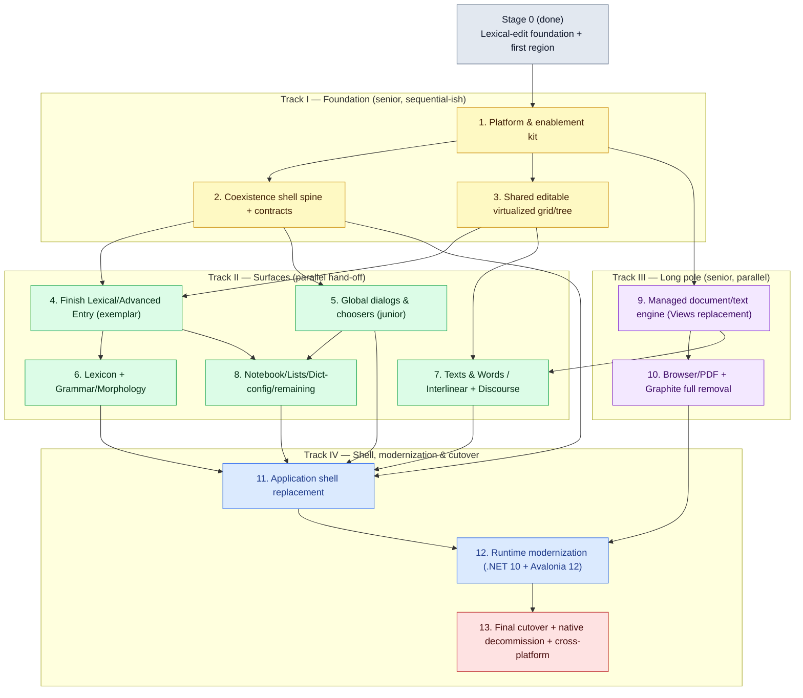

# FieldWorks → Avalonia: Complete Migration Program Plan

> **Purpose.** This is the master, end-to-end plan for migrating **all** of FieldWorks'
> WinForms UI and native C++ UI/rendering code to Avalonia + C#. It extends the existing
> `avalonia-migration-roadmap` (which covers Phase 0 spike → Lexical Edit → shell) to the
> *whole* application, organizes the work into stages sized to become **JIRA epics**, and
> sequences the foundation work that must precede broad hand-off to less-AI-experienced
> developers.
>
> **Status:** planning only. No code/behavior change. JIRA epics/issues will be created
> from this document later, not now.
>
> **Grounding:** built from (a) the frozen architecture in
> `.claude/skills/fieldworks-winforms-to-avalonia-migration/references/`, (b) the as-built
> work in `Src/Common/FwAvalonia/` and `openspec/changes/lexical-edit-avalonia-migration/`,
> (c) a full repo surface inventory, and (d) external research on incremental desktop
> migrations (sources cited in the Appendix).

---

## 1. Executive summary

FieldWorks is a large desktop app: ~16 WinForms UI projects, 200+ Form/UserControl classes,
~200 dialogs, a 73-file DataTree slice framework, a 44-file XMLViews browse framework, and a
native C++ **Views** rendering/editing engine (`Src/views/`, VwRootBox/VwSelection/VwTextBoxes)
consumed through registration-free COM and hosted by `SimpleRootSite`. Conservative sizing:
**~150k LOC of UI/render code, an 18–30 month program.**

The first vertical slice — the **Lexical Edit / Advanced Entry** region — is essentially done
and proves the whole approach: a typed view-definition IR compiled from XML, a region
model + composer, owned dense Avalonia controls, frozen seam contracts, a managed
multi-writing-system text-editing foundation (no native Views), a global surface-selection
switch with explicit per-host behavior, and a triangulated parity-evidence harness
(semantic + visual + workflow + performance). **The architecture is decided; do not reinvent it.**

What remains is (1) **hardening that one-off into a reusable platform** other developers can
drive, (2) **a shared editable virtualized grid/tree** (the single biggest off-the-shelf gap),
(3) **migrating each remaining surface** in parallel vertical slices, (4) **replacing the native
Views engine** for the document/multi-paragraph/interlinear surfaces (the long pole), and
(5) **the shell + final cutover + cross-platform enablement**.

The plan below is **13 stages in 4 tracks**. Tracks I (foundation) and III (native engine) are
senior-led; Track II (surfaces) is built for parallel hand-off; Track IV (shell, runtime
modernization, cutover) lands last.

---

## 1a. Post-review revision status (2026-06-15)

This plan was reviewed **stage-by-stage by 13 independent subagents** (one per stage), each grounded
in repo inspection + targeted web research. Full evidence is in `reviews/stage-NN-*.md`; the
cross-comparison is in `reviews/00-cross-comparison-synthesis.md`. **Read the synthesis before
creating epics.** Headlines:

- **The 13 stages and their ordering are confirmed sound** — including the contested calls (dialogs
  before shell; the .NET 10 + Avalonia 12 jump kept late). The late runtime jump is in fact *forced*:
  Avalonia 12 dropped `netstandard2.0`/net48 (repo pins **Avalonia 11.3.17** for exactly this reason),
  and the one-CLR rule means net48 can't be left until the WinForms host (Stage 11) is gone.
- **Sizing is the main problem.** Eight stages (**3, 6, 7, 8, 9, 10, 11, 13**) are too coarse for a
  single epic and decompose into the gated sub-epics mapped in synthesis §6. JIRA epics should be
  created from that sub-epic map, not from the one-row-per-stage table in §4.
- **Several "build" items are already built** (JSON view-def serializer, 10k-row read-only browse,
  custom-field rendering, host bridge, command-bridge seam, chooser virtualization, AutomationId
  convention). Stages 1–4 are largely *finish / re-home / generalize*, not *build*.
- **Stage 9 is the gravity well and the #1 correctness risk:** its scope text is too narrow for what
  Stages 6b and 7A depend on (in-memory presentation cache / `CachePair`, hit-test combo editing,
  aligned interlinear grid). Expanded below; decomposed in synthesis §6.
- **Conflicts/double-bookings resolved** in synthesis §3 (surface registry → Stage 2 only; dictionary
  preview → Stage 10 only; Find/Replace + Styles dialogs → Stage 9-gated, not junior Stage 5; native
  Graphite + Views deletion → Stage 13, not 10/9; ViewsInterfaces split to keep `IVwCacheDa`).
- **Missing dependency edges** (synthesis §7), most importantly **`S9 → S6`**.
- **A user decision must be re-opened — Graphite vs. Awami Nastaliq** — see §11.

The per-stage prose in §6 below is **retained as the scope baseline**; where a review supersedes it,
the change is captured in the synthesis and flagged inline. Sub-epic decomposition (synthesis §6) is
the authoritative structure for JIRA.

---

## 2. Guiding principles (research-grounded; some already chosen by the repo)

1. **Strangler Fig, never big-bang.** Keep shipping FieldWorks on Windows; build Avalonia
   surfaces beside the old ones; retire WinForms surface-by-surface behind a feature flag.
   (Avalonia's own WinForms guide, Fowler, Spolsky/Netscape all converge here.)
2. **`WinFormsAvaloniaControlHost` is the coexistence spine.** Host whole Avalonia *views*
   inside the running WinForms shell (already proven as `LexicalEditHostControl`). Windows-only
   during transition is acceptable — FieldWorks targets Windows today.
3. **Decouple logic from the UI framework first.** The framework-free seams, typed IR, and
   region models are reusable by both surfaces and are what make per-screen strangling possible.
4. **Prove behavior before replacing it.** Characterization/golden-master baselines (semantic +
   visual + workflow + performance) gate every surface. This is non-negotiable *because* the work
   is AI-assisted — the dominant AI failure mode is **hallucinated parity**.
5. **Reuse the frozen architecture; don't reinvent.** Typed IR, region/composer, owned dense
   controls, plugin registry, seam catalog, surface-selection switch, Path-3 evidence bundle.
6. **Repo divergence from generic advice — managed rendering, not native interop.** Standard
   advice is "keep the native engine via `NativeControlHost`, rewrite last." FieldWorks instead
   bet on a **managed-only** path (no native Views on the Avalonia surface; managed `ITsString`
   editing already works for fields). Tradeoff: more engine work up front, but it unblocks
   cross-platform and avoids the airspace/transparency limits of native hosting. The long pole is
   therefore *replacing* the Views engine for document surfaces, not hosting it.
7. **Editable virtualized grids are the #1 framework gap.** TreeDataGrid is display-only and
   licensing-blocked; standard DataGrid is slow at scale. Plan an **owned virtualized control**.
8. **`AutomationId` is mandatory, day one, every control** — it is the single prerequisite for
   both accessibility identity and Appium/WinAppDriver automation.
9. **One global undo/redo stack** (LCModel action handler). Never a parallel Avalonia history.
10. **Slice work as vertical, file-creating, independently-owned units.** New surfaces are new
    files (conflict-free); defer host-wiring/config edits to a single integration step; cap
    concurrency at ~4–6 active streams; give dialogs to juniors, engine/shell to seniors.
11. **Budget an explicit integration-and-verification phase per milestone.** Clean merges ≠ working
    software (one practitioner spent ~83% of integration time post-merge even with zero conflicts).
12. **Upgrade the look while keeping the functionality.** This program is also chartered to modernize
    the UX: adopt a modernized **Fluent-based** ControlTheme rather than mimicking the legacy WinForms
    chrome. The hard contract is **functional fidelity + density**, not pixel- or look-for-look parity —
    parity evidence asserts behavior/semantics/density, the visual lane allows an intentional restyle.
13. **Fully managed text — Graphite is being sunset.** No native Graphite (or native Views) shaping on
    any Avalonia surface. Complex-script shaping is HarfBuzz/managed only. This supersedes the earlier
    per-writing-system "classify-and-warn" compromise in `graphite-transition-support`: Graphite is
    *removed*, not warned.
14. **Land .NET 10 + Avalonia 12 before the program closes** (its own stage). Sequenced *late* — after
    the WinForms shell and most WinForms surfaces are gone — so the runtime jump ports surviving managed
    code, not throwaway WinForms (same "don't invest in code being deleted" principle that froze DataTree).

---

## 3. Current state (what is already done — "Stage 0")

This is the proven baseline the program builds on. Source: `lexical-edit-avalonia-migration`
(Phases 0–1 complete, 2–8 mostly complete) and `avalonia-multi-writing-system-text-foundation`
(completed 2026-06-15).

| Asset | Where | Reusable for |
| --- | --- | --- |
| Typed view-definition IR + XML importer + compiler (deterministic, cached, off-thread) | `Src/Common/FwAvalonia/ViewDefinition/` | Every surface driven by XML layouts |
| Region model + composer (boundary **above** DataTree) | `Src/xWorks/FullEntryRegionComposer.cs`, `Src/Common/FwAvalonia/Region/LexicalEditRegionModel.cs` | Detail/tree/browse surfaces |
| Owned dense controls (multi-WS text, chooser flyout, reference vector, dialog launcher) | `Src/Common/FwAvalonia/Region/FwFieldControls.cs`, `FwOptionPicker.cs`, `RegionMenuFlyout.cs` | All field/cell rendering |
| Managed multi-WS `ITsString` editing (fonts, RTL/bidi, IME, grapheme clusters, ghost realization) | `FwMultiWsTextField` | All text fields (no native Views) |
| Frozen seam contracts (edit session, undo, validation, scheduler, lifetime, refresh, navigation, command bridge, clipboard, drag-drop) | `Src/Common/FwAvalonia/Seams/ISeams.cs`, `ActiveHostContract.cs` | Every surface |
| Plugin registry for custom/legacy slice classes | `Src/xWorks/RegionEditorPlugins.cs`, `ChorusNotesPlugin.cs` | Custom slices anywhere |
| Surface-selection switch (explicit Supported / ExplicitLegacyFallback / Blocked per host) | `Src/Common/FwAvalonia/LexicalEditSurfaceSelectionService.cs`, `Src/xWorks/RecordEditView.cs` | Every host |
| In-process WinForms→Avalonia host bridge | `Src/Common/FwAvalonia/LexicalEditHostControl.cs` | Coexistence spine |
| Path-3 parity evidence harness (semantic + visual + workflow + performance), legacy timing baselines | `FwAvaloniaTests/Path3BundleTests.cs`, `DetailControlsTests/DataTreeTimingBaselines.json` | Every parity claim |
| Engine-isolation symbol audit (forbidden WinForms/Views/Graphite/Gecko symbols) | `FwAvaloniaTests/EngineIsolationAuditTests.cs` | Every migrated region |
| Region manifest template (gates, perf budgets, rollback) | `lexical-edit-avalonia-migration/region-manifest.md` | Every surface's definition-of-done |

**Open items still inside Stage 0** (fold into Stage 4): table/browse virtualization (7.x), full
P0/P1 field parity beyond first slice, 150% DPI + typing-latency budgets, JSON view-definition
serialization/retirement (9.x), Path-3 completeness across all scenarios.

---

## 4. The stages at a glance

| # | Stage (→ JIRA epic) | Track | Depends on | Parallel? | Lead level | Exit gate |
| --- | --- | --- | --- | --- | --- | --- |
| 1 | Migration platform & developer-enablement kit | I Foundation | Stage 0 | — | Senior | Kit + runbook proven by a junior+Claude migrating a trivial surface end-to-end |
| 2 | Coexistence shell spine & host contracts | I Foundation | 1 | with 3 | Senior | Any Avalonia view hostable in WinForms shell behind the flag; theming + AutomationId conventions locked |
| 3 | Shared editable virtualized grid/tree control | I Foundation | 1 | with 2 | Senior | Owned control passes 10k-row browse + 253-slice tree at 100%/150% DPI within perf budget |
| 4 | Finish Lexical / Advanced Entry surface (exemplar) | II Surfaces | 2,3 | — | Senior | Region manifest fully green; becomes the reference implementation |
| 5 | Global dialogs & choosers (FwCoreDlgs + shared) | II Surfaces | 2 | yes (4–6 streams) | **Junior-friendly** | Each dialog: parity bundle + AutomationIds + localization; WinForms-owned modality honored |
| 6 | Lexicon completion + Grammar/Morphology detail | II Surfaces | 4 | yes | Mid | Detail surfaces at parity via region/composer + plugins |
| 7 | Texts & Words / Interlinear + Discourse | II Surfaces | 3,9 | partial | Senior | Interlinear/concordance/chart parity on managed document engine |
| 8 | Notebook, Lists, Dictionary-config UI, remaining tools | II Surfaces | 4,5 | yes | Mid | Remaining areas at parity |
| 9 | Managed document/text rendering & editing engine (Views replacement) | III Long pole | 1 | with II | Senior | Multi-paragraph/StText + structured editing parity; no native Views on Avalonia path |
| 10 | Browser/PDF & dictionary-preview replacement; **Graphite full removal** | III Long pole | 9 | with II | Senior | Gecko + Graphite **removed** from codebase; fully-managed shaping; preview/print parity |
| 11 | Application shell replacement (window, areas, menus, toolbars, lifetime) | IV Shell | 2, enough of 5–8 | partial | Senior | Avalonia shell hosts migrated screens; `fieldworks-avalonia-shell-migration` gates pass |
| 12 | **Runtime & toolchain modernization (.NET 10 + Avalonia 12)** | IV Shell | 11, most of 5–10 | — | Senior | Whole process on .NET 10 + Avalonia 12; build/test/CI green |
| 13 | Final cutover, native decommission & cross-platform enablement | IV Cutover | all | — | Senior | Avalonia default; WinForms + native Views/COM UI retired; Linux/macOS smoke green |

Cross-cutting concerns (accessibility/UIA, localization, performance, parity evidence) are **not**
separate stages — they are continuous per-surface gates enforced by the harness from Stage 1 on.

---

## 5. Sequencing and parallelism

**The critical path** is `Stage 1 → 2/3 → 4 → 11 → 12 → 13` for the shell/runtime, and
`Stage 1 → 9 → 10 → 13` for the native engine. Track II surfaces fan out wide and absorb most of the
parallel head-count. **The .NET 10 + Avalonia 12 jump (Stage 12) is deliberately late** — it runs after
the shell and most surfaces are Avalonia so it ports surviving code, not soon-to-be-deleted WinForms.
During coexistence the whole process stays on the current Avalonia 11.x / .NET Framework 4.8 (one CLR
per process); new code is written Avalonia-12-ready (avoiding APIs removed in 12) but the actual bump
ships in Stage 12.
**Hand-off to less-experienced developers begins after Stage 1 completes** (the kit exists) and
**accelerates after Stage 4** (a fully-worked exemplar exists to copy).

---

## 6. Stage detail (JIRA epic → representative sub-tasks)

Each stage is one **epic**. Sub-bullets are representative **issues** (real backlog will be finer).
Every surface-migrating issue inherits the per-region **Definition of Done** in §7.

### Track I — Foundation (must precede broad hand-off)

#### Stage 1 — Migration platform & developer-enablement kit  *(senior)*
Turn the lexical-edit one-off into a reusable, documented platform a mid/junior dev + Claude can drive.
- Extract a reusable **region scaffolding** template (new-surface generator: composer skeleton, region
  model, view, manifest stub, test bundle stub).
- Promote the **Path-3 evidence harness** to a shared test base any surface test can derive from.
- Freeze & document the **seam catalog** and **plugin-registry** onboarding ("how to add a custom slice").
- Author a **"migrate-a-surface" runbook** mapping the 10-step workflow to concrete repo actions; wire it
  to the `fieldworks-winforms-to-avalonia-migration` skill so AI assistants follow it.
- Lock **conventions**: AutomationId derivation from StableId, density tokens, ControlTheme baseline,
  localization lanes (StringTable for labels, `FwAvaloniaStrings.resx` for product strings), `<RootNamespace>`.
- **Validation:** a junior+Claude migrates one trivial surface (e.g. a single simple dialog) end-to-end
  using only the kit + runbook, with a green parity bundle. That is the gate.

> **Post-review (reviews/stage-01).** Deliver **two kits**, not one: the **region/IR** scaffolding (feeds
> Stages 4/6) *and* an **MVVM-dialog** scaffolding (CommunityToolkit.Mvvm + compiled bindings + first
> `.axaml`; feeds Stage 5's ~200-dialog reservoir). The repo today has **zero `.axaml` and no
> CommunityToolkit.Mvvm** — this stage is the program's first XAML/MVVM adoption, so that toolchain (and a
> dialog-flavored evidence bundle without an IR semantic anchor) must be explicit here, not assumed in
> Stage 5. The validation gate (migrate a dialog) currently exercises only the dialog kit — add a region
> mini-surface so both are proven. "Freeze the seam catalog" → **"version + amendment protocol"** (it still
> grows via Stages 3/9). Mark the region template **provisional** until Stage 4 closes (its exemplar gates
> are still Partial). Much is already reusable (`FwFieldControls`/`FwOptionPicker` are surface-agnostic;
> AutomationId convention + `<RootNamespace>` already in place) — this is generalization, not green-field.

#### Stage 2 — Coexistence shell spine & host contracts  *(senior)*
Generalize the host bridge and surface switch beyond Lexical Edit so any surface can coexist.
- Generalize `LexicalEditHostControl` → a reusable `WinFormsAvaloniaControlHost`-based region host.
- Generalize `LexicalEditSurfaceSelectionService` → an app-wide surface registry/switch with explicit
  per-host `Supported/ExplicitLegacyFallback/Blocked` decisions.
- Stand up the **XCore mediator/PropertyTable bridge** seam (`IXCoreCommandBridge`) for shell-scope commands.
- Global **feature-flag** plumbing (default WinForms) and the dual-run build.
- **ControlTheme** baseline matching legacy look + density; theming resource pipeline.
- Pull forward the **contract layer** of `fieldworks-avalonia-shell-migration` (window/dialog ownership
  contracts) without yet replacing the shell.
- Apply `fieldworks-ui-wiring-review`.

> **Post-review (reviews/stage-02).** Feasibility is high and the riskiest dependency is **already retired**:
> the build ships on net48 + Avalonia 11.3.17 with `WinFormsAvaloniaControlHost` in production. Five of six
> deliverables are **generalizations of existing code**, not net-new. **This stage — not Stage 1 — owns** the
> app-wide surface registry (resolve the Stage 1/2 double-booking) **and a living surface-census artifact**
> (the asset Stage 8's straggler-sweep presumes). **Name the exact ownership ports** Stage 2 extracts
> (lifetime, main-window, active-window registry, dialog owner, dispatcher, shutdown, modal state) and declare
> them the **single source of truth shared with Stage 11** — reuse `IUiScheduler`/`IRegionLifetime`, don't
> redefine. Disambiguate "dual-run build" as a **CI build matrix**, not just the `UIMode` preference. Fix
> `LexicalEditSurfaceResolver` so unregistered tools default to **legacy/blocked, never silent Avalonia**. All
> Stage-2 theming/host code must be **Av12-delta-localized** (theming APIs change 11→12).

#### Stage 3 — Shared editable virtualized grid/tree control  *(senior)*
The identified off-the-shelf gap; build it once, many surfaces depend on it.
- Spike & decide: owned virtualizing list/table over `VirtualizingStackPanel` vs. fully-owned realization
  window (record the fired pivot trigger per `seam-catalog.md` §3 if deviating).
- Implement an **owned virtualized table** (browse/XMLViews) and **owned virtualized tree** (slice/detail,
  flattened with expander/indent) with editing, selection, keyboard, and custom automation peers.
- Prove against **large fixtures**: 10k-row browse, 253-slice detail, at **100% and 150% DPI**, within the
  measured legacy performance budget.
- **Do not** build on TreeDataGrid (display-only, licensing). Record the decision in the manifest.

> **Post-review (mis-sized — reviews/stage-03).** The **tree half is largely already solved**: the detail
> surface is a flat indented stack (already rendered by `LexicalEditRegionView`, budget tops at 253 slices —
> below where virtualization matters) and the unbounded chooser is **already virtualized** (`FwOptionPicker`).
> Re-scope to **"editable virtualized *table* + indented row chrome."** The table is the real, unsolved work
> (`LexicalBrowseView` is **read-only**; legacy `BrowseViewer`/`BulkEditBar`/`FilterBar` are ~15K LOC of
> editing/bulk-edit/filter). Ship **consumer-gated sub-milestones**: **3a read@scale** (unblocks 7/8 display)
> → **3b editable cells** (unblocks Stage 4 — top priority) → **3c bulk-edit/checkbox/filter** (unblocks 8).
> The no-TreeDataGrid call is now **stronger** (FOSS repo archived 2025-10; editing behind a commercial
> license). Promote **custom AutomationPeer** to a first-class item (zero exist in-repo; virtualized UIA
> enumeration is non-trivial). Make the spike measure **scroll/expand on production fixtures**, not just
> realization count.

### Track II — Surface migration (parallel, hand-off-friendly)

#### Stage 4 — Finish the Lexical / Advanced Entry surface (the exemplar)  *(senior)*
Close the open Stage-0 items so this region is 100% green and becomes the copy-me reference.
- Tables/browse in the entry view on the Stage-3 control (lexical-edit tasks 7.x).
- Full **P0/P1 field parity** beyond the first slice (custom fields, rich references, media/pronunciation).
- **150% DPI + scroll/expand/typing-latency** budgets (tasks 2.13, 7.7).
- **JSON view-definition** serialization + override migrator + runtime-XML-disable for the gated surface (9.x).
- Path-3 bundle completeness across all entry scenarios; region manifest fully green.

> **Post-review (scope stale — reviews/stage-04).** Several items are already built: the **JSON serializer
> exists** (`ViewDefinitionJsonSerializer.cs`; the open 9.x work is the **override migrator** +
> **runtime-XML-disable** + override fixtures), the **browse table is built and 10k-row-proven** (open work
> = re-home onto the Stage-3 control at 150% DPI), and **custom fields / reference vectors / pictures /
> pronunciation already render** in the 2524-line `FullEntryRegionComposer`. Reword items 1 & 4 as
> **"re-home / finish," not "build."** The real heart is **latency + 150% DPI budgets** and flipping the
> manifest §6 rows (Layout/Validation/Accessibility/Performance) from **Partial** (today's verdict: "Default
> stays Legacy"). Add an explicit **exemplar-quality exit criterion** — unify the dual projector and document
> `RegionViewingServices` + the plugin burn-down as the **copy-me contract** — or Stages 6/8 will clone a
> 2524-line composer. Disambiguate the exit gate: **"manifest green + enable-able"** ≠ "enabled by default"
> (the latter wrongly inherits Stage 10/13 default-path validation). "Rich references" = reference vectors,
> **not** rich text; StText/ORC editing is **Stage 9**.

#### Stage 5 — Global dialogs & choosers  *(junior-friendly, 4–6 parallel streams)*
~200 dialogs; mostly mechanical, file-creating, low merge contention — the main hand-off reservoir.
- `Src/FwCoreDlgs/` first (most reused): Font, Styles, Apply-Style, Writing-System setup, New-Project
  wizard, Project properties, Backup/Restore, Find/Replace, Valid-Characters, Chooser, converters.
- Shared chooser/launcher infrastructure (the `FwOptionPicker`/flyout pattern).
- Domain dialogs across `xWorks`, `LexText`, `FdoUi` as their owning areas migrate.
- **Coexistence rule:** until the shell migrates (Stage 11), anything modal stays a WinForms dialog owned
  by the host form (`dialog-ownership.md`); new Avalonia dialog *content* is fine inside the host.
- Each dialog: parity bundle + AutomationIds + localization review.

> **Post-review (modal tension resolved — reviews/stage-05).** The "no Avalonia modal windows during
> coexistence" rule does **not** block Stage 5. The mechanism is the **content/chrome split**: replace a
> dialog's *body* with an Avalonia view hosted via `WinFormsAvaloniaControlHost` inside a thin WinForms
> `Form` that still owns `ShowDialog`/modality. Make this **host-wrapped-body contract the first rule of the
> epic** (juniors must not write `new Window().ShowDialog()` — the unsupported path). `S5 → S11` is a
> *finishing* edge (Stage 11 later strips the WinForms wrapper), not a block. **Re-tier the backlog:**
> Tier A junior (small, Views-free), Tier B mid (New-Project wizard, WS-setup, Project-props, Valid-Chars),
> **Tier C → Stage 9** (`FwFindReplaceDlg`, `FwStylesDlg` host `IVwRootSite`/`SimpleRootSite` — *not* junior
> work). The dialog-authoring stack (CommunityToolkit.Mvvm, compiled bindings, dialog scaffolding) must come
> from Stage 1; allow a code-behind exception so proven owned controls embed in XAML dialogs without rewrite.

#### Stage 6 — Lexicon completion + Grammar/Morphology detail  *(mid)*
Detail-view-heavy areas that reuse region/composer + plugin registry directly.
- Lexicon (`Src/LexText/Lexicon`, `LexTextControls`) remaining slices/launchers (MSA, references, examples).
- Morphology (`Src/LexText/Morphology`): inflection features/classes, phonological environments, categories.
- Grammar detail editors via `FdoUi` editors (POS, inflection, phonological features).
- Custom slice classes → plugin registry with burn-down tracking.

> **Post-review (mis-bundled across 3 substrates — reviews/stage-06).** Split into **6a** Lexicon detail
> (mid; truly reuses region/composer + plugin registry — references are already `LaneAbsorbed`), **6b**
> Morphology/grammar **document editors** (`InflAffixTemplateSlice`, `RuleFormulaSlice`×4,
> `PhEnvStrRepresentationSlice`, `InterlinearSlice` — these are **Views-based document surfaces; re-parent
> under Stage 9**), and **6c** the four `FdoUi` editors (**bulk-edit-bar controls on the browse surface →
> move to Stage 8**, gated on Stage 3). **Add the missing edges** `S9 → S6` (the plan's single biggest graph
> error), `S3 → S6`, `S5 → S6` (every MSA/feature launcher opens a dialog — row is 6, dialog body is 5).
> Promote `FwDialogLauncherField` to a first-class `RegionFieldKind`. Extend the existing
> `LexemeEditorBurnDownTests` census to morphology/grammar layouts to make burn-down concrete.

#### Stage 7 — Texts & Words / Interlinear + Discourse  *(senior; depends on Stage 9)*
The most complex non-shell surface; Views-engine-heavy document rendering.
- Interlinear doc + sandbox (`Src/LexText/Interlinear`, ~98 files): word/morpheme breakdown, glossing, POS.
- Concordance + raw-text + statistics views.
- Constituent charts (`Src/LexText/Discourse`): chart body, logic, export.
- Import wizards (SFM, LinguaLinks) — can be split to Stage-5-style hand-off.
- Depends on the managed document engine (Stage 9) and shared tables (Stage 3).

> **Post-review (mis-sized; 5 surfaces, 1–2 orders of magnitude apart in Views coupling — reviews/stage-07).**
> Split: **7A interlinear + Sandbox** (~27K lines; the deepest Views construction in FieldWorks — private
> `VwCacheDa` via `CachePair`, hit-test combo editing, aligned grid; **senior; hard-blocks on extended Stage
> 9** — confirm 9.0 covers these constructs), **7B constituent chart** (`ConstituentChartLogic` is ~5.5K lines
> of **pure logic that ports as-is**; rendering is ~1.8K lines → **Stage 3 grid**, not Stage 9), **7C
> concordance/statistics** (`UserControl`, no `IVwEnv` in host — Stage-5-class), **7D import wizards**
> (junior/MVVM per §11.3). Only RawTextPane (plain StText) is clearly inside Stage 9 as currently scoped.
> Move 7C/7D off the Stage-9 critical path; rebalance 7B toward Stage 3.

#### Stage 8 — Notebook, Lists, Dictionary-config UI, remaining tools  *(mid)*
- Notebook area, Lists editors, bulk-edit surfaces.
- Dictionary configuration dialogs (`DictionaryConfigurationDlg` family) and config preview wiring.
- Remaining utilities/tools; sweep for stragglers via the surface registry.

> **Post-review (grab-bag — reviews/stage-08).** Split **8a** Notebook/Lists/bulk-edit (region/composer +
> shared grid; **bulk-edit `BulkEditBar` is the real engineering item, gated on Stage 3**) and **8b**
> dictionary-config dialogs (already MVP with `IDictionary*View` + `*Controller` — unusually **MVVM-ready**;
> use the Stage-5 idiom, not the region pattern). **Move "config preview wiring" out — the preview is Gecko
> and belongs to Stage 10** (`DictionaryConfigurationDlg` hard-requires `GeckoWebBrowser`); the XHTML/CSS
> generators are framework-agnostic (reclassify non-UI). Add **Stage 3 and Stage 9** to the dependency row.
> The "straggler sweep" presumes a **living surface-census artifact** that does not exist yet — hoist it
> into Stage 1/2 (see Stage 2 post-review).

### Track III — The long pole (native engine; senior, parallel with Track II)

#### Stage 9 — Managed document/text rendering & editing engine (Views replacement)  *(senior)*
Replace the native C++ Views engine for **document/multi-paragraph/structured** surfaces. (Field-level
multi-WS editing is already managed — `FwMultiWsTextField`.)
- **Spike first** (de-risk the #1 framework gap): mixed bidi (Arabic/Hebrew + Latin), CJK IME, custom
  writing systems, multi-paragraph `StText` editing, selection across structured content. Decide build-vs-extend.
- **Fully managed shaping — no Graphite, no native Views.** Complex-script shaping is HarfBuzz/managed only
  (decision confirmed 2026-06-15). Verify HarfBuzz coverage for the scripts Graphite formerly handled during
  the spike; this is a gating risk for the Graphite sunset.
- Managed text layout/shaping on HarfBuzz/SkiaSharp (`TextLayout`); managed selection/caret model replacing
  `VwSelection`; structured document model replacing `VwRootBox`/box hierarchy for the surfaces that need it.
- Editing path: keystroke/IME/clipboard/undo through the existing seams and one global undo stack.
- Validate against the rich-text/bidi/IME open-issue risks identified in research; keep the bridge coarse if
  any residual native call survives transitionally.
- Forbidden-symbol audit stays green on every migrated surface.

> **Post-review (decompose; scope is too narrow — synthesis §3/§6).** This is the program's long pole and
> is **not one stage**. Decompose: **9.0 spike + G0–G3 coverage scan (gate)** → **9.1 multi-paragraph
> `StText`** → **9.2 owned selection/caret model** (the ~14.4K-LOC `IVwSelection` replacement) →
> **9.3 owned `TextLayout`-based layout/box model** → **9.4 embedded objects / tables / footnotes /
> overlays**. Reframe scope as the **DELTA over the landed field foundation** (`FwMultiWsTextField` is stock
> `TextBox`-per-WS with bolt-on bidi/grapheme/`ITsString` write-back — *not* a managed engine; it explicitly
> deferred `StText` and ORC editing). **Critically, add the constructs Stage 7A needs** that the bullets
> above omit: a secondary in-memory presentation cache/decorator editing model (replacing
> `CachePair`/`VwCacheDa`), icon/picture-anchored hit-test combo editing, and the aligned multi-line
> interlinear grid layout — include a Sandbox/interlinear scenario in the 9.0 spike or 7A stalls late.
> Build-vs-extend: extend the foundation for 9.1; **build** an owned selection/layout layer for 9.2+ (open
> Avalonia bidi/caret `TextBox` defects don't scale to documents). Native `Src/views` deletion is **Stage 13**.

#### Stage 10 — Browser/PDF & dictionary-preview replacement; **Graphite full removal**  *(senior)*
- Replace Gecko/XULRunner-based dictionary preview & PDF export (`GeckoWebBrowser`, `GeckofxHtmlToPdf`).
- Managed print/preview parity.
- **Sunset Graphite entirely** (decision confirmed 2026-06-15): this supersedes
  `graphite-transition-support`'s per-WS "classify-and-warn" compromise. Remove the native Graphite engine
  (`GraphiteEngineClass`) and its references from the codebase, not just from the default path. Gated on
  Stage 9 proving HarfBuzz/managed shaping covers the formerly-Graphite scripts.

> **Post-review (split + correct — reviews/stage-10).** Split **10A** (Gecko/PDF/preview) and **10B**
> (Graphite). They have different gates and blast radius. **10A:** the preview is generated as managed
> XHTML/CSS (`LcmXhtmlGenerator`/`CssGenerator`) — Gecko only *displays* it, so replacement is "render this
> HTML" (Avalonia WebView in Av12, or CoreWebView2); **decouple the process-wide XULRunner bootstrap first**
> (`FieldWorks.cs` hard-fails without it); PDF is one call site → `CoreWebView2.PrintToPdfAsync`. **10B:**
> the `RenderEngineFactory` Graphite branch is shared by **legacy** WinForms+Views surfaces, so **native
> deletion must wait for Stage 13** (deleting at 10 breaks legacy); Stage 10B only removes Graphite from the
> *managed/Avalonia* path and runs the **G0–G3 classifier** as pre-removal evidence. **Keep
> `DefaultFontFeatures`** (LCModel-owned, reused for OpenType export — do not delete). Add superseded banners
> to `graphite-transition-support`'s four files. ⚠ See §11.1 — the **Awami Nastaliq** gap may block "full
> removal" outright. Note Av12's WebView (10A's preferred impl) creates an **`S10 ↔ S12` ordering tension**
> to resolve.

### Track IV — Shell, runtime modernization & cutover

> Track IV is ordered **shell → runtime jump → cutover** on purpose: replacing the WinForms shell (11)
> and surfaces first means the .NET 10 + Avalonia 12 jump (12) ports surviving managed code rather than
> WinForms that's about to be deleted.

#### Stage 11 — Application shell replacement  *(senior; = `fieldworks-avalonia-shell-migration` body)*
- Avalonia application lifetime, main-window ownership, multi-window, active-window tracking, shutdown.
- Compile `Language Explorer/Configuration/Main.xml` into typed shell definitions (commands, menus, context
  menus, toolbars, sidebars, status, shortcuts, listeners, screen/tool registrations).
- Avalonia shell composition: navigation (replace `SilSidePane`/OutlookBar), content hosting, record/side
  panes (replace `CollapsingSplitContainer`/`MultiPane`), menus/toolbars/status, diagnostics, accessibility.
- Retire `FlexUIAdapter` default behavior; route mediator/PropertyTable through the typed command bridge.
- Migrate screens area-by-area into the Avalonia main-screen registry.

> **Post-review (a second program in one row — reviews/stage-11).** Decompose into **11a** app-lifetime/
> windowing (critical path — re-homing the `Form dialogOwner` seams threaded through ~15 lifecycle methods;
> `xWindow.cs` *is* a 2,498-line `Form`), **11b** Main.xml typed-shell compiler (the *easy* part — reuses the
> `ViewDefinition/` pipeline; types already have runtime peers), **11c** command/state bridge (the seams
> already exist in `ISeams.cs`), **11d** navigation/panes (owned controls replacing SilSidePane/MultiPane/
> CollapsingSplitContainer — comparable to the Stage-3 build), **11e** screen registry + area-by-area, **11f**
> startup/installer/default-switch + FlexUIAdapter (~3.2K lines) removal. State the **Stage 2/11 split
> explicitly** (2 = ports + contract design; 11 = implementation + shell-scope + default switch — *not*
> redefinition). Add a **dialog-modality re-host task in 11a** to flip Stage-5 content from WinForms-owned to
> `Window`-owned at the switch. Enumerate which areas must be Avalonia before the switch (Interlinear/Stage 7
> is likely a legacy island). 11 code must be **Av12-delta-localized** (`XWindow : Form` + `Application.Run()`
> pin the process to net48/Av11 through all of 11).

#### Stage 12 — Runtime & toolchain modernization (.NET 10 + Avalonia 12)  *(senior)*
The chartered "move to modern tools" jump, sequenced late by design.
- Port the surviving managed codebase from **.NET Framework 4.8 → .NET 10** (WinForms-on-net48 host is gone
  or nearly gone by now; any residual WinForms moves to WinForms-on-.NET 10, Windows-only).
- Bump **Avalonia 11.x → 12**; resolve breaking changes flagged during coexistence (new code was written
  Avalonia-12-ready to minimize this).
- One CLR per process: this is a coordinated whole-process bump, not a per-project trickle. Land it behind
  the green build/test/CI gate (apply `fieldworks-managed-netfx-review`).
- Prerequisite for cross-platform (net48 is Windows-only; .NET 10 is not).

> **Post-review (synthesis §3/§5; reviews/stage-12).** The late, coordinated, one-CLR shape is **forced,
> not just wise**: Avalonia 12 dropped `netstandard2.0`/net48 (repo pins **Avalonia 11.3.17** with an
> in-repo comment to this effect), so the Av11→12 bump is *impossible* until the process leaves net48,
> which can't happen until the WinForms host (Stage 11) is gone. Corrections: (1) the repo is **uniformly
> net48 (130 projects, no net8 multi-targeting)** — this is a **single-target port**, not a "retarget
> multi-targeting"; the `fieldworks-managed-netfx-review` net48-vs-net8/C#7.3 premise is itself stale
> (repo defaults C#8). (2) Don't split net10 vs Av12 (coupled), but insert an **intermediate green
> checkpoint: net10 + Avalonia 11.3.17** (legal — 11.3.x is netstandard2.0) to decouple the two biggest
> risk sources. (3) **Add an explicit NUnit 3 → 4 deliverable** — Avalonia 12 headless requires NUnit 4
> (repo pins NUnit 3.14.0 across ~40 test projects). (4) Restate "Av12-ready" as **"Av12-delta-localized"**:
> confine unavoidable 11-only APIs (clipboard `IDataObject`→`IAsyncDataTransfer`, binding, focus, theming)
> to named seams, enforced by a Stage 2/11 exit gate.

#### Stage 13 — Final cutover, native decommission & cross-platform enablement  *(senior)*
- Flip the global default to Avalonia after all region/shell manifests pass.
- Delete the WinForms shell, WinForms-only dialogs, DataTree/Slice, SimpleRootSite/RootSite, XMLViews,
  and the WinForms↔Avalonia interop spine.
- Decommission native C++ **UI/render** projects (`Src/views/`, `ManagedVwDrawRootBuffered`) and the
  `IVwRootBox`/`IVwGraphics`/`IVwEnv` COM surface; keep non-UI native/linguistics services (Kernel, Generic,
  ICU, XAmple, encoding converters, parsers) behind service seams.
- Installer/packaging changes; remove Gecko harvest.
- **Cross-platform enablement** (now unblocked by the managed path + .NET 10 from Stage 12): Linux/macOS
  build + headless + smoke. Held to this final stage by decision (2026-06-15) — no cross-platform validation
  cost is incurred earlier in the program.
- Final cross-cutting gates: accessibility (Narrator/NVDA spot-checks), localization parity, performance.

> **Post-review (five workstreams in one — reviews/stage-13).** Split **13a** flip + bake (flip `UIMode`
> default; **WinForms stays as live rollback**, reversible), **13b** decommission (**irreversible deletion**,
> gated on 13a's bake metric), **13c** cross-platform + final gates. The irreversible step must not share a
> stage with the reversible one it rolls back to. **Correct the COM-retirement scope:** `ViewsInterfaces.cs`
> defines render interfaces *alongside* `IVwCacheDa` (a **data-access** contract used by 45+ projects) —
> **split it; keep data-access behind a seam, delete only render interfaces** (`ITsString` is already safe,
> lives in `Src/Kernel`). Use a **leaf-first deletion runbook** (consumers → DetailControls/XMLViews →
> RootSite → SimpleRootSite → ManagedVwDrawRootBuffered → ViewsInterfaces split → `Src/views` → render COM);
> native Graphite deletes here too. `retire-linux-era-view-shims` lands **first** (preserves VwTextStore/
> IViewInputMgr/ManagedVwDrawRootBuffered). **De-risk the cross-platform deferral within the decision:** run
> the OS-portable `Avalonia.Headless` lane on Linux CI **from Stage 1**, lint Windows-only APIs as code is
> written, stand up a Linux/macOS **compile-only** build at end of Stage 12, and budget an explicit
> integration-debug sub-phase in 13c. Linux/macOS **packaging is net-new** (WiX6 is Windows-only).

---

## 7. Definition of Done (per surface — applies inside every Track-II/III issue)

Reuse the frozen per-region checklist
(`.claude/skills/fieldworks-winforms-to-avalonia-migration/references/migration-checklist.md`).
Condensed gate: a surface is **migrated** only when —
1. Custom slice census taken; plugins exist or explicit "unsupported" rows render (never silent fallback).
2. Semantic + visual + workflow + performance baselines captured *before* refactor and matched after.
3. Seams reused from `ISeams.cs`; any new seam recorded in `seam-catalog.md` with a pivot trigger.
4. Owned-control choices per `architecture-patterns.md` §4; deviations justified by a fired pivot trigger.
5. Composer walks compiled IR; stable AutomationIds from StableId; ghost rows are runtime-only.
6. Explicit `HostUiBehavior` per host; full wiring path traced; active-host contract holds (no hidden DataTree/Views).
7. Path-3 parity bundle per scenario; perf ≤ legacy × 1.2 or accepted delta recorded; **100% + 150% DPI**.
8. Localization lanes correct; AutomationIds nonlocalized, Names localized.
9. `EngineIsolationAuditTests` + active-host contract tests pass; `./build.ps1` + `./test.ps1` green.
10. Retrospective folds new lessons back into the skill set in the **same** PR.

**Evidence language is enforced:** a checked task whose evidence says *substitute / placeholder /
skipped / future / partial* is a review blocker (`parity-evidence.md`).

---

## 8. Staffing & hand-off model

- **Seniors (with Claude):** Stages 1, 2, 3, 4, 7, 9, 10, 11, 12, 13 — foundation, engine, shell, runtime
  modernization, exemplar.
- **Mid (with Claude):** Stages 6, 8 — detail surfaces that follow the exemplar pattern.
- **Junior (with Claude):** Stage 5 dialog streams — high-volume, mechanical, well-fenced; the runbook +
  exemplar make these safe. Cap at **4–6 parallel streams**; each stream owns whole files.
- **Integration owner:** one senior runs a per-milestone **integration-and-verification** pass (host wiring,
  cross-surface refresh/undo, headless + screen-reader + perf) — clean merges are not "done."
- **Hand-off prerequisites:** Stage 1 (kit + runbook) before any junior work; Stage 4 (worked exemplar)
  before scaling Track II head-count.

---

## 9. Risk register (top risks + mitigation)

| Risk | Likelihood | Impact | Mitigation |
| --- | --- | --- | --- |
| Rich-text / bidi / IME gaps in Avalonia for complex scripts | High | High | Managed text foundation already proven for fields; Stage 9 spike-first on document editing; keep coarse interop fallback if needed |
| Editable virtualized grid at scale | High | High | Stage 3 owns the control; validate on 10k-row/253-slice fixtures at 150% DPI before any dependent surface |
| AI "hallucinated parity" (claims done, isn't) | High | High | Mandatory Path-3 evidence bundle + evidence-language enforcement + integration owner verification |
| Native Views engine replacement underestimated (long pole) | Med | High | Senior-only; spike-first; runs in parallel so it doesn't block dialogs/detail surfaces |
| Merge contention across parallel teams | Med | Med | Vertical file-owning slices; defer wiring to integration step; ~4–6 stream cap |
| Coexistence threading/focus/modality bugs | Med | Med | WinForms owns all modality until Stage 11; `dialog-ownership.md` rules; finalizer-safe sync context |
| Scope drift / mixed PRs | Med | Med | `fieldworks-migration-scope-review`; one surface per PR; skill retrospective in same PR |
| Shell migration timing pulled too early | Low | High | Gate 11 on enough of Stages 5–8; existing roadmap already defers shell |
| Graphite-only scripts (Awami Nastaliq) lose support — **accepted loss** (decision §11.1) | High (confirmed) | Med (mitigated by comms) | Stage 9.0 G0–G3 scan enumerates exact dropped scripts; **document + notify affected users with migration guidance** before removal ships (Stage 10B/13 deliverable); native deletion stays Stage 13 |
| Stage 9 scope too narrow for Stage 7 interlinear/sandbox (in-memory cache, hit-test combo, aligned grid) | Med | High | Add interlinear/sandbox scenario to the Stage 9.0 spike; make the Stage 9↔7A engine seam explicit before freezing the 9 API |
| Stage decomposition deferred — coarse epics hide critical-path bottlenecks | Med | Med | Create JIRA epics from the sub-epic map (synthesis §6), not the one-row-per-stage table; ship consumer-gated sub-milestones (esp. Stage 3a/3b/3c) |
| .NET 10 / Avalonia 12 breaking changes ripple late | Med | Med | New code written Av12-ready; jump sequenced after WinForms is mostly gone so the port surface is smaller; `fieldworks-managed-netfx-review` |
| Cross-platform regressions surface only at the end | Med | Med | Accepted tradeoff (held to Stage 13 by decision); headless tests are cross-platform-capable from Stage 1 to catch logic regressions early even though OS smoke is deferred |

---

## 10. JIRA structure suggestion

- **1 program/initiative:** "FieldWorks → Avalonia complete migration."
- **Epics: use the sub-epic map in `reviews/00-cross-comparison-synthesis.md` §6**, not the one-row-per-stage
  table in §4. Eight stages (3, 6, 7, 8, 9, 10, 11, 13) decompose into gated sub-epics (e.g. 3a/3b/3c,
  6a/6b/6c, 7A–7D, 9.0–9.4, 10A/10B, 11a–11f, 13a/13b/13c); the other five map 1:1.
- **Issues under each epic:** one per surface/dialog/control, carrying the §7 Definition of Done as a
  checklist and the region-manifest fields as acceptance criteria.
- **Labels:** `track-foundation | track-surfaces | track-longpole | track-shell`, `lead-junior|mid|senior`,
  `parallel-safe`, `parity-blocked-by:<seam>`.
- **Dependencies:** wire epic links per the §5 graph; mark Stage 1 as blocking all junior issues and
  Stage 4 as the "scale-up" milestone.
- Existing OpenSpec changes map onto epics: `lexical-edit-avalonia-migration` → Stage 4 close-out;
  `avalonia-multi-writing-system-text-foundation` → Stage 0/9; `graphite-transition-support` → Stage 10;
  `fieldworks-avalonia-shell-migration` → Stage 11.

---

## 11. Decisions (resolved 2026-06-15)

1. **Graphite → fully removed, fully managed only. RESOLVED 2026-06-15: accept the loss, document + notify.**
   The Stage 9 review confirmed HarfBuzz covers the large majority of formerly-Graphite scripts (SIL itself
   dropped Graphite from Charis/Doulos v7 in 2025) **except Graphite-only scripts such as Awami Nastaliq
   (Urdu/Arabic Nastaliq), which have no OpenType/HarfBuzz path.** The decision is to **remove Graphite
   entirely anyway** — no escape-hatch, no gating on an external Nastaliq solution. **Obligation incurred:**
   the program must (a) run the Stage 9.0 LDML **G0–G3 coverage scan** (salvaged from
   `graphite-transition-support`) to enumerate the **exact** dropped-script list and affected projects,
   (b) **document** the dropped scripts and (c) **notify affected users with migration guidance** before the
   removal ships. This user-comms deliverable is now part of Stage 10B / Stage 13, not optional. Engineering
   sequencing unchanged: Stage 10B removes Graphite from the managed/Avalonia path; **native
   `GraphiteEngineClass` deletion stays in Stage 13** (deleting earlier breaks *legacy* surfaces that still
   use it during coexistence).
2. **Cross-platform held to the final stage (13).** No Linux/macOS validation cost is incurred earlier;
   headless tests stay cross-platform-capable so logic regressions are still caught during the program.
3. **New standalone dialogs/wizards use modern Avalonia MVVM — CommunityToolkit.Mvvm + compiled bindings —
   NOT the region/composer pattern.** *Rationale:* the region/IR/owned-control machinery exists for surfaces
   driven by FieldWorks' **XML view-definitions** (the entry/detail/browse views) — it compiles XML layouts
   into a typed IR and data-binds dense owned controls. **Dialogs and wizards have no XML layout to compile**;
   they are hand-authored UI with bespoke logic, so forcing them through the IR machinery is a misfit and
   pure overhead. Idiomatic MVVM fits them, and aligns with the "migrate to modern tools" charter:
   *CommunityToolkit.Mvvm* gives source-generated observable properties/commands (less boilerplate, gentler
   curve for less-experienced devs), and *compiled bindings* (`x:CompileBindings`) make bindings
   statically checked and refactor-safe — which catches a whole class of AI-introduced binding errors at
   build time. The **owned writing-system-aware field controls** (`FwMultiWsTextField`, `FwOptionPicker`)
   are still reused *inside* dialogs wherever WS-aware text or chooser fields appear. Net rule:
   **region pattern for IR-driven surfaces; MVVM + compiled bindings for dialogs/wizards/shell.**
   **RESOLVED 2026-06-15 — the XAML-compiler/MSBuild question is decided: yes, adopt Avalonia XAML +
   CommunityToolkit.Mvvm.** To keep the documented "pure-C#, no XAML" guarantee of the **foundation**
   project (`Src/Common/FwAvalonia`) intact, XAML/MVVM dialogs live in a **dedicated XAML-enabled project**
   (e.g. `Src/Common/FwAvaloniaDialogs`), not in the foundation. That project enables the Avalonia XAML
   compiler + `EnableDefaultAvaloniaItems` + compiled bindings (`x:CompileBindings`) and references
   CommunityToolkit.Mvvm (added to `Directory.Packages.props`). The owned field controls remain consumable
   from the foundation. The one-time MSBuild integration (proving Avalonia's XAML targets compose with the
   repo's customized build on net48) is the **first task of Stage 1.2** and the gating spike for Stage 5 —
   it is now unblocked (decision made), no longer "needs an owner decision."
4. **Upgrade the look; keep the functionality.** Adopt a modernized **Fluent-based** ControlTheme rather
   than mimicking the legacy WinForms chrome. The contract is functional fidelity + density (asserted by
   the semantic/workflow/perf parity lanes); the visual lane permits an intentional restyle. This is the
   chartered UX upgrade, not a regression.
5. **150% DPI parity deferred to post-100%-conversion (decided 2026-06-15).** During coexistence, DPI
   problems are handled by the **WinForms fallback** (a user on a scaled display can run WinForms-only),
   so 150% DPI mixed-mode parity is **not a coexistence/Stage-4 gate**. Full 150% DPI validation happens
   once the app is fully Avalonia — there is then no mixed-mode WinForms-vs-Avalonia DPI surface to
   reconcile, and it can be tested properly end-to-end. (Stage 4's exit stays "manifest green +
   enable-able"; the DPI lane is explicitly out of that gate.)
6. **Standard Avalonia input paths first; custom IME is "do not build unless there is no other way"
   (decided 2026-06-15).** All text input rides the **stock Avalonia `TextBox`** (TSF on Windows, IBus on
   Linux) + **libpalaso per-writing-system keyboard activation, including Keyman keyboards** — the platform
   and Keyman do the input-method work. The managed `RegionImeCompositionState` composition model is
   **forward foundation only and is consciously NOT wired** onto the live input path (**task 18.10 = will
   not build** unless the standard path is *demonstrated* insufficient for a specific scenario, verified on
   a real desktop with the relevant Keyman/IME keyboard). *Rationale:* FieldWorks' historical custom IME
   (`VwTextStore`, the IBus handler) existed only because the native **Views** editing surface was
   non-standard and couldn't receive platform input on its own; a standard control offloads that to the OS
   + Keyman, so custom composition is unnecessary by default. **Document/Sandbox surfaces (Stages 7/9)
   should likewise move toward standard input controls** where feasible (so they too inherit platform IME),
   rather than re-creating a custom text store — a *later* goal, not now.

### Remaining open question (spike decides, not blocking epic creation)

- **Document-engine build-vs-extend (Stage 9):** fully-managed rewrite of the document/structured-text
  surfaces vs. extending an existing managed editor. The Stage 9 spike output decides; both paths are
  fully managed (no native Views, no Graphite) per decision 1.

---

## Appendix — external research sources (high-signal)

- Avalonia official **WinForms migration guide** (incremental; `WinFormsAvaloniaControlHost`): https://docs.avaloniaui.net/docs/migration/winforms/
- Avalonia **native interop / NativeControlHost** (airspace limits): https://docs.avaloniaui.net/docs/app-development/native-interop
- Avalonia **XPF** (WPF-compat product — *not* applicable to WinForms origin): https://docs.avaloniaui.net/xpf/welcome
- **TreeDataGrid** (display-only, no editing): https://avaloniaui.net/blog/announcing-the-release-of-treedatagrid
- Avalonia **rich-text editor** (Pro tier; RTL unverified): https://avaloniaui.net/blog/rich-text-editor
- **AvaloniaEdit** (code editor, not rich text): https://github.com/AvaloniaUI/AvaloniaEdit
- Avalonia **headless testing**: https://docs.avaloniaui.net/docs/concepts/headless/  •  **accessibility**: https://docs.avaloniaui.net/docs/app-development/accessibility  •  **Appium UI testing**: https://docs.avaloniaui.net/docs/testing/ui-testing-with-appium  •  **ControlThemes**: https://docs.avaloniaui.net/docs/basics/user-interface/styling/control-themes
- **Strangler Fig** (Fowler): https://martinfowler.com/bliki/StranglerFigApplication.html  •  **Branch by Abstraction**: https://martinfowler.com/bliki/BranchByAbstraction.html
- **Working Effectively with Legacy Code** (seams) summary: https://understandlegacycode.com/blog/key-points-of-working-effectively-with-legacy-code/  •  **Characterization tests**: https://en.wikipedia.org/wiki/Characterization_test
- **Joel Spolsky — never rewrite from scratch**: https://www.joelonsoftware.com/2000/04/06/things-you-should-never-do-part-i/  •  **Netscape 6**: https://en.wikipedia.org/wiki/Netscape_6
- **JetBrains WPF→Avalonia** case: https://avaloniaui.net/success/jetbrains  •  WinForms→Avalonia "near-100% rewrite" maintainer note: https://github.com/AvaloniaUI/Avalonia/discussions/11104  •  **Expert guide to porting** (~9 hrs/view): https://avaloniaui.net/blog/the-expert-guide-to-porting-wpf-applications-to-avalonia
- **C++/CLI interop perf**: https://learn.microsoft.com/en-us/cpp/dotnet/performance-considerations-for-interop-cpp
- **Google LLM migration at scale** (~50% time saved, checkpoints+review): https://getdx.com/research/migrating-code-at-scale-with-llms-at-google/
- **Vertical slicing / parallel dev**: https://medium.com/@kmorpex/vertical-slicing-the-key-to-better-net-projects-991c1c757393  •  zero-conflict architecture: https://dev.to/aviad_rozenhek_cba37e0660/zero-conflict-architecture-the-8020-of-parallel-development-5aok

> Caveat: the richest WinForms→Avalonia case studies are vendor-published (avaloniaui.net) and
> promotional in framing; independent numbers-rich retrospectives are scarce. FieldWorks may become
> one of the more substantial public examples.
