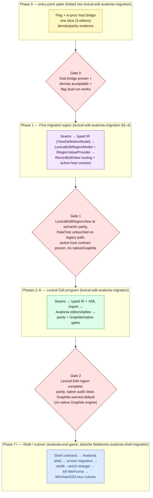
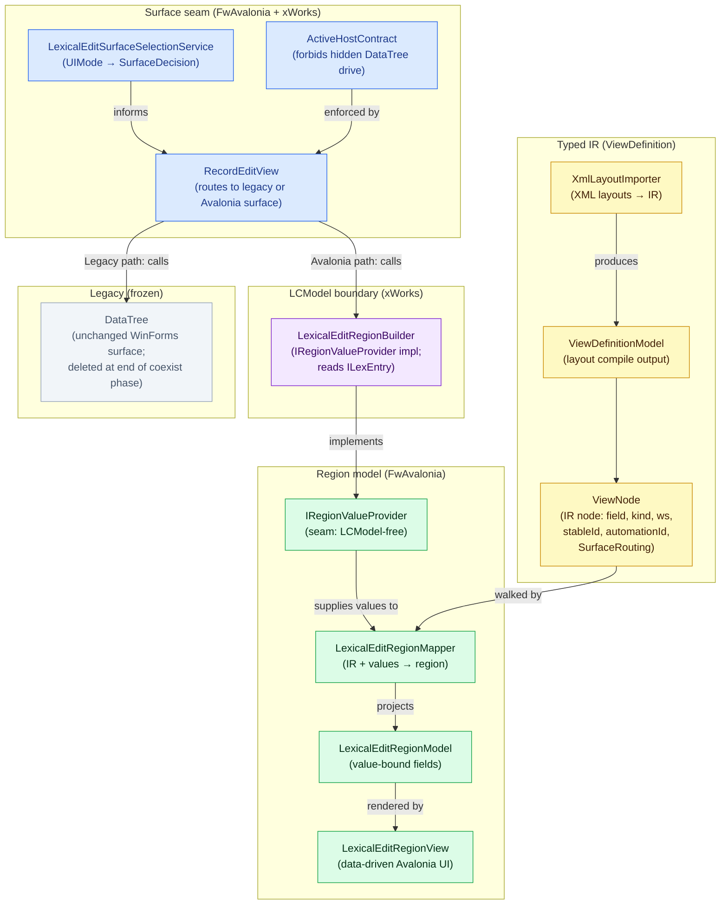

## Context

> **Status note (2026-06-09 — resolved).** Execution diverged from the original sequence. After
> Gate 0, work proceeded directly into the lexical-edit program (sections 2–4 of
> `lexical-edit-avalonia-migration/tasks.md`) and built the region-model path
> (`ViewDefinitionModel`/`LexicalEditRegionModel` through `RecordEditView`) rather than Plan A's
> `DataTreeModel`/`SliceSpec`/`IDataTreeView`. `seam-domain-comparison.md` classifies wiring new
> ports into legacy `DataTree` internals as throwaway work, which undercuts Plan A's premise.
>
> **Resolution (1.13 done 2026-06-09):** `datatree-model-view-separation` is formally superseded as
> a migration gate. `DataTree` is frozen on the legacy side and will be deleted at end of the ~1-year
> coexistence phase; its internal extraction (`DataTreeModel`/`SliceSpec`/`IDataTreeView`) is
> optional legacy maintenance only. Gate 1 is redefined below around the region-model boundary.
> See `datatree-model-view-separation/hybrid-alignment.md` for the superseded banner and historical
> content.

The recommendation from the original plan-comparison analysis (Plan A "datatree-model-view-separation"
vs. Plan B "lexical-edit-avalonia-migration") was **Approach 3 then Approach 2**: a time-boxed
proof-of-concept spike, then the Hybrid (Plan B as the spine). Execution
confirmed that approach but resolved the Phase 1 boundary differently from the original plan: instead
of extracting a model layer from `DataTree`, Phase 1 built a typed IR path (`ViewDefinitionModel` →
`LexicalEditRegionModel`) that bypasses `DataTree` entirely on the Avalonia side.

**Plan A — `datatree-model-view-separation`** (superseded as migration gate): would have split
`DataTree.cs` into `DataTreeModel`/`SliceSpec`/`IDataTreeView`. Refactoring the internals of a class
that will be deleted in ~1 year is throwaway. DataTree stays frozen as the legacy surface.

**Plan B — `lexical-edit-avalonia-migration` (+ `avalonia-end-game`)**: the
end-to-end program. This is the active plan. Phase 1 was executed as sections 3–4 of the
lexical-edit tasks. Phase 7+ / shell is now owned by `avalonia-end-game` (the cutover), which absorbs
and supersedes `fieldworks-avalonia-shell-migration` (2026-06-20).

## Goals / Non-Goals

**Goals:**
- One ordered plan with explicit gates and a clear overlap resolution.
- Start with a small phase-0 spike, then the densest real screen (Lexical Edit via the DataTree region).
- Keep everything behind a default-off flag with WinForms as the safe default during transition.
- Preserve functional fidelity and density; pixel-perfect is explicitly not required.

**Non-Goals:**
- Duplicating the referenced changes' detailed requirements.
- Fixing shell timing before the regional gates are proven.

## Decisions

### 1. Sequence: phase-0 spike → first migrated region → Lexical Edit → Shell

**Decision:** Phase 0 is the entry-point spike; Phase 1 is the first migrated region via the region-model
path (lexical-edit-avalonia-migration sections 3–4); Phases 2–6 are the continued lexical-edit
program; Phase 7+ is the shell, gated on the regional gates.

**Rationale:** Banks cheapest risk reduction first (phase-0 spike), then the typed-IR + surface-seam
foundation that all further Avalonia screens build on, and defers the most expensive work (shell)
until the regional pattern is proven. The `DataTree` internal extraction was originally planned as
Phase 1 but is superseded: bypassing DataTree entirely on the Avalonia path is both simpler and
avoids investing in a class that will be deleted.

### 2. Region-model boundary as the seam

**Decision:** The boundary between legacy and Avalonia is `ViewDefinitionModel` (typed IR compiled
from XML layouts) + `LexicalEditRegionModel` (value-bound region) + `IRegionValueProvider` (seam to
LCModel). `RecordEditView` selects the surface via `LexicalEditSurfaceSelectionService`; the
active-host contract (`ActiveHostContract`) forbids driving hidden legacy `DataTree` infrastructure
when Avalonia is active. `DataTree` remains the complete legacy surface — no internal extraction.

**Rationale:** Avalonia does not need to understand DataTree's mental model (slices, XML configs,
ObjSeqHashMap reuse keys). The typed IR path is standalone, testable without WinForms, and can be
compiled off-thread. DataTree is deleted wholesale at end of the coexistence phase; the seam is at
RecordEditView routing, not inside DataTree.

### 3. Minimal-risk posture throughout

**Decision:** Every phase keeps WinForms as the default, lands behind tests, and is independently
valuable and reversible. No phase deletes native Views or makes Avalonia default until that region's
manifest gates pass.

## Master sequence and gates

### Gate definitions

- **Gate 0 (phase-0 spike → region):** in-process net48 host bridge proven (or fallback recorded); density
  delta acceptable at 100% and 150% DPI; the same build runs either surface behind the flag;
  `spike-evidence.md` gives go.
- **Gate 1 (first region → continued program):** `LexicalEditRegionView` renders
  `LexicalEditRegionModel` built from `ViewDefinitionModel` + `IRegionValueProvider`; the legacy
  `DataTree` is untouched on the legacy path; `RecordEditView` routing selects the appropriate
  surface via `LexicalEditSurfaceSelectionService`; `RecordEditViewActiveHostContractTests` proves no
  hidden DataTree drive under Avalonia mode; semantic + density baseline matches within tolerance; no
  native Views or Graphite on the Avalonia path. **(Passed — lexical-edit-avalonia-migration §3–4
  complete as of 2026-06-09.)**
- **Gate 2 (program → shell):** the Lexical Edit region manifest passes — semantic parity, UIA2 legacy
  baselines, Avalonia.Headless tests, render-comparison evidence, native-viewing audit clean, and no
  native Graphite engine or native Views shaping on the Avalonia path. (Per
  `graphite-transition-support`, 2026-06-09: Graphite *presence* in a project no longer blocks an
  Avalonia default — the gate is per-writing-system classification + warning coverage; Graphite stays
  fully supported on legacy surfaces until the M2 sunset milestone.)

## Vocabulary — as-built (Phase 1)

The original overlap map mapped Plan A vocabulary to Plan B vocabulary. That mapping is superseded.
The vocabulary actually built:

## Risk controls

- WinForms stays the default until each region's gate passes; the flag default is WinForms.
- Each phase is independently valuable and reversible; stalling at any phase still leaves value.
- No native Views deletion or Graphite default-path removal until the region manifest proves it.
- The phase-0 spike converts the roadmap's remaining estimates into measured numbers before the region starts.
