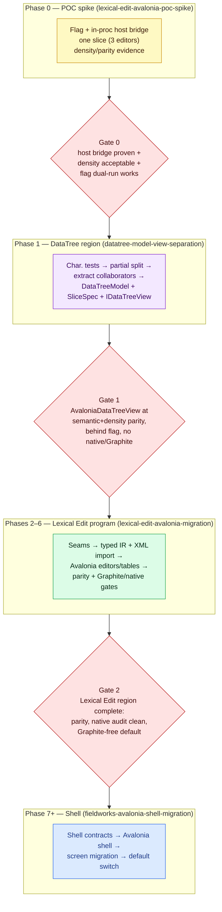
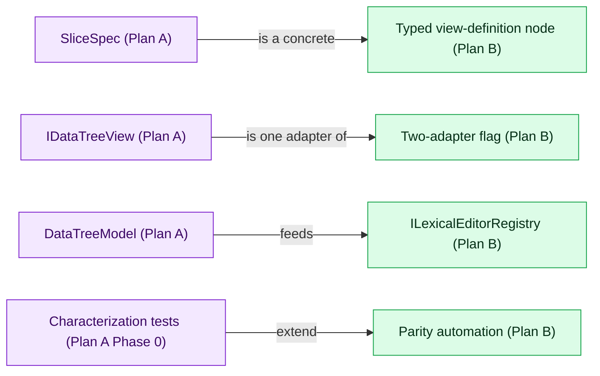

## Context

The recommendation from `Docs/avalonia-migration-approach-comparison.md` is **Approach 3 then
Approach 2**: run a time-boxed proof-of-concept spike, then execute the Hybrid (the lexical-edit
program as the spine, with the DataTree model/view split as the first concrete migrated region). This
roadmap encodes that recommendation as an ordered, gated sequence so the work is minimal-risk and the
two older plans stop competing.

Two plans are reconciled:

- **Plan A — `datatree-model-view-separation`**: splits the 4.7k-line `DataTree.cs` into a UI-agnostic
  `DataTreeModel` + `SliceSpec[]` + `IDataTreeView`. Low risk, days of work, but stops at the
  abstraction boundary (no Avalonia, no flag, no Graphite/native work).
- **Plan B — `lexical-edit-avalonia-migration` (+ `fieldworks-avalonia-shell-migration`)**: the
  end-to-end program with typed view definitions, seams, parity automation, Graphite/native
  decommissioning, the two-adapter flag, and the shell.

The Hybrid uses B as the spine and runs A as B's first migrated region.

## Goals / Non-Goals

**Goals:**
- One ordered plan with explicit gates and a clear overlap resolution.
- Start with a small POC, then the densest real screen (Lexical Edit via the DataTree region).
- Keep everything behind a default-off flag with WinForms as the safe default during transition.
- Preserve functional fidelity and density; pixel-perfect is explicitly not required.

**Non-Goals:**
- Duplicating the referenced changes' detailed requirements.
- Fixing shell timing before the regional gates are proven.

## Decisions

### 1. Sequence: POC → DataTree region → Lexical Edit → Shell

**Decision:** Phase 0 is the POC spike; Phase 1 is the DataTree model/view split executed as a
migrated region; Phases 2–6 are the lexical-edit program; Phase 7+ is the shell, gated on the
regional gates.

**Rationale:** This banks the cheapest risk reduction first (POC), then the densest, highest-value
real screen, and defers the most expensive work (shell) until the regional pattern is proven — which
is the dependency the lexical-edit program already mandates.

### 2. Overlap resolution: A is a concrete realization of B

**Decision:** `SliceSpec` (Plan A) is a concrete instance of the typed view-definition node (Plan B);
`IDataTreeView` (Plan A) is one of the two adapters selected by the two-adapter flag (Plan B). The
DataTree region's `AvaloniaDataTreeView` consumes the same `DataTreeModel`/`SliceSpec` the WinForms
view uses and is selected by the flag.

**Rationale:** Avoids building two competing boundary types. The DataTree split produces the swap
point; the lexical-edit program supplies the flag, parity harness, and Graphite/native gates.

### 3. Minimal-risk posture throughout

**Decision:** Every phase keeps WinForms as the default, lands behind tests, and is independently
valuable and reversible. No phase deletes native Views or makes Avalonia default until that region's
manifest gates pass.

## Master sequence and gates

### Gate definitions

- **Gate 0 (POC → region):** in-process net48 host bridge proven (or fallback recorded); density
  delta acceptable at 100% and 150% DPI; the same build runs either surface behind the flag;
  `spike-evidence.md` gives go.
- **Gate 1 (region → program):** `AvaloniaDataTreeView` implements `IDataTreeView`, consumes the same
  `DataTreeModel`/`SliceSpec` as WinForms, is selected by the two-adapter flag, matches the semantic +
  density baseline within tolerance, and instantiates no native Views or Graphite at runtime.
- **Gate 2 (program → shell):** the Lexical Edit region manifest passes — semantic parity, UIA2 legacy
  baselines, Avalonia.Headless tests, render-comparison evidence, native-viewing audit clean, and no
  unapproved Graphite/native-rendering default-path dependency.

## Overlap map (vocabulary reconciliation)

## Risk controls

- WinForms stays the default until each region's gate passes; the flag default is WinForms.
- Each phase is independently valuable and reversible; stalling at any phase still leaves value.
- No native Views deletion or Graphite default-path removal until the region manifest proves it.
- The POC converts the roadmap's remaining estimates into measured numbers before the region starts.
