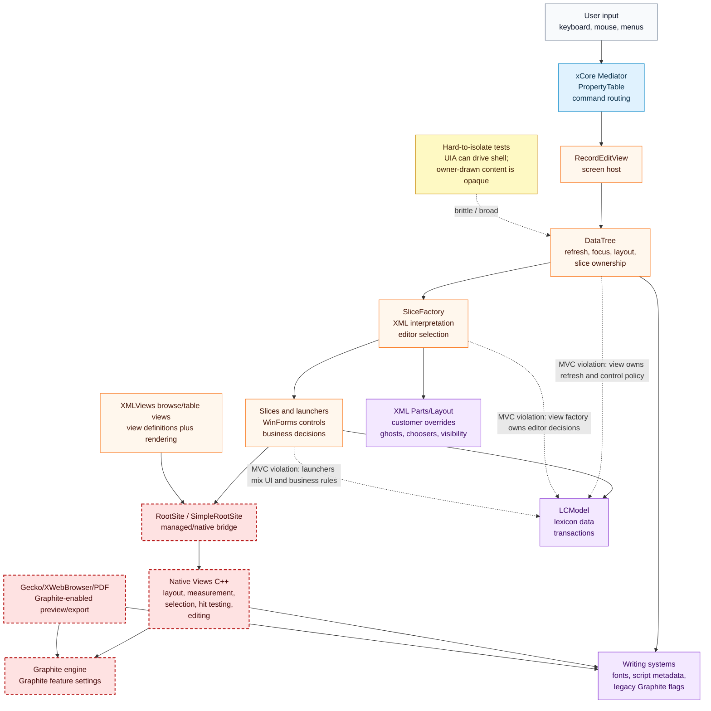
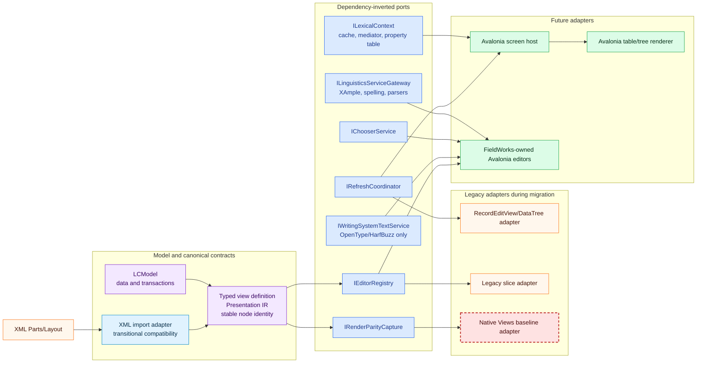
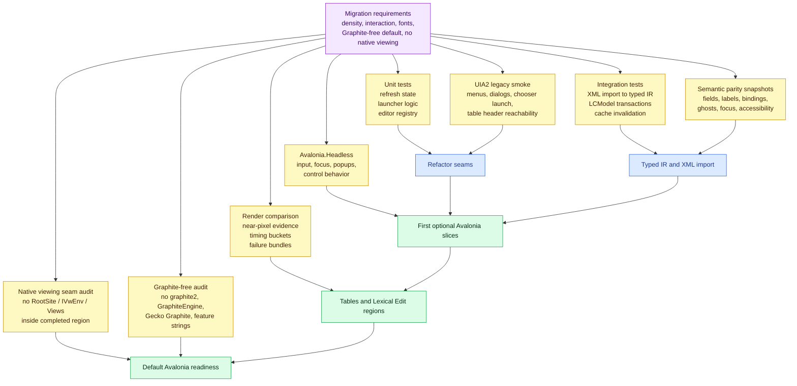
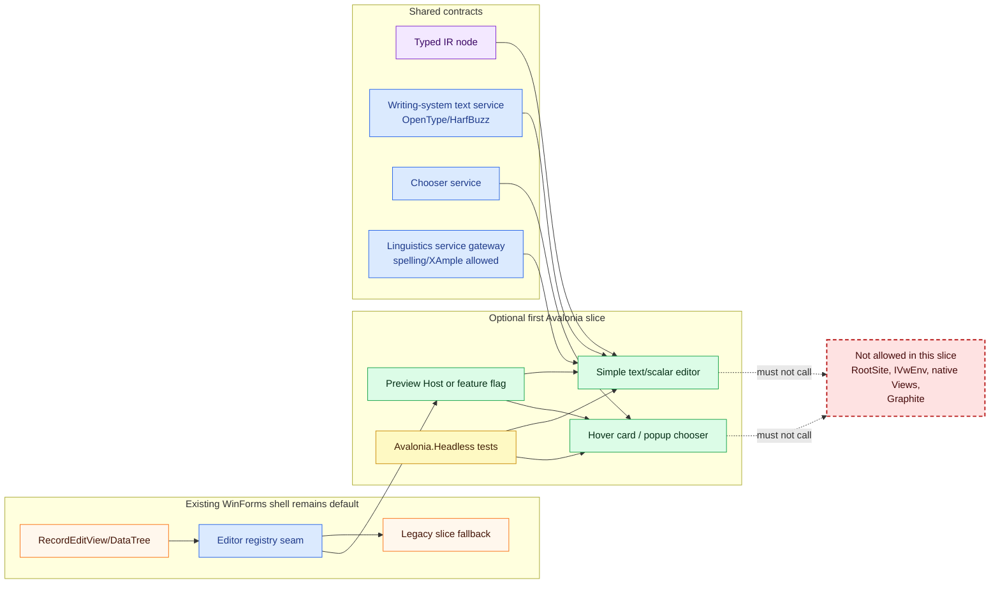
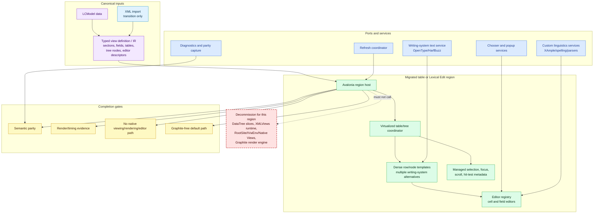
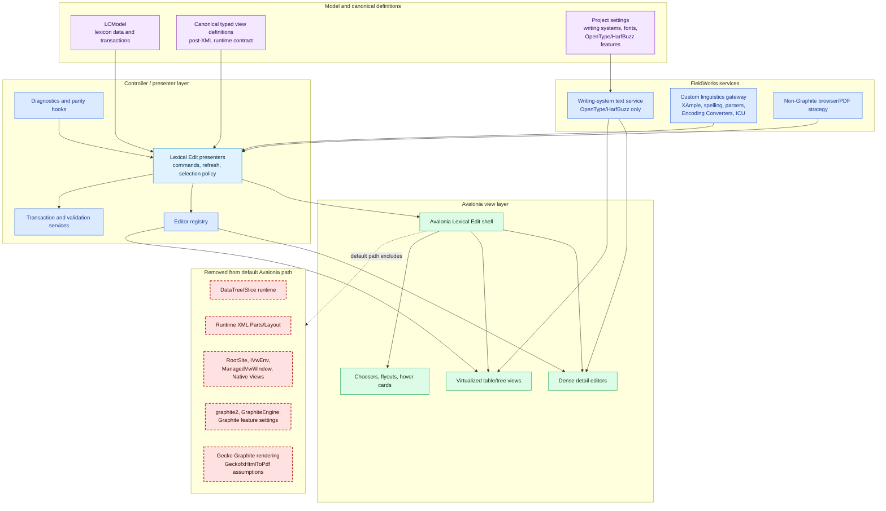

# Lexical Edit Avalonia Migration Architecture Diagrams

These diagrams summarize the current WinForms architecture, the migration seams, the testing strategy, the first optional Avalonia slices, the table/full Lexical Edit path, and the final default architecture after Graphite and native viewing/rendering are removed from migrated regions.

Legend used across diagrams:

- Red dashed nodes are decommissioning targets for completed Avalonia regions.
- Green nodes are Avalonia or future managed UI pieces.
- Blue nodes are dependency-inverted service contracts.
- Yellow nodes are validation and test layers.
- Purple nodes are model or canonical data contracts.

## 1. Current WinForms Architecture and MVC Pressure

The current stack mixes model access, controller behavior, view creation, refresh policy, and native rendering inside the same path. This is why it is hard to test in isolation and why wrapping it in Avalonia would preserve the wrong boundary.

## 2. Dependency Inversion Path and Better MVC

The first architectural move is not Avalonia. It is extracting narrow ports around refresh, view definitions, editor selection, chooser behavior, writing-system text, diagnostics, and retained linguistics services. Legacy WinForms becomes one adapter. Avalonia becomes another adapter later.

## 3. Testing and Validation Map

Tests are layered around the seam being proven. Deep behavior moves to unit and integration tests. UI automation stays narrow. Render verification captures both semantic and visual evidence. Avalonia.Headless covers new controls without booting the full application.

## 4. First Optional Avalonia Slices: Hover, Popup, Simple Editors

The first slices should be optional and low-blast-radius. They use the same ports that legacy code uses, but the rendered surface is Avalonia-owned and can run in the Preview Host or headless tests.

## 5. Lexical Edit and Table Views Slice

Table views and full Lexical Edit regions are meaningfully different from the first hover/simple-editor slices. They need virtualization, stable row/node identity, selection and scrolling services, table/tree templates, and stronger parity gates.

## 6. Final Default Architecture After Avalonia and Graphite Decommissioning

In the final default path, MVC is explicit: LCModel and canonical view definitions are model/data contracts; presenters and services coordinate commands, refresh, transactions, and diagnostics; Avalonia controls own display and input. Graphite and native viewing/rendering are outside the default path. Retained native linguistics engines are service dependencies, not UI dependencies.

