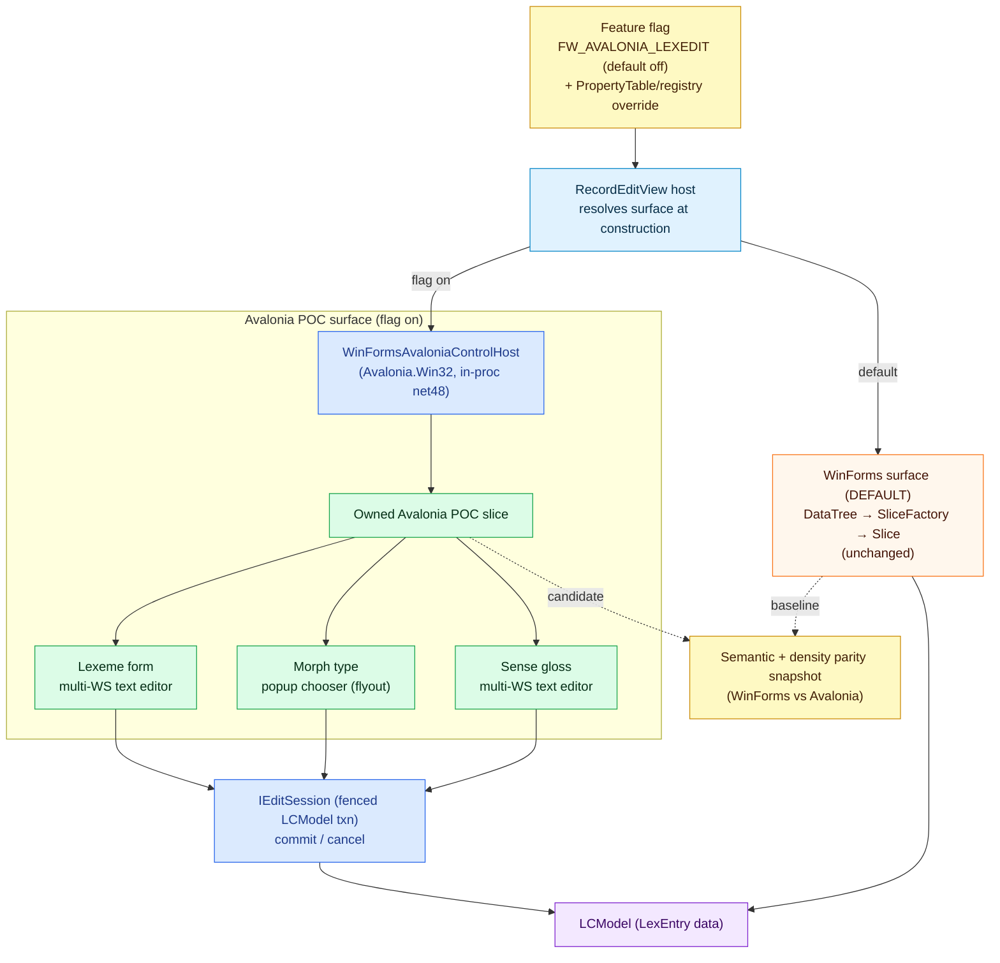

## Context

The migration roadmap (`avalonia-migration-roadmap`) recommends a small proof-of-concept before the
regional Lexical Edit migration. FieldWorks runs on .NET Framework 4.8 with WinForms and native C++
Views. The Avalonia preview prototype already exists on `010-advanced-entry-preview-prototype` but as
a **net8** module hosted out-of-process. The open question that blocks planning is whether Avalonia
can render an editable FieldWorks slice **in-process on net48**, selected beside the WinForms view by
a feature flag.

Avalonia 11 targets `netstandard2.0`, so it can load on net48. Avalonia also ships
`WinFormsAvaloniaControlHost` (in `Avalonia.Win32.Interoperability`) to embed an Avalonia control
inside a WinForms control tree. This spike validates that path with the smallest possible slice.

Relevant current constraints:
- `RecordEditView` hosts `DataTree`, which materializes `Slice` controls via `SliceFactory` from XML
  Parts/Layout. The POC must sit beside this host without altering the default path.
- The seam decisions are already frozen in the lexical-edit change; the POC consumes them, it does
  not redefine them.
- The semantic-baseline characterization test
  (`DataTreeTests.CfAndBib_SemanticSliceBaselineCapturesStableBindingsAndFocusOrder`) already proves
  stable bindings and focus order for a two-field layout. The POC parity snapshot extends that format.

## Goals / Non-Goals

**Goals:**
- Prove (or disprove) in-process net48 Avalonia hosting beside WinForms.
- Prove near-pixel density/fidelity parity for one representative slice.
- Prove a default-off feature flag that switches the same build between WinForms and Avalonia.
- Produce measured evidence and a go/no-go for the regional migration.

**Non-Goals:**
- Any default behavior change, native change, or broad UI replacement.
- Production hardening of undo/redo, accessibility, localization, or performance.

## Decisions

### 1. In-process net48 embedding is the primary host-bridge strategy

**Decision:** Embed the Avalonia POC slice into the existing WinForms host using
`WinFormsAvaloniaControlHost` (Avalonia.Win32 interop) on net48. The out-of-process net8 preview host
from `010-advanced-entry-preview-prototype` is the documented fallback if in-proc embedding fails.

**Rationale:** In-process embedding is the lowest-friction path to a flagged dual-run inside the
shipping product and directly answers the roadmap's host-bridge question. Out-of-process adds IPC,
lifetime, and focus complexity that should only be paid if embedding is proven unworkable.

**Alternatives considered:**
- Out-of-process net8 host first: defers the in-proc question that the full migration depends on.
- Full net8 migration of the shell first: far too large for a POC and reverses the roadmap order.

### 2. Two-adapter selection behind a default-off flag

**Decision:** The host resolves a `LexicalEditSurface` at construction time from a feature flag
(`FW_AVALONIA_LEXEDIT` environment variable, with a `PropertyTable`/registry override), defaulting to
the WinForms surface. The Avalonia surface is only constructed when the flag is on.

**Rationale:** A construction-time selection keeps both adapters fully isolated, makes the default
path identical to today, and matches the two-adapter pattern the regional migration will reuse.

**Alternatives considered:**
- Compile-time `#if`: cannot run both from one build; fails the dual-run requirement.
- Per-field live toggling: unnecessary for a POC and complicates focus/commit semantics.

### 3. The POC slice uses owned controls over three representative editor kinds

**Decision:** The slice renders exactly three editors over the live `LexEntry`:
multi-writing-system **lexeme form** text, a **morph type** popup chooser, and one **sense gloss**
multi-writing-system text. Editing commits through the existing fenced LCModel edit-session model
(`avalonia-edit-sessions`), with control-local text undo as leaf behavior (`avalonia-undo-redo`).

**Rationale:** These three cover the dominant Lexical Edit interaction classes (dense WS text and a
chooser flyout) while staying tiny. They exercise density, font/script behavior, and popup focus
return — the things the fidelity question is about.

**Alternatives considered:**
- A single read-only label: too weak to answer the editing/commit and chooser questions.
- The full entry layout: not a spike; defeats the time-box and minimal-risk goal.

### 4. Parity is measured semantically and by density, not by pixels

**Decision:** Capture a normalized semantic snapshot (label, field, flid, editor kind, visibility,
focus order, accessibility name, writing-system metadata) for both the WinForms baseline and the
Avalonia slice, plus a density comparison (visible rows, label/editor column widths, line height) at
the same DPI. Differences are classified as accepted near-pixel variance, font/rendering variance,
missing data, or regression.

**Rationale:** Pixel-perfect parity is an explicit non-goal; density and functional fidelity are
what matter. The semantic snapshot reuses the existing baseline test format so the POC plugs into the
regional parity automation.

## Architecture

## Risk controls (minimal-risk posture)

- **Default unchanged:** flag defaults to WinForms; the Avalonia surface is never constructed unless
  explicitly enabled. The spike cannot regress shipping behavior.
- **Isolated project:** all POC code and Avalonia package references live in a dedicated
  `Src/Common/FwAvalonia/` project; the only edit to existing code is the guarded selection hook.
- **No native, no Graphite:** the slice must not instantiate native Views or Graphite; a headless
  test asserts this.
- **Reversible:** removing the flag hook and the POC project fully reverts the spike.
- **Time-boxed:** if the in-process host bridge is not proven within the time box, record the failure
  and switch to the documented out-of-process fallback rather than expanding scope.

## Open questions (to be answered by the spike, not before)

1. Does `WinFormsAvaloniaControlHost` initialize and render correctly under the FieldWorks net48
   startup, message loop, and DPI settings?
2. What is the measured density delta (rows visible, column widths, line height) at 100% and 150% DPI?
3. Does popup-chooser focus return correctly to the host on close?
4. Does a fenced LCModel commit from the Avalonia editor behave identically to the WinForms slice?
