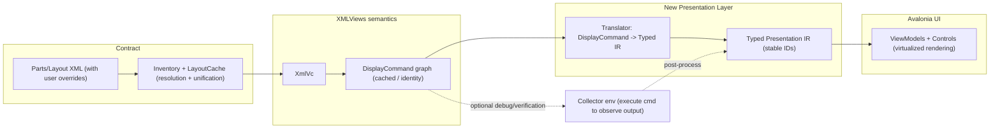
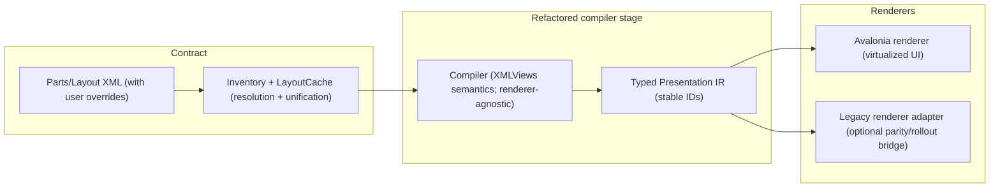

# Presentation IR research (Path 3 support)

**Feature**: Advanced Entry Avalonia View
**Spec**: `specs/010-advanced-entry-view/spec.md`
**Plan**: `specs/010-advanced-entry-view/plan.md`
**Parity checklist**: `specs/010-advanced-entry-view/parity-lcmodel-ui.md`

## Goal
We need a **managed** (C#) way to interpret legacy **Parts/Layout** configuration (XML) into something that an Avalonia UI can render/edit.

This document answers:
- What already exists in FieldWorks that looks like (or can become) a “presentation IR”?
- Do we need a new abstraction layer, or can we adapt an existing one?
- Where are the relevant files?
- The top 3 implementation paths, with risks, maintainability, and effort.

## Working definition: “Presentation IR”
For this feature, **presentation IR** is a stable, testable, in-memory tree describing *what to show and how it is grouped* for a given “view contract” entry point.

A good IR (for Avalonia) should:
- Preserve legacy **layout semantics**: groups/sections, nested sequences, “ghost” add-first-item behavior, conditional visibility, separators/labels, and multi-writing-system rules.
- Reference **data bindings** in a managed-safe way (e.g., “string on field X, ws rule Y”, “sequence property flid Z”).
- Provide **stable node identity** (for selection, validation, staged state keys, and persistence of per-node UI state).
- Avoid dependence on the legacy **C++ view runtime**.

## What already exists (and what it implies)
### 1) The “view contract” loader/resolver already exists (Inventory + LayoutCache)
FieldWorks already has a managed mechanism that:
- Loads Parts and Layouts from the configuration directory
- Applies **override** and **unification** semantics (`base=...`, “last wins”, user override files)
- Provides resolved `XmlNode`s for a given class and layout/part name

Key files:
- `Src/XCore/Inventory.cs`
  - Composite XML inventory with override/unification semantics.
  - Two key inventories: `"layouts"` and `"parts"`.
- `Src/Common/Controls/XMLViews/LayoutCache.cs`
  - Fast lookup: resolves a class + layoutName into a `layout` or `part` XML node.
  - Also wires up user overrides and layout versioning.

Implication: we should **reuse** Inventory/LayoutCache for Path 3. Re-implementing override/unification rules would be risky.

### 2) A managed interpreter already exists (XmlVc.ProcessFrag)
The `XmlVc` class is a managed “view constructor” driven by XML fragments:
- It resolves which `layout`/`part` applies (`GetNodeForPart`, `GetDisplayNodeForChild`).
- It interprets XML tags like `string`, `para`, `div`, `if`, `choice`, `seq`, `obj`, `part`, `sublayout`, etc.
- It emits calls to an abstract environment (`IVwEnv`).

Key files:
- `Src/Common/Controls/XMLViews/XmlVc.cs`
  - `GetNodeForPart(...)` and `GetDisplayNodeForChild(...)` are the core “contract resolution” hooks.
  - `ProcessFrag(...)` is the core interpreter.
  - The newer `DisplayCommand` mechanism is a compiled/intermediate representation of “how to display fragId X”.
- `Src/Common/Controls/XMLViews/XmlBrowseViewBaseVc.cs`
  - Browse-specific behaviors built on the same model.
- `Src/Common/Controls/XMLViews/XmlViewsUtils.cs`
  - Utilities that replicate parts of XmlVc resolution logic for other consumers.

Implication: much of the hard semantic work (conditions, WS behavior, nested traversal, unification rules) is **already implemented in managed code**.

### 3) There is already a “compiled command” layer (DisplayCommand)
`XmlVc` doesn’t always interpret raw XML nodes directly. It maintains:
- `m_idToDisplayCommand : fragId -> DisplayCommand`
- `m_displayCommandToId : DisplayCommand -> fragId`

And various `DisplayCommand` subclasses call back into `XmlVc` to produce output.

This is already *IR-like* in the sense that:
- It is a stable object graph (with equality/hash semantics)
- It decouples “what to display” (command) from “where to display it” (the environment)

But it is currently designed to drive `IVwEnv` (the legacy Views runtime abstraction).

### 4) XmlVc already supports “collector envs” (evidence we can emit something else)
`XmlVc` is used with non-rendering environments in multiple places:
- Height estimation uses `StringMeasureEnv` (collects widths)
- Sorting uses `SortCollectorEnv`
- Key building uses `TsStringCollectorEnv`
- Tests use a managed-only `MockEnv : IVwEnv` in `XMLViewsTests`

Key file:
- `Src/Common/Controls/XMLViews/XMLViewsTests/XmlVcTests.cs` (contains `MockEnv`)

Implication: we can likely build a **presentation IR builder** as another managed `IVwEnv` implementation (or a close cousin), without involving the legacy C++ view runtime.

### 5) Missing today: an Avalonia-friendly typed IR
What does **not** exist today is a clean, Avalonia-targeted IR:
- The current XMLViews pipeline emits *rendering* operations (paragraph/span/div, string runs, dependencies).
- It is not directly a structured “form model” (fields, editors, sections).
- Editing semantics for Avalonia (validation hints, editor kinds, commands, ghost UX) are entangled with legacy UI infrastructure.

Conclusion: we almost certainly need **some** abstraction layer for Avalonia.
The open question is how big it needs to be, and how much we can reuse.

## Relevant configuration inputs (the contract)
- Parts example (Entry): `DistFiles/Language Explorer/Configuration/Parts/LexEntryParts.xml`
- Layouts: `*.fwlayout` under the configuration Parts directory (loaded by `LayoutCache.InitializePartInventories`).

Note: the loader code points to a configuration directory under the Flex folder:
- `LayoutCache.InitializePartInventories` builds `.../Configuration/Parts` and loads `*Parts.xml` and `*.fwlayout`.

## Top 3 paths to the Presentation IR layer
Below are three plausible implementation paths ordered by “reuse now” vs “clean architecture later”.

## Performance reality check (why IR matters)
One of the key motivations for moving to Avalonia (or any modern UI) is **not** just “different rendering”, but a chance to stop doing expensive layout/custom-field work on the UI thread.

In the current system, a lot of cost comes from:
- **Custom-field expansion into concrete XML nodes**.
  - `PartGenerator` clones template XML for each acceptable field and does per-field metadata lookups (labels, ws rules, dest class checks), and can generate parts from referenced layouts.
- **Recomputation triggered by context changes**.
  - For example, browse views explicitly recompute columns so “the layout/parts system can generate parts for custom fields” when the list item class changes.
- **Legacy Views rendering model coupling**.
  - The expensive work often happens in a pipeline designed around the legacy Views runtime (`IVwEnv` + RootBox/Views rendering), which historically includes native/C++ components and is not structured for incremental/virtualized UI updates.

What a Presentation IR buys us:
- A place to do **one-time compilation + caching** (Parts/Layout → IR) separate from rendering.
- A place to introduce **stable IDs**, enabling incremental updates and memoization.
- A place to choose **modern UI patterns** (virtualization, incremental rendering, async precompute) without changing the contract semantics.

### Path 1 — Add a new managed “IR collector env” and run existing XmlVc
**Idea**
- Implement a new `IVwEnv` (similar to `MockEnv` in tests) that records a structured event stream/tree.
- Run `XmlVc.Display(...)` against this env to produce a “low-level IR” of:
  - Flow containers (OpenDiv/OpenParagraph/OpenSpan/etc.)
  - Data-binding operations (AddStringProp/AddStringAltMember/AddObjVecItems/etc.)
  - Markers (IdentifySource)
  - Conditionals are already resolved by `XmlVc`.
- Post-process that recorded tree into the higher-level “presentation IR” nodes we want (sections/fields/sequences).

**What this reuses**
- Inventory + LayoutCache resolution/unification.
- XmlVc semantic interpreter, including complex legacy behaviors.
- Existing test patterns (MockEnv) prove the VC can run without a real rendering engine.

**Risks**
- The emitted structure is **rendering-oriented**, not form-oriented; mapping “paragraph/span + strings” to “editable field X” can become brittle.
- You may accidentally lock the new Avalonia editor to legacy view runtime concepts (flow objects, text props) even if C++ is not used.
- Hard to ensure stability: small changes in XmlVc rendering logic could change the IR shape.

**Maintainability**
- Medium (good reuse, but IR semantics are derived indirectly).

**Effort**
- Low–Medium to get a first IR output.
- Medium–High to make the post-processing robust enough for real editor usage.

**Best when**
- You want a fast proof that “we can interpret Parts/Layout into a tree” without committing yet to the final IR shape.

---

### Path 2 — Build a new “Parts/Layout → typed IR compiler”, reusing only resolution utilities
**Idea**
- Reuse Inventory/LayoutCache to resolve the right XML nodes for a given entry point.
- Write a new compiler that walks the XML and emits a typed IR directly:
  - `Section`, `Field`, `Sequence`, `Group`, `Conditional`, `GhostRule`, `ChooserHint`, `MultiWsString`, etc.
- Implement only the subset of XML constructs we need first (Stage 1 parity), then expand.

**What this reuses**
- Inventory + LayoutCache (including user overrides and unification).
- Potentially helper logic already factored in `XmlViewsUtils` (layout name resolution, child node selection patterns).

**Risks**
- You will re-discover a lot of tricky semantics already handled in `XmlVc` (writing systems, virtual/custom fields, conditions, recursion, special-case objects).
- High risk of “looks right for LexEntryParts.xml” but fails for other layouts.

**Maintainability**
- High (clean separation; IR is stable and tailored for Avalonia).

**Effort**
- Medium–High initial cost.
- Ongoing cost as new XML constructs are needed (but cost is predictable and localized).

**Best when**
- You want a long-lived, well-designed abstraction that is clearly independent of legacy view rendering.

---

### Path 3 — Treat `DisplayCommand` as the “compiler output”, and translate to typed IR
**Idea**
- Use `XmlVc`’s existing compilation/caching layer (`DisplayCommand`, fragId mapping) as the stable intermediate.
- Create a translator that converts the relevant `DisplayCommand` / XML nodes into a typed Avalonia-oriented IR.
  - Example: `MainCallerDisplayCommand` already resolves “main node + caller + layoutName + unified child node”.
  - `DetermineNeededFields(...)` can be repurposed to pre-compute binding needs for the IR.
- Optionally still use a collector env to observe what a command would emit, but keep the *public* IR independent of low-level `IVwEnv` calls.

**How Path 3 can specifically address UI slowness**
The important shift is: **treat Parts/Layout interpretation as compilation** (mostly CPU + metadata), and treat Avalonia as a fast **view over compiled state**.

Concretely, Path 3 enables:
- **Precompilation and caching**
  - Cache the typed IR by a key like `(rootClassId, layoutName, configVersion, wsProfile, userOverrideSet)`.
  - Because `DisplayCommand` already has identity/dedup semantics, it’s a natural cache boundary.
- **Async build + progressive render**
  - Build the IR off the UI thread, then bind the resulting immutable-ish tree into Avalonia.
  - Render can become “show skeleton → fill sections as they compile” if needed (without changing the contract).
- **Virtualization / incremental UI**
  - A typed IR makes it practical to virtualize long sequences (e.g., lists of senses/examples) and to delay creation of editors until the node is visible/expanded.
- **Avoid per-open XML cloning for custom fields**
  - Instead of `PartGenerator` cloning XML into large concrete trees each time, treat “generated custom fields” as a logical IR node (`GeneratedFields`) that expands lazily (or once, cached) into child IR nodes.
- **Reduced churn on “context changes”**
  - When root object class changes, instead of “recompute columns” (which can trigger parts regeneration), invalidate the relevant cache key and rebuild only the affected IR.
  - With stable IDs, unchanged subtrees can be reused.

**What this reuses**
- The best parts of Path 1 (reusing semantics) without committing your public IR to rendering events.
- The existing “dedup” and “identity” behavior of DisplayCommands.

**Risks**
- DisplayCommand is still designed around `IVwEnv` and the legacy Views model; some commands may be hard to interpret without executing them.
- There are many command types; you’ll need to decide which are “in scope” for the editor.

**Maintainability**
- Medium–High (better than Path 1 because the typed IR is explicit; still coupled to XmlVc internals).

**Effort**
- Medium.

**Best when**
- You want an incremental bridge: keep shipping while gradually isolating Avalonia from XMLViews internals.

---

## Option 4 — Refactor existing XMLViews into a cleaner “compiler + renderer” architecture
This is a plausible “clean architecture” route: keep the Parts/Layout contract, but restructure the *implementation* so that logic and UI are more cleanly separated.

**Idea**
- Extract/introduce an explicit pipeline:
  1) Contract resolution (`Inventory`/`LayoutCache`)
  2) Compilation (XMLViews semantics) → stable intermediate model
  3) Rendering (a renderer for WinForms/legacy views; and a renderer for Avalonia)

This is related to Path 3, but aims to make the separation a first-class goal, potentially benefitting both:
- Existing UI (short-term maintenance)
- Avalonia UI (long-term migration)

**Why it might help performance**
- You can put most of the expensive work (layout resolution, custom-field expansion, needed-fields analysis) into a cacheable compiler step.
- Rendering becomes a relatively cheap traversal of precomputed nodes.

**How it could be implemented**
- Treat `DisplayCommand` (or a new sibling abstraction) as the “compiled output”.
- Make the compilation stage produce a renderer-agnostic representation (typed IR).
- Implement two renderers:
  - A legacy renderer adapter (if we need parity verification or incremental rollout).
  - An Avalonia renderer (the main goal).

**Risks / costs**
- Large refactor surface: `XmlVc` today interleaves resolution, compilation decisions, and rendering calls to `IVwEnv`.
- A “clean” separation can easily turn into a multi-quarter effort if we try to make it fully general.
- If the long-term goal is to **sunset C++ Views code**, spending heavily on improving the legacy rendering pipeline may have diminishing returns.

**When Option 4 is worth it**
- If we need a long period of hybrid operation (legacy UI + Avalonia) and want shared logic.
- If performance work must land quickly in the existing UI while migration proceeds.
- If there are correctness/maintainability issues in XMLViews that block IR work.

---

## Path 3 vs Option 4 (visual)

### Diagram A — Path 3: Bridge from `DisplayCommand` → typed IR

### Diagram B — Option 4: Explicit compiler boundary + multiple renderers

## Path 3 vs Option 4 (comparison table)

| Dimension | Path 3: Translate `DisplayCommand` → typed IR | Option 4: Refactor XMLViews into compiler + renderer |
|---|---|---|
| Primary intent | Ship an incremental bridge quickly while reusing existing XMLViews semantics. | Create a cleaner long-term architecture with a first-class compilation boundary and multiple render targets. |
| Pros | Faster to first working editor; leverages existing semantics and caching; smaller initial surface area; good stepping stone to later cleanup. | Clear separation of concerns; cleaner public interfaces; easier to test compiler output directly; sets up a “one compiler, many renderers” story. |
| Cons | Still coupled to XMLViews internals; harder to reason about all command types; “IR meaning” may be partially implicit in commands. | Larger refactor; higher coordination risk; can easily expand scope; may spend effort improving legacy pipeline that is slated for retirement. |
| Depth / type of changes | Mostly additive: new typed IR + translator + caches, minimal changes to XMLViews except hooks for translation/caching. | Structural: reorganize existing XMLViews code into explicit stages; likely requires moving logic, redefining interfaces, and updating many call sites. |
| Cleanness of resulting interface | Medium–High: typed IR can be clean, but translation layer remains aware of XMLViews command details. | High: compiler output is the designed interface; renderers depend on typed IR rather than XMLViews internals. |
| Ease during transition | High: can keep legacy UI running largely unchanged while Avalonia uses the new IR path. | Medium: transition requires maintaining refactor compatibility and potentially a legacy renderer adapter while migrating call sites. |
| “Health” when complete | Medium–High: good if coupling is contained; still some legacy knowledge stays in translator. | High: best chance at a maintainable, testable, modern boundary (contract resolver + compiler + renderer). |
| Performance leverage | High: enables caching/async compilation and Avalonia virtualization without immediately rewriting all semantics. Biggest wins come from avoiding repeated custom-field expansion and heavy UI-thread work. | High: same levers as Path 3 plus the ability to enforce “no rendering work in compiler”. Potentially the cleanest place to guarantee off-UI-thread compilation. |
| Biggest risk area | Correctly and sustainably interpreting the many `DisplayCommand` variants (and/or needing to execute them to understand effects). | Scope creep and long tail of regressions while untangling interleaved resolution/compilation/rendering logic. |
| Best fit | When time-to-value matters and we want to iteratively decouple from legacy Views/C++ runtime. | When we can afford a bigger re-architecture and want a single clean boundary that outlives the migration. |

## Recommendation (for this repo’s current reality)
If the near-term goal is to get a working Path-3-driven editor (while we still have a lot of layout semantics encoded in XMLViews), the most pragmatic sequence is:

1) Start with **Path 3**: leverage `DisplayCommand` + `LayoutCache` and translate to a typed IR that matches the plan’s “Presentation IR” concept.
2) Use **Path 1** tactically for verification/debugging (a collector env is a great way to see “what XmlVc would have emitted”).
3) If long-term coupling to XMLViews becomes painful, evolve toward **Path 2** by re-implementing the compiler in a clean module while keeping Inventory/LayoutCache as the contract resolver.

Performance note: whichever path we choose, the key success criteria should include **(a)** IR compilation is cacheable and mostly off the UI thread, and **(b)** Avalonia rendering is incremental/virtualized so “hundreds of custom fields” doesn’t imply “hundreds of live controls”.

## Quick “where to look next” (high signal)
- Contract resolution & overrides:
  - `Src/XCore/Inventory.cs`
  - `Src/Common/Controls/XMLViews/LayoutCache.cs`
  - `Src/Common/Controls/XMLViews/LayoutMerger.cs`
- Interpreter & compiled command layer:
  - `Src/Common/Controls/XMLViews/XmlVc.cs`
  - `Src/Common/Controls/XMLViews/XmlBrowseViewBaseVc.cs`
  - `Src/Common/Controls/XMLViews/NeededPropertyInfo.cs`
- Helper logic / parallel implementations:
  - `Src/Common/Controls/XMLViews/XmlViewsUtils.cs`
- Proof that managed-only execution is possible:
  - `Src/Common/Controls/XMLViews/XMLViewsTests/XmlVcTests.cs` (includes `MockEnv : IVwEnv`)
- Domain-specific behaviors to preserve:
  - `Src/FdoUi/LexEntryUi.cs` and related LexText UI controls
- Parts contract examples:
  - `DistFiles/Language Explorer/Configuration/Parts/LexEntryParts.xml`
